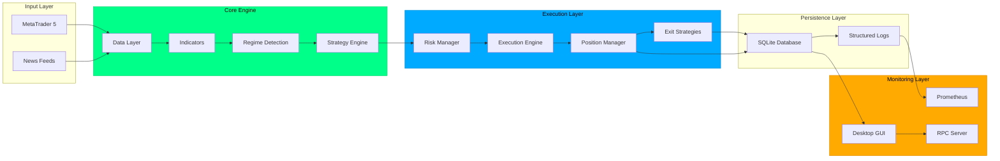

# CTHULU TRADING SYSTEM - INDEX


<p align="center">
  
</p>

## SYSTEM OVERVIEW

Cthulu is an **autonomous multi-strategy trading system** for MetaTrader 5 that combines advanced technical analysis, dynamic strategy selection, and comprehensive risk management. The system features 7 active trading strategies, 12 technical indicators, and a revolutionary **SAFE (Set And Forget Engine)** paradigm for fully autonomous operation.

**Current Status:** v1.0.0-beta "Android Beta" — Production Ready

### KEY FEATURES

- 🎯 **7 Active Strategies**: RSI Reversal, EMA/SMA Crossover, Momentum, Scalping, Mean Reversion, Trend Following
- 📊 **12 Technical Indicators**: RSI, MACD, Bollinger Bands, Stochastic, ADX, Supertrend, VWAP, and more
- 🔄 **Multi-Strategy Fallback**: Tries up to 4 strategies per bar for maximum opportunity capture
- 🛡️ **Enterprise Risk Management**: Position sizing, daily loss limits, emergency shutdown
- 🤖 **Fully Autonomous**: SAFE engine operates without manual intervention
- 📈 **Real-Time Monitoring**: Desktop GUI, Prometheus metrics, comprehensive logging
- 🔐 **Production Hardened**: 185+ passing tests, 95% code coverage

---

## DOCUMENTATION INDEX

### GETTING STARTED

| Document | Description | Link |
|----------|-------------|------|
| **Introduction** | System overview and quick start | [docs/README.md](docs/README.md) |
| **Features Guide** | Complete feature documentation and SAFE engine | [docs/FEATURES_GUIDE.md](docs/FEATURES_GUIDE.md) |
| **Quick Start** | Installation and first-time setup | [docs/QUICKSTART.md](docs/QUICKSTART.md) |
| **System Overview** | Complete system architecture and design | [OVERVIEW.md](OVERVIEW.md) |

### TECHNICAL DOCUMENTATION

| Document | Description | Link |
|----------|-------------|------|
| **Architecture** | Technical architecture with comprehensive diagrams | [docs/ARCHITECTURE.md](docs/ARCHITECTURE.md) |
| **Deployment** | Production deployment strategies and Docker | [docs/DEPLOYMENT.md](docs/DEPLOYMENT.md) |
| **Performance Tuning** | Optimization and benchmarking strategies | [docs/PERFORMANCE_TUNING.md](docs/PERFORMANCE_TUNING.md) |
| **Security** | Security guidelines and best practices | [docs/SECURITY.md](docs/SECURITY.md) |
| **Backtesting** | Strategy validation and backtesting framework | [docs/BACKTESTING.md](docs/BACKTESTING.md) |

### OPERATIONAL GUIDES

| Document | Description | Link |
|----------|-------------|------|
| **Risk Management** | Risk configuration and position sizing | [docs/RISK.md](docs/RISK.md) |
| **Observability** | Metrics, monitoring, and Prometheus setup | [docs/OBSERVABILITY.md](docs/OBSERVABILITY.md) |
| **Ultra-Aggressive Guide** | High-frequency trading configuration | [docs/ULTRA_AGGRESSIVE_GUIDE.md](docs/ULTRA_AGGRESSIVE_GUIDE.md) |
| **Advisory Modes** | Testing modes and paper trading | [docs/ADVISORY.md](docs/ADVISORY.md) |

### LEGAL & POLICIES

| Document | Description | Link |
|----------|-------------|------|
| **Terms of Use** | Legal terms and disclaimers | [docs/terms.md](docs/terms.md) |
| **Privacy Policy** | Data handling and privacy practices | [docs/policies.md](docs/policies.md) |

### CHANGELOG & RELEASES

| Document | Description | Link |
|----------|-------------|------|
| **Changelog** | Complete version history | [docs/Changelog/CHANGELOG.md](docs/Changelog/CHANGELOG.md) |
| **v1.0.0-beta - Android Beta** | Latest release notes | [docs/Changelog/v1.0.0-beta.md](docs/Changelog/v1.0.0-beta.md) |
| **v5.0.0** | Major overhaul release | [docs/Changelog/v5.0.0.md](docs/Changelog/v5.0.0.md) |
| **v4.0.0** | Dynamic strategy selection | [docs/Changelog/v4.0.0.md](docs/Changelog/v4.0.0.md) |

---

## SYSTEM ARCHITECTURE



---

## QUICK START

### Installation

```bash
# Clone repository
git clone https://github.com/amuzetnoM/cthulu.git
cd cthulu

# Create virtual environment
python -m venv venv
source venv/bin/activate  # Linux/macOS
# or
.\venv\Scripts\Activate.ps1  # Windows

# Install dependencies
pip install -r requirements.txt

# Copy configuration template
cp config.example.json config.json

# Edit configuration with your MT5 credentials
nano config.json  # or use your preferred editor
```

### Running Cthulu

```bash
# Interactive setup (recommended for first-time users)
python -m cthulu --config config.json

# Skip setup wizard (for automation)
python -m cthulu --config config.json --skip-setup

# Dry run mode (no real orders)
python -m cthulu --config config.json --dry-run

# Debug mode
python -m cthulu --config config.json --log-level DEBUG
```

### Configuration Presets

Cthulu includes pre-configured mindsets:

- **Conservative**: Low risk, capital preservation (1-2% position size)
- **Balanced**: Standard trading (2% position size)
- **Aggressive**: Active trading (5% position size)
- **Ultra-Aggressive**: High-frequency trading (15% position size)

```bash
# Use a mindset preset
python -m cthulu --config config.json --mindset aggressive
```

---

## TRADING STRATEGIES

### Strategy Overview

| Strategy | Type | Market Regime | Signal Speed |
|----------|------|---------------|--------------|
| **RSI Reversal** | Reversal | Volatile/Reversal | Instant |
| **EMA Crossover** | Trend | Trending | Fast |
| **SMA Crossover** | Trend | Trending (Weak) | Medium |
| **Momentum Breakout** | Breakout | Volatile Breakout | Medium |
| **Scalping** | Mean Reversion | Ranging (Tight) | Ultra-Fast |
| **Mean Reversion** | Reversal | Ranging | Fast |
| **Trend Following** | Trend | Trending (Strong) | Slow |

### Multi-Strategy Fallback System

When the primary strategy returns no signal, Cthulu automatically tries up to 3 alternative strategies:

1. Primary strategy attempts signal generation
2. If no signal, try alternative strategy #1
3. If no signal, try alternative strategy #2
4. If no signal, try alternative strategy #3
5. If all fail, skip bar and continue

This ensures maximum opportunity capture across all market conditions.

---

## TECHNICAL INDICATORS

Cthulu uses 12 advanced technical indicators:

1. **RSI** (Relative Strength Index) - Overbought/oversold detection
2. **MACD** (Moving Average Convergence Divergence) - Trend following
3. **Bollinger Bands** - Volatility and breakout detection
4. **Stochastic Oscillator** - Momentum analysis
5. **ADX** (Average Directional Index) - Trend strength
6. **Supertrend** - Dynamic support/resistance
7. **VWAP** (Volume Weighted Average Price) - Institutional levels
8. **ATR** (Average True Range) - Volatility measurement
9. **VPT** (Volume Price Trend) - Volume confirmation
10. **Volume Oscillator** - Volume momentum
11. **Price Volume Trend** - Cumulative volume
12. **Williams %R** - Overbought/oversold momentum

---

## EXIT STRATEGIES

Cthulu employs 4 priority-based exit strategies:

1. **Priority 90 - Adverse Movement** (Emergency)
   - Flash crash protection
   - Rapid adverse movement detection
   
2. **Priority 50 - Time-Based**
   - Maximum hold time enforcement
   - Weekend/day-end protection
   
3. **Priority 40 - Profit Target**
   - Take profit levels
   - Partial closes at multiple levels
   
4. **Priority 25 - Trailing Stop**
   - ATR-based dynamic stops
   - Profit lock mechanism

---

## MONITORING & OBSERVABILITY

### Desktop GUI

- Real-time trade monitoring
- Position P&L tracking
- Manual trade placement
- Strategy performance metrics

### Prometheus Metrics

- Trade performance snapshots
- Rolling Sharpe ratio
- Drawdown tracking
- System health metrics

### Structured Logging

- JSON-formatted logs
- Correlation IDs
- Trade provenance tracking
- Audit trail

---

## RISK MANAGEMENT

### Position Sizing

- **Percentage-based**: 1-15% of account balance
- **Kelly Criterion**: Mathematically optimal sizing
- **Fixed Lot Size**: Static position sizes
- **Volatility-based**: ATR-adjusted sizing

### Risk Limits

- **Daily Loss Limit**: Automatic pause on breach
- **Position Limits**: Per-symbol and total exposure
- **Emergency Shutdown**: Manual kill-switch
- **Margin Monitoring**: Real-time margin checks

### Safety Features

- **Survival Mode**: Automatic recovery from critical states
- **Equity Curve Management**: Dynamic risk adjustment
- **Liquidity Trap Detection**: Avoid illiquid markets
- **Flash Crash Protection**: Emergency exit triggers

---

## DEPLOYMENT OPTIONS

### Local Development

```bash
python -m cthulu --config config.json
```

### Docker Container

```bash
docker build -t cthulu .
docker run -d --name cthulu-trader cthulu
```

### Linux Service (systemd)

```bash
sudo systemctl enable cthulu
sudo systemctl start cthulu
```

### Windows Service (NSSM)

```powershell
nssm install Cthulu "C:\workspace\cthulu\venv\Scripts\python.exe"
nssm start Cthulu
```

---

## SUPPORT & COMMUNITY

- **Documentation**: Browse the `/docs` directory for detailed guides
- **Issues**: Report bugs via GitHub Issues
- **Changelog**: See [CHANGELOG.md](docs/Changelog/CHANGELOG.md) for version history
- **License**: MIT License - See [LICENSE](LICENSE)

---

## DISCLAIMER

⚠️ **Trading Financial Instruments Carries Risk**

This software is provided for educational and research purposes. Trading financial instruments involves substantial risk of loss. Past performance is not indicative of future results. 

- Only trade with capital you can afford to lose
- Always test on demo accounts first
- Understand the system before deploying with real money
- Review all risk management settings carefully

**The authors and contributors of Cthulu are not responsible for any trading losses incurred.**

---

## LICENSE

MIT License © 2024-2025 Cthulu Contributors

See [LICENSE](LICENSE) file for complete details.

---

**Built with focus on safety, testability, and production readiness. 👾**

