# Complete System Overview

  
  
 

## Executive Summary

👾 Cthulu is an **autonomous trading system** designed for MetaTrader 5 (MT5) that implements adaptive, algorithmic trading strategies with comprehensive risk management, real-time monitoring, and machine learning instrumentation. The system features multiple trading mindsets (conservative, balanced, aggressive, ultra-aggressive), dynamic strategy selection, and a sophisticated exit management system.

**Current Status:** Fully operational with complete architectural overhaul finished.

## System Architecture

### Complete System Architecture (v5.2.33)


### Data Flow Architecture

```mermaid
flowchart LR
    subgraph INPUT["📥 Input"]
        MT5_DATA["MT5 Market Data"]
        NEWS_DATA["News Feed"]
        CALENDAR["Economic Calendar"]
    end
    
    subgraph PROCESSING["⚙️ Processing Pipeline"]
        direction TB
        INGEST["Data Ingestion"]
        IND_CALC["Indicator Calculation"]
        REGIME_DET["Regime Detection"]
        SIG_GEN["Signal Generation"]
        COG_ENH["Cognition Enhancement"]
        RISK_CHK["Risk Check"]
    end
    
    subgraph DECISION["🎯 Decision"]
        APPROVE["Approval Gate"]
        SIZE["Position Sizing"]
    end
    
    subgraph OUTPUT["📤 Output"]
        ORDER["Order Execution"]
        DB_WRITE["DB Write"]
        METRICS_OUT["Metrics Export"]
    end
    
    INPUT --> PROCESSING
    PROCESSING --> DECISION
    DECISION --> OUTPUT
    
    INGEST --> IND_CALC --> REGIME_DET --> SIG_GEN --> COG_ENH --> RISK_CHK
```



### Module Integration Matrix

| Module | Inputs From | Outputs To | Purpose |
|--------|-------------|------------|---------|
| **EntryConfluenceFilter** | market_data, signal | execution gate | Entry quality assessment |
| **CognitionEngine** | market_data, indicators | trading_loop, exit_coord | Signal enhancement, exit signals |
| **RegimeClassifier** | OHLCV data | CognitionEngine, StrategySelector | Market state detection |
| **PricePredictor** | features | CognitionEngine | Direction probability |
| **AdaptiveAccountManager** | balance, equity | RiskEvaluator, trading_loop | Phase-based position sizing |
| **ConfluenceExitManager** | positions, indicators | ExitCoordinator | Multi-indicator exit signals |
| **ProfitScaler** | positions, balance | trading_loop | Partial profit taking |
| **AdaptiveLossCurve** | balance, position | RiskEvaluator | Non-linear loss tolerance |

## Core Concepts

### 1. Trading Mindsets

Cthulu supports **4 trading mindsets** that adjust risk tolerance and trading frequency:

| Mindset | Position Size | Daily Loss Limit | Max Positions | Poll Interval | Use Case |
|---------|--------------|------------------|---------------|---------------|----------|
| **Conservative** | 1-2% | $25 | 2 | 60s | Capital preservation |
| **Balanced** | 2% | $50 | 3 | 30s | Standard trading |
| **Aggressive** | 5% | $100 | 5 | 20s | Active trading |
| **Ultra-Aggressive** | 15% | $500 | 10 | 15s | Scalping/HFT |

**Configuration:** Applied via `config/mindsets.py` or `--mindset` CLI flag.

### 2. Strategy System

#### Strategy Types

1. **SMA Crossover** - Simple moving average crossover (traditional)
2. **EMA Crossover** - Exponential moving average crossover (responsive)
3. **Momentum Breakout** - Breakout detection with momentum confirmation
4. **Scalping** - High-frequency trading on M1-M5 timeframes with tight stops
5. **Mean Reversion** - Statistical mean reversion strategies
6. **Trend Following** - Trend-following with dynamic adaptation

#### Dynamic Strategy Selection

When `strategy.type = "dynamic"`, Cthulu uses **StrategySelector** that:
- Monitors multiple strategies simultaneously
- Evaluates performance metrics (win rate, profit factor, Sharpe ratio)
- Detects market regime (trending/ranging using ADX)
- Automatically switches to best-performing strategy every 3 minutes
- Adapts to changing market conditions

**Configuration Example:**
```json
{
  "strategy": {
    "type": "dynamic",
    "dynamic_selection": {
      "enabled": true,
      "regime_check_interval": 180,
      "performance_weight": 0.4,
      "regime_weight": 0.4
    },
    "strategies": [
      {"type": "ema_crossover", "params": {...}},
      {"type": "momentum_breakout", "params": {...}},
      {"type": "scalping", "params": {...}}
    ]
  }
}
```

### 3. Indicator System

#### Technical Indicators

Cthulu calculates **12 next-generation technical indicators**:

1. **RSI (Relative Strength Index)** - Momentum oscillator (0-100)
   - Overbought: >70, Oversold: <30
   - Enhanced with EPSILON constant for division-by-zero protection
   - EMA smoothing for better responsiveness

2. **MACD (Moving Average Convergence Divergence)** - Trend following
   - Fast: 12, Slow: 26, Signal: 9 (default)
   - Detects momentum shifts

3. **ATR (Average True Range)** - Volatility measurement
   - Uses EMA (not SMA) for scalping responsiveness
   - Essential for dynamic stop-loss placement

4. **ADX (Average Directional Index)** - Trend strength
   - >25: Strong trend, <20: Ranging market
   - Used for regime detection

5. **Bollinger Bands** - Volatility bands
   - 20-period SMA ± 2 standard deviations
   - Mean reversion signals

6. **Stochastic Oscillator** - Momentum indicator
   - %K and %D lines (0-100)
   - Overbought/oversold levels

7. **Supertrend** - Trend indicator
   - Dynamic support/resistance
   - Based on ATR

8. **VWAP (Volume Weighted Average Price)** - Institutional price level
   - Intraday benchmark
   - Buy below, sell above

9. **VPT (Volume Price Trend)** - Volume-price analysis
   - Combines price and volume for trend confirmation

10. **Volume Oscillator** - Volume momentum
    - Measures volume trend strength

11. **Price Volume Trend** - Volume-weighted price movement
    - Enhanced volume analysis

12. **EMA/SMA** - Moving averages at various periods
    - Dynamically calculated based on strategy requirements
    - Crossovers generate signals

#### Runtime Indicator Management

**IndicatorRequirementResolver** (new in Phase 1):
- Analyzes strategies to determine required indicators
- Automatically computes missing indicators at runtime
- Single-pass analysis eliminates duplicate calculations
- Ensures all strategies have necessary data

### 4. Execution Engine

#### Order Flow

```
Signal Generated
    ↓
Risk Approval (RiskManager)
    ↓
Advisory Decision (if enabled)
    ↓
Order Placement (ExecutionEngine)
    ↓
Position Tracking (PositionManager)
    ↓
Database Recording (Database)
    ↓
Exit Monitoring (Exit Strategies)
```

#### Order Types

- **MARKET** - Immediate execution at best available price
- **LIMIT** - Execute at specified price or better
- **STOP** - Trigger at specified price

#### Execution Modes

1. **Live Trading** - Real orders placed on MT5
2. **Dry Run** - Simulated trading (no real orders)
3. **Advisory Mode** - Signal generation only, no execution
4. **Ghost Mode** - Test small positions without full commitment

### 5. Risk Management

#### Risk Manager Components

**Current (To be unified in Phase 6):**
- `risk/manager.py` - Pre-trade approval, position sizing
- `position/risk_manager.py` - Helper functions for stop-loss adjustment

**Risk Limits:**
```python
max_position_size_pct: 0.02      # 2% per trade (default)
max_total_exposure_pct: 0.10     # 10% total exposure
max_daily_loss_pct: 0.05         # 5% daily loss limit
max_positions_per_symbol: 1      # 1 position per symbol
max_total_positions: 3           # 3 total positions
min_risk_reward_ratio: 1.0       # Minimum 1:1 RR
```

#### Kelly Criterion (Optional)

When enabled, uses **Kelly formula** for optimal position sizing:
```
Kelly % = (Win Rate × Average Win) - (Loss Rate × Average Loss) / Average Win
```

#### Emergency Stops

- **Emergency Stop Loss**: 8% (default) - Hard stop if position moves against
- **Daily Loss Circuit Breaker**: Stops trading if daily loss exceeds limit
- **Connection Loss**: Attempts reconnection, avoids new trades

### 6. Exit Strategy System

#### Exit Strategy Types (Priority-Based)

1. **Trailing Stop** (Priority: 80) - Follows price, locks in profits
2. **Profit Target** (Priority: 70) - Fixed take-profit levels
3. **Time-Based Exit** (Priority: 60) - Close after N hours/bars
4. **Adverse Movement** (Priority: 50) - Quick exit on rapid adverse moves

**Exit Evaluation:**
- Sorted by priority (highest first)
- First strategy to trigger wins
- Prevents conflicting exits

**Configuration Example:**
```json
{
  "exit_strategies": [
    {
      "type": "trailing_stop",
      "enabled": true,
      "atr_multiplier": 2.0,
      "activation_profit_pct": 1.0
    },
    {
      "type": "time_based",
      "enabled": true,
      "max_age_hours": 24.0
    }
  ]
}
```

### 7. Entry Confluence Filter

The Entry Confluence Filter is a **quality gate** between signal generation and execution that prevents blind entries.

#### Problem Solved
The system generates revolutionary signals, but executing them at arbitrary price levels leads to poor entries. The timing between signal generation and execution was causing trades to start in stressed positions.

#### Entry Quality Assessment

| Factor | Weight | Description |
|--------|--------|-------------|
| **Level Score** | 40% | Proximity to S/R, round numbers, EMAs, previous session levels |
| **Momentum Score** | 25% | Recent bar momentum alignment, RSI confirmation |
| **Timing Score** | 20% | Range position (chasing vs. optimal), extension from levels |
| **Structure Score** | 15% | Higher highs/lows, trend structure alignment |

#### Quality Classifications

| Classification | Score | Position Multiplier | Action |
|---------------|-------|---------------------|--------|
| PREMIUM | ≥ 85 | 1.0 (full) | Execute immediately |
| GOOD | ≥ 70 | 0.85 | Execute with standard size |
| MARGINAL | ≥ 50 | 0.6 | Execute with reduced size |
| POOR | ≥ 30 | 0.3 | Wait for better or skip |
| REJECT | < 30 | 0.0 | Signal rejected |

#### Pending Entry Queue
When entry quality is POOR but waiting is recommended:
- Signal is queued with optimal entry price
- Checked each loop iteration
- Executes when price reaches optimal level
- Times out after `max_wait_bars` with 0.5x size

**Configuration Example:**
```json
{
  "entry_confluence": {
    "min_score_to_enter": 50,
    "min_score_for_full_size": 75,
    "enable_wait_mode": true,
    "max_wait_bars": 10,
    "level_weight": 0.40,
    "momentum_weight": 0.25,
    "timing_weight": 0.20,
    "structure_weight": 0.15
  }
}
```

### 8. Position Management

#### Position Lifecycle

```
1. Signal Generated → Risk Approved
2. Order Placed → Execution
3. Position Tracked → Real-time Monitoring
4. Exit Triggered → Position Closed
5. P&L Recorded → Metrics Updated
```

#### Position Tracking

**PositionInfo** dataclass tracks:
- Ticket, symbol, side (BUY/SELL)
- Entry price, current price
- Stop loss, take profit
- Unrealized P&L, realized P&L
- Commission, swap charges
- Age, metadata

#### External Trade Adoption

**TradeManager** can adopt trades not placed by Cthulu:
- Manual trades from MT5 terminal
- Trades from other EAs/bots
- Applies Cthulu's exit strategies
- Configurable adoption policy (symbols, age limit)

**Use Case:** Take over existing positions and manage exits.

### 9. Database & Persistence

#### SQLite Schema

**Signals Table:**
- Timestamp, symbol, side, confidence
- Entry price, stop loss, take profit
- Strategy name, metadata
- Execution status

**Trades Table:**
- Signal ID, order ID, ticket
- Entry/exit prices, volume
- Entry/exit times
- P&L, commission, swap
- Exit reason

**Performance Metrics:**
- Trade history for backtesting
- Strategy performance analysis
- Risk-adjusted returns

### 10. Observability & Monitoring

#### Logging

- **Console**: INFO level, real-time updates
- **File**: `Cthulu.log` - DEBUG level, rotating
- **Structured**: JSON format option for parsing

#### Metrics Collection

**MetricsCollector** tracks:
- Win rate, profit factor
- Average win/loss
- Max drawdown, Sharpe ratio
- Position statistics
- Strategy performance

#### Real-Time Monitoring

**TradeMonitor** (optional):
- Polls positions every 5 seconds
- Logs P&L changes
- Tracks unrealized profits
- ML data collection integration

#### Prometheus Integration

Optional **PrometheusExporter**:
- Exports metrics in Prometheus format
- Grafana dashboard ready
- HTTP endpoint: `/metrics`

### 11. User Interfaces

#### Command-Line Interface

```bash
# Basic usage
python __main__.py --config config.json

# Options
--dry-run              # Simulate trading
--mindset aggressive   # Apply mindset
--symbol EURUSD        # Override symbol
--log-level DEBUG      # Verbose logging
--wizard               # Run setup wizard
--enable-rpc           # Enable RPC server
--no-gui               # Headless mode
```

#### GUI (Tkinter Desktop)

**Features:**
- Real-time position monitoring
- Trade history display
- Performance metrics dashboard
- Manual trade execution
- Log viewing
- Dark mode themed

**Auto-launch**: Opens automatically unless `--no-gui` or `--headless`

#### Setup Wizard

**Interactive Configuration:**
- Mindset selection
- Symbol selection
- Timeframe selection
- Strategy configuration
- Risk parameters
- Exit strategies

**Modes:**
- Standard wizard (guided)
- NLP wizard (natural language)

### 12. Machine Learning Integration

#### ML Data Collector

**Optional** (enabled by default):
- Records every trade, signal, indicator state
- JSON event logs for ML training
- Features: OHLCV + indicators + position state
- Outputs: Trade outcomes (win/loss/P&L)

**Use Cases:**
- Supervised learning (predict trade outcome)
- Reinforcement learning (optimize strategy)
- Pattern recognition
- Anomaly detection

#### Advisory Manager

**Modes:**
1. **Advisory** - Signal generation, no execution (paper trading)
2. **Ghost** - Small test trades to validate signals
3. **Full** - Normal execution (default)

### 13. Configuration System

#### Configuration File (`config.json`)

```json
{
  "mt5": {
    "account": 12345,
    "password": "***",
    "server": "Broker-Server"
  },
  "trading": {
    "symbol": "EURUSD",
    "timeframe": "TIMEFRAME_M15",
    "poll_interval": 30,
    "lookback_bars": 500
  },
  "strategy": { ... },
  "risk": { ... },
  "exit_strategies": [ ... ],
  "indicators": [ ... ],
  "orphan_trades": { ... },
  "ml": { "enabled": true },
  "advisory": { "mode": "full" }
}
```

#### Pydantic Schema Validation

**Config Schema** (`config_schema.py`):
- Type checking at load time
- Default value handling
- Validation errors with clear messages
- Pydantic v2 compatible

### 14. News & Market Data

#### News Ingestion (Optional)

**NewsManager**:
- Fetches economic calendar events
- FRED (Federal Reserve) data integration
- Filters by currency, impact level
- Triggers strategy adjustments

**Use Case:** Pause trading during high-impact news events.

### 15. Architectural Overhaul

#### Current Status: Phase 10/10 Complete (100%)

**Goals Achieved:**
-  Reduced codebase from 6,447 → 3,600 lines (44% reduction)
-  Improved modularity and testability
-  Single responsibility per module
-  Better error handling
-  Easier to extend

## Key Features

### Autonomous Trading
- No manual intervention required
- Continuous 24/7 operation
- Automatic reconnection on failures

### Adaptive Strategies
- Dynamic strategy switching
- Market regime detection
- Performance-based selection

### Comprehensive Risk Management
- Position sizing (fixed, percentage, Kelly)
- Daily loss limits
- Emergency stops
- Exposure management

### Multiple Exit Types
- Trailing stops (lock in profits)
- Time-based exits (manage stale positions)
- Profit targets (take profit)
- Adverse movement protection

### Real-Time Monitoring
- Live position tracking
- Performance metrics
- Trade history
- GUI dashboard

### External Trade Support
- Adopt manual trades
- Adopt trades from other EAs
- Apply exit strategies to adopted trades

### ML Instrumentation
- Trade data collection
- Event logging
- Feature extraction
- Model training ready

### Production Ready
- Comprehensive error handling
- Graceful shutdown
- Database persistence
- Prometheus metrics
- Logging & debugging

## Getting Started

### Prerequisites

- **Python 3.8+**
- **MetaTrader 5** terminal installed
- **MT5 Python API** (`pip install MetaTrader5`)
- **Dependencies**: pandas, numpy, pydantic, etc.

### Installation

```bash
# Clone repository
git clone https://github.com/amuzetnoM/Cthulu.git
cd Cthulu

# Install dependencies
pip install -r requirements.txt

# Run setup wizard
python __main__.py --config config.json --wizard

# Start trading
python __main__.py --config config.json
```

### Quick Start (Dry Run)

```bash
# Test without real money
python __main__.py --config config.json --dry-run --mindset balanced

# View logs
tail -f Cthulu.log
```

### Configuration Wizard

```bash
# Interactive setup
python __main__.py --config config.json --wizard

# NLP-based wizard (experimental)
python __main__.py --config config.json --wizard-ai
```

## Common Workflows

### 1. Standard Trading Session

```bash
# Start with balanced mindset, GUI enabled
python __main__.py --config config.json --mindset balanced

# Monitor via GUI (auto-opens)
# Logs written to Cthulu.log
# Database: Cthulu.db
# Metrics: logs/latest_summary.txt
```

### 2. Ultra-Aggressive Scalping

```bash
# High-frequency trading on M1/M5
python __main__.py --config config_ultra_aggressive.json --symbol EURUSD

# Poll every 15 seconds
# 15% position sizing
# Dynamic strategy selector
```

### 3. Advisory Mode (Paper Trading)

```bash
# Generate signals without executing
python __main__.py --config config.json --dry-run

# Or use advisory manager
# Set "advisory": {"mode": "advisory"} in config
```

### 4. External Trade Adoption

```bash
# Adopt and manage external trades
python __main__.py --config config.json --adopt-only

# Configure in config.json:
# "orphan_trades": {
#   "enabled": true,
#   "adopt_symbols": ["EURUSD", "GOLD#m"],
#   "apply_exit_strategies": true
# }
```

### 5. Headless/Server Deployment

```bash
# No GUI, no prompts
python __main__.py --config config.json --headless --no-prompt

# Systemd service recommended for production
```

## Performance Metrics

### Key Performance Indicators (KPIs)

- **Win Rate**: % of profitable trades (target: >50%)
- **Profit Factor**: Gross profit / Gross loss (target: >1.5)
- **Sharpe Ratio**: Risk-adjusted returns (target: >1.0)
- **Max Drawdown**: Largest peak-to-trough decline (monitor: <20%)
- **Average Win/Loss**: Size of wins vs losses
- **Recovery Factor**: Net profit / Max drawdown

### Viewing Metrics

```bash
# Real-time via GUI

# Console output (every 100 loops)

# Summary file
cat logs/latest_summary.txt

# Database queries
sqlite3 Cthulu.db "SELECT * FROM trades ORDER BY entry_time DESC LIMIT 10;"
```

## Troubleshooting

### Common Issues

1. **No signals generated**
   - Check indicator calculations in logs
   - Verify strategy parameters match market conditions
   - Ensure sufficient lookback bars (500+)
   - Try lower confidence threshold

2. **Hitting daily loss limit**
   - Reduce position size
   - Lower max positions
   - Tighten stops
   - Switch to conservative mindset

3. **Connection failures**
   - Verify MT5 credentials
   - Check network connectivity
   - Ensure MT5 terminal is running
   - Review firewall settings

4. **High slippage**
   - Trade during high-volume hours
   - Use higher timeframes
   - Reduce position size
   - Check broker execution quality

### Debug Mode

```bash
# Verbose logging
python __main__.py --config config.json --log-level DEBUG

# Check specific components
grep "StrategySelector" Cthulu.log
grep "RSI\|ATR" Cthulu.log
```

## Development

### Code Structure

```
Cthulu/
├── __main__.py           # Entry point (being refactored)
├── core/                 # NEW - Refactored modules
├── connector/            # MT5 API wrapper
├── strategy/             # Trading strategies
├── indicators/           # Technical indicators
├── execution/            # Order execution
├── position/             # Position management
├── risk/                 # Risk management
├── exit/                 # Exit strategies
├── persistence/          # Database
├── observability/        # Logging, metrics
├── data/                 # Data layer
├── config/               # Configuration
├── ui/                   # GUI
├── monitoring/           # Monitoring
├── advisory/             # Advisory mode
├── news/                 # News ingestion
├── training/             # ML/RL training & instrumentation
├── tests/                # Test suite
└── docs/                 # Documentation
```

### Adding New Strategy

```python
# strategy/my_strategy.py
from strategy.base import Strategy, Signal, SignalType

class MyStrategy(Strategy):
    def __init__(self, config):
        super().__init__("my_strategy", config)
        self.param1 = config.get('param1', 100)
    
    def on_bar(self, bar):
        # Your logic here
        if condition:
            return Signal(
                symbol=bar.symbol,
                side=SignalType.LONG,
                confidence=0.8,
                stop_loss=bar.close * 0.98,
                take_profit=bar.close * 1.04
            )
        return None

# Register in core/strategy_factory.py
STRATEGY_REGISTRY = {
    ...
    'my_strategy': MyStrategy
}
```

### Adding New Indicator

```python
# indicators/my_indicator.py
from indicators.base import Indicator

class MyIndicator(Indicator):
    def __init__(self, period=14):
        super().__init__("my_indicator")
        self.period = period
    
    def calculate(self, df):
        # Your calculation
        df['my_indicator'] = ...
        return df['my_indicator']

# Register in core/indicator_loader.py
INDICATOR_REGISTRY = {
    ...
    'my_indicator': MyIndicator
}
```

## Production Deployment

### Recommended Setup

1. **Dedicated VPS/Server**
   - Windows (for MT5) or Linux (with Wine)
   - 2GB+ RAM, 10GB+ disk
   - Stable internet connection

2. **MT5 Configuration**
   - Allow automated trading
   - Disable "Ask manual confirmation" for trades
   - Configure max slippage

3. **Cthulu Configuration**
   - Use `--no-gui --no-prompt` for headless
   - Set appropriate poll interval
   - Configure daily loss limits
   - Enable database persistence

4. **Monitoring**
   - Set up log rotation
   - Monitor disk space
   - Track database size
   - Enable Prometheus/Grafana

5. **Backups**
   - Database: `Cthulu.db`
   - Configuration: `config.json`
   - Logs: `Cthulu.log`, `logs/`

### Systemd Service (Linux)

```ini
[Unit]
Description=Cthulu Trading System
After=network.target

[Service]
Type=simple
User=Cthulu
WorkingDirectory=/opt/Cthulu
ExecStart=/usr/bin/python3 __main__.py --config config.json --headless --no-prompt
Restart=on-failure
RestartSec=10s

[Install]
WantedBy=multi-user.target
```

## Security Considerations

### API Credentials

- Store MT5 credentials in `.env` file (not in config.json)
- Use environment variables
- Never commit credentials to git
- Rotate passwords regularly

### RPC Server

- Binds to `127.0.0.1` by default (localhost only)
- Use `Cthulu_API_TOKEN` for authentication
- Consider firewall rules if exposing externally
- Enable HTTPS for production

### Database

- Regular backups
- Encrypt sensitive data
- Access control (file permissions)

## Resources

### Documentation

- `/docs/ULTRA_AGGRESSIVE_GUIDE.md` - Ultra-aggressive mindset guide
- `/docs/ARCHITECTURE_REVIEW.md` - Architectural analysis
- `/ARCHITECTURAL_OVERHAUL_PROGRESS.md` - Refactoring progress
- `/CLEANUP_SUMMARY.md` - Cleanup summary

### Support

- GitHub Issues: Report bugs, request features
- Discussions: Ask questions, share strategies
- Wiki: Additional guides and tutorials

### Changelog

Track system updates and releases in `/docs/changelog/`

## Glossary

- **ADX**: Average Directional Index - measures trend strength
- **ATR**: Average True Range - measures volatility
- **EA**: Expert Advisor - automated trading program in MT5
- **EMA**: Exponential Moving Average
- **HFT**: High-Frequency Trading
- **MACD**: Moving Average Convergence Divergence
- **MT5**: MetaTrader 5 - trading platform
- **P&L**: Profit and Loss
- **RSI**: Relative Strength Index
- **SMA**: Simple Moving Average
- **VWAP**: Volume Weighted Average Price

## Version History

- **v5.2.33** - Current (Web backtesting UI, LLM integration, vector DB, profit scaling)
   - 207 commits since v5.1.0 with major feature additions
   - Flask-based backtesting UI with interactive charts
   - Ollama LLM integration for AI-powered analysis
   - ChromaDB vector database for pattern recognition
   - Intelligent profit scaling system
- **v5.1.0** - Previous (Architectural overhaul complete, 6 strategies, 12 indicators)
   - Complete rebranding from `herald` → `Cthulu` (package, CLI, logs, DB)
   - 150+ files modified; ~978 references updated across the repo
   - CI/CD: GitHub Actions workflow added for multi-OS / multi-Python testing
   - Tests: 156/156 unit tests passing (reported at release)
   - Infrastructure renames: Docker services -> `Cthulu-*`, Prometheus jobs -> `Cthulu_*`
   - Environment variables renamed: `HERALD_*` -> `Cthulu_*`

- **v4.x** - Dynamic strategy selection, exit strategies
- **v3.x** - Multi-strategy support, ML integration
- **v2.x** - Initial release

---

**Last Updated**: 2026-01-04  
**Status**: Active Development  
**License**: See LICENSE file  
**Author**: Cthulu Development Team

For questions or contributions, please open an issue or pull request on GitHub.


