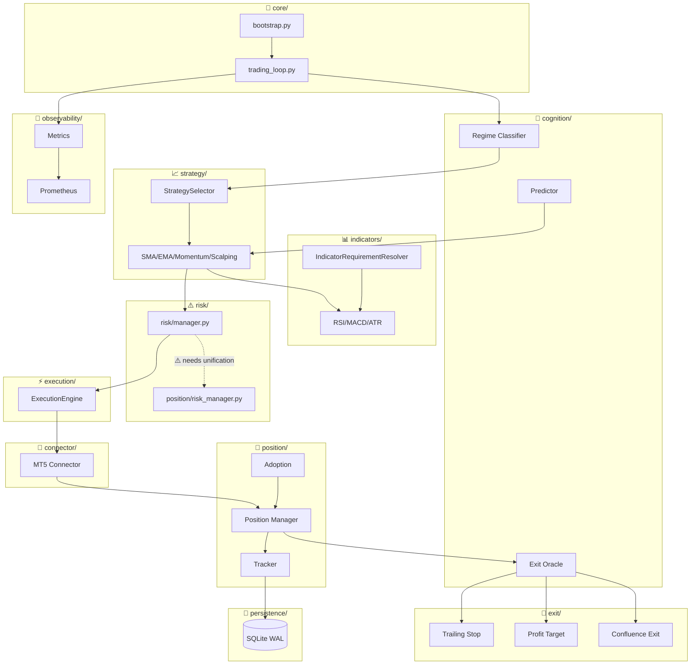

# System High Level Overview

## Top-level summary
- Version/tag: **v1.0.0 Beta** — consistent across `OVERVIEW.md`, `_dev` reports and changelog.
- Docs: Extensive documentation across `docs/`, `monitoring/`, `observability/`, `_dev/` and `OVERVIEW.md`.
- Missing: No dedicated `system_map` or `system_mapping` file under `cthulu/` (added `cthulu/_dev/system_map.html`).

---

## System Integration Overview



---

## Per-directory notes

### 🔧 `core/`
| File | Integration | Notes |
|------|-------------|-------|
| `bootstrap.py` | → `trading_loop.py` | Centralized startup |
| `trading_loop.py` | → `cognition/`, `strategy/` | Main runtime loop |

- **Good**: Centralized bootstrap and loop code; `OVERVIEW.md` references `bootstrap.py` and `trading_loop.py`.
- **Risk**: Ensure robust graceful shutdown + restart tests (shutdown edge cases).

---

### 🧠 `cognition/` (AI/ML)
| Component | Integration | Notes |
|-----------|-------------|-------|
| Regime Classifier | → `StrategySelector` | Drives strategy selection |
| Predictor | → `strategy/` | ML-based signals |
| Exit Oracle | → `exit/` | ML exit decisions |

- **Good**: Clear separation; docs reference cognition engine.
- **Concern**: Unit tests for ML determinism and data pipelines should be emphasized (data drift tests, deterministic seeding).

---

### 📈 `strategy/`
| Component | Integration | Notes |
|-----------|-------------|-------|
| Strategies | ← `cognition/`, → `indicators/` | Signal generation |
| StrategySelector | ← Regime Classifier | Dynamic switching |

- **Good**: Well-documented; StrategySelector exists for dynamic selection.
- **Action**: Add more integration tests simulating strategy switching under regime changes.

---

### 📊 `indicators/`
| Component | Integration | Notes |
|-----------|-------------|-------|
| RSI/MACD/ATR | ← `strategy/` | Indicator calculations |
| IndicatorRequirementResolver | → all indicators | Avoids duplication |

- **Good**: IndicatorRequirementResolver noted in docs; avoids duplicated computation.
- **Concern**: Profiling for high-throughput: ensure single-pass computation for many symbols.

---

### ⚠️ `risk/`
| Component | Integration | Notes |
|-----------|-------------|-------|
| `risk/manager.py` | ← `strategy/`, → `execution/` | Primary risk gate |
| `position/risk_manager.py` | ← `position/` | ⚠️ Split implementation |

- **Note**: OVERVIEW notes unification planned (Phase 6) — risk manager currently split.
- **Action**: Prioritize unified interface and more comprehensive unit tests for risk limits and emergency stops.

```
┌─────────────────┐     ┌─────────────────────┐
│ risk/manager.py │ ⚠️  │ position/risk_mgr.py│
│   (primary)     │────▶│   (secondary)       │
└────────┬────────┘     └─────────┬───────────┘
     │                        │
     └────────┬───────────────┘
          ▼
     ┌────────────────┐
     │ UNIFY (Phase 6)│
     └────────────────┘
```

---

### 💼 `position/`
| Component | Integration | Notes |
|-----------|-------------|-------|
| Position Manager | ← `connector/`, → `persistence/` | Lifecycle management |
| Tracker | ← Position Manager | State tracking |
| Adoption | → Position Manager | External trade support |

- **Good**: Clear lifecycle separation.
- **Concern**: Concurrency and DB consistency tests when positions are updated rapidly (race conditions).

---

### 🚪 `exit/`
| Component | Integration | Notes |
|-----------|-------------|-------|
| Trailing Stop | ← Exit Oracle | Priority-based |
| Profit Target | ← Exit Oracle | Priority-based |
| Confluence Exit | ← Exit Oracle | Multi-signal |

- **Good**: Priority-based exit system described in docs.
- **Action**: Add property-based tests covering exit conflicts (ensuring highest priority wins and no double-closes).

---

### ⚡ `execution/` and 🔌 `connector/`
| Component | Integration | Notes |
|-----------|-------------|-------|
| ExecutionEngine | ← `risk/`, → `connector/` | Order routing |
| MT5 Connector | ← ExecutionEngine, → `position/` | External API |

```
┌──────────┐    ┌─────────────┐    ┌──────────┐    ┌─────┐
│  Risk    │───▶│  Execution  │───▶│ Connector│───▶│ MT5 │
│ Manager  │    │   Engine    │    │  (MT5)   │    │ API │
└──────────┘    └─────────────┘    └────┬─────┘    └─────┘
                    │
                   ⚠️ CRITICAL
                (retry + circuit breaker)
```

- **Critical**: MT5 connectivity is an external dependency — add robust retry & circuit-breaker tests, and a clear dry-run mode verification.

---

### 💾 `persistence/` and DB files
| Component | Integration | Notes |
|-----------|-------------|-------|
| SQLite WAL | ← `position/`, `cognition/` | Central storage |

- **Concern**: Banking on SQLite for production; document migration path to a more scalable DB and ensure WAL tuning is included in ops docs.

---

### 📡 `observability/` & `monitoring/`
| Component | Integration | Notes |
|-----------|-------------|-------|
| Metrics | ← all modules | Collection |
| Prometheus | ← Metrics | Export |
| Dashboard | ← Prometheus | Visualization |

- **Good**: Complete guides exist; dashboards and metrics present.
- **Action**: Add SLO/alerting runbook and announce which metrics are critical for circuit breakers.

---

### 🧪 `tests/`
- **Observation**: Test coverage is present but add more integration tests for real-world scenarios (regime shifts, connectivity outages, rapid fills).

---

### 📚 `docs/` & `_dev/`
- **Good**: `_dev` contains a comprehensive system report and reviews. `OVERVIEW.md` mermaid diagrams were recently added and align with `_dev`.

---

## Critical issues / risks (priority)

| Priority | Issue | Modules Affected | Status |
|----------|-------|------------------|--------|
| 🔴 **High** | Execution/Connector flakiness under MT5 network issues | `execution/` ↔ `connector/` | Add circuit breakers |
| 🟠 **Med-High** | Risk manager split (Phase 6 unification) | `risk/` ↔ `position/` | Unify interface |
| 🟡 **Medium** | DB concurrency/race conditions | `position/` ↔ `persistence/` | Add locks/transactions |
| 🟡 **Medium** | ML reproducibility & data validation | `cognition/` | Add data-contract tests |

---

## Quick recommendations
- ✅ Add `docs/architecture/` with a small set of diagrams (C4 container + sequence for order flow) — `system_map.html` is a good starting point.
- 🔲 Add an integration test harness that can run key workflows (signal → risk → exec) in a simulated MT5/DB environment.
- 🔲 Consolidate risk-related modules earlier rather than later; add comprehensive unit tests for emergency stops and daily loss breakers.

---

If you want, I can:
- Expand this into a precise, file-by-file table listing the important files (every file) with a one-line verdict, or
- Create an additional C4-style diagram and a sequence diagram for the order flow (signal → risk → exec).

Next steps: I will commit these new `_dev` artifacts and prepare a short PR description. Want me to commit now? (I can also push and open a draft PR.)
