 


<div style="display:flex;gap:.5rem;flex-wrap:wrap;align-items:center">

<p align="center">
   

</p>


```
_________   __  .__          .__         
\_   ___ \_/  |_|  |__  __ __|  |  __ __ 
/    \  \/\   __\  |  \|  |  \  | |  |  \
\     \____|  | |   Y  \  |  /  |_|  |  /
 \______  /|__| |___|  /____/|____/____/ 
        \/           \/                  
 ```


</div>

<br>

 **NEW in v5.2.33:**<br> 
 **Web Backtesting UI, LLM Integration, Vector DB**  
> 👾 Cthulu evolves with AI-powered insights and professional backtesting tools!
>
> - **Web Backtesting UI**: Flask-based browser interface with interactive charts and real-time results  
> - **Local LLM Integration**: Ollama support for AI-powered trade analysis and market insights  
> - **Hektor**: Vector Studio integration for intelligent market pattern recognition  
> - **Intelligent Profit Scaling**: Dynamic profit target adjustments based on market conditions  
> - **7 Active Strategies**: Complete arsenal — EMA, Momentum, Scalping, Trend, SMA, Mean Reversion, RSI Reversal  
> - **Aggressive Configuration**: Optimized thresholds for maximum opportunity capture (confidence: 0.15, ADX: 15)
> - **Enhanced Database**: WAL mode with 30-second timeout for concurrent access  
> - **Live Validated**: 5 trades executed autonomously within 15 minutes of deployment!
>
> **S A F E <br> Smart strategy selection, <br> Adaptive to all conditions, <br> Fully autonomous, <br> Expert risk management**
>  
> See [05_FEATURES_GUIDE.md](05_FEATURES_GUIDE.md) for full strategy ensemble, fallback mechanism, and indicator details.


---

<br>

## Table of Contents

- [Overview](#overview)
- [Features](#features)
- [Architecture](#architecture)
- [Quick Start](#quick-start)
- [Configuration](#configuration)
- [Usage](#usage)
- [Development](#development)
- [Testing](#testing)
- [Deployment](#deployment)
- [Troubleshooting](#troubleshooting)
- [License](#license)

---

## Overview

👾 Cthulu is a high-fidelity, autonomous, rule-based trading engine implementing a staged, modular approach to automated trading. It is designed to be deterministic at its core, ensuring error-free execution and strict risk adherence, while utilizing machine learning to enhance signal confidence. The architecture emphasizes clear boundaries, testability, and safety with pluggable components that can be enhanced without disrupting core functionality.

### Design Principles

- **Single Responsibility**: Each module has a focused, well-defined role
- **Clear Boundaries**: Communication via standardized interfaces and data contracts
- **Replaceability**: Swap implementations (strategies, data sources) without core changes
- **Event-Driven**: Signals flow through approval and execution pipeline
- **Safety First**: Multiple layers of risk management and validation

### Data Flow

**Phase 1 Foundation:**
```
Market Data → Data Layer → Strategy → Signal → Risk Check → Execution → Persistence
```

**Phase 2 Autonomous Trading (NEW):**
```
Market Data → Indicators (5) → Strategy Signals → Risk Approval → 
Order Execution → Position Tracking → Exit Detection (4) → Position Close → 
Persistence & Metrics
```

---

## CLI & Usage

### Getting Started

Cthulu uses an **interactive setup wizard** as the primary entry point. When you run Cthulu, it guides you through configuring your trading parameters before starting:

```bash
# Start Cthulu (opens interactive setup wizard)
cthulu --config config.json
```

The wizard walks you through:
1. **Trading Mindset** — Conservative, Balanced, or Aggressive risk profile
2. **Symbol** — Which instrument to trade (EURUSD, XAUUSD#, etc.)
3. **Timeframe** — M5, M15, M30, H1, H4, or D1
4. **Risk Management** — Daily loss limit, position size %, max positions
5. **Strategy Settings** — SMA periods and other strategy-specific params

**Quickstart / Deployment checklist**

- Ensure MT5 AutoTrading is enabled (Terminal -> AutoTrading); this allows Cthulu to apply SL/TP settings to adopted trades automatically.
- For headless runs, use `--skip-setup` and `--no-prompt` to avoid interactive prompts.
- Use `--symbol` to override the config symbol at startup (useful for multi-process deployments).

```bash
# Quick start: run aggressive H1 profile for GOLD#m in non-interactive mode
python -m cthulu --config configs/mindsets/aggressive/config_aggressive_h1.json --symbol "GOLD#m" --skip-setup --no-prompt
```

Note: If you see repeated `Failed to select symbol` warnings, enable market watch symbol visibility in MT5 or use `--symbol` with the broker-specific symbol name (Cthulu now attempts flexible matching and will log candidate matches).
### End-to-end testing utilities

Two small helper scripts are provided to validate adoption and SL/TP behavior in a live MT5 account:

- `scripts/place_test_trade.py` — places a **Cthulu** trade (magic number = Cthulu's magic); useful to test the full trading loop and reconciliation behavior.
- `scripts/place_external_test_trade.py` — places an **external** trade (magic = 0) to validate adoption and SL/TP application.

Example: place an external test trade and run adopt-only scan to validate adoption and SL/TP application:

```bash
python scripts/place_external_test_trade.py
python -m cthulu --config configs/mindsets/aggressive/config_aggressive_h1.json --symbol "GOLD#m" --adopt-only --log-level DEBUG
```

If SL/TP application fails due to terminal or broker restrictions, Cthulu performs several aggressive immediate retries, then queues background retries. Cthulu now *verifies* SL/TP after applying them by reading back the position from MT5; if verification fails the action is logged and a Prometheus metric is emitted (if configured). Review logs for `SL/TP verification failed` messages and check the `Cthulu_sl_tp_failure_total` metric via the Prometheus exporter.
### Command Line Options

```bash
# Interactive setup (default)
cthulu --config config.json

# Skip wizard for automation/CI (uses existing config as-is)
cthulu --config config.json --skip-setup

# Dry run mode (simulates orders without placing them)
cthulu --config config.json --dry-run

# Apply a mindset overlay
cthulu --config config.json --skip-setup --mindset aggressive

# Disable interactive prompts at shutdown (leave positions open)
cthulu --config config.json --no-prompt

# Debug logging
cthulu --config config.json --skip-setup --log-level DEBUG
```

### Manual Trade CLI 🆕

The `Cthulu-trade` CLI allows manual trade placement that Cthulu will then manage:

```bash
# Place a trade
Cthulu-trade --symbol BTCUSD# --side BUY --volume 0.01

# List open positions
Cthulu-trade --list

# Close a specific position
Cthulu-trade --close 485496556

# Close all positions
Cthulu-trade --close-all
```

Trades placed via `Cthulu-trade` use Cthulu's magic number, so they are automatically tracked and managed by the trading loop's exit strategies.

## Development & CI

- Run tests locally (default: unit tests):
  - `python -m pytest Cthulu/tests/unit -q`  # unit tests
  - `python -m pytest Cthulu -q`  # full package tests (integration tests skipped unless enabled)

- To enable MT5 integration tests (only in environments with MT5 set up), export an env var and run:
  - `setx RUN_MT5_CONNECT_TESTS 1 ; pytest Cthulu -q` (Windows PowerShell)
  - `RUN_MT5_CONNECT_TESTS=1 pytest Cthulu -q` (Linux/macOS)

- Continuous Integration: GitHub Actions runs Cthulu package unit tests and lint on each push/PR (see `.github/workflows/ci.yml`).

## Output Directories

- The canonical scan output directory is `flex_audit/audit_output/`. Use `flex_audit/scripts/normalize_audit_output.py` to safely merge older directories into the canonical folder.


## Features

### Core Infrastructure (Phase 1)

| Component | Description |
|-----------|-------------|
| **MT5 Connector** | Reliable session management with automatic reconnection and rate limiting |
| **Data Layer** | Normalized OHLCV data pipeline with caching and resampling |
| **Strategy Engine** | Pluggable strategy architecture starting with SMA crossover |
| **Execution Engine** | Idempotent order submission with partial fill handling |
| **Risk Manager** | Position sizing, exposure limits, daily loss guards, emergency shutdown |
| **Persistence** | SQLite database for trades, signals, and performance metrics |
| **Observability** | Structured logging with health checks and status monitoring |

### Autonomous Trading (Phase 2)

| Component | Description |
|-----------|-------------|
| **Technical Indicators** | 12 indicators: RSI, MACD, Bollinger Bands, Stochastic, ADX, Supertrend, VWAP, VPT, Volume Oscillator, Price Volume Trend, ATR, Williams %R |
| **Position Manager** | Real-time tracking, P&L monitoring, MT5 synchronization |
| **Exit Strategies** | 4 strategies: Trailing stop, time-based, profit target, adverse movement |
| **Autonomous Loop** | Complete 10-step trading cycle with health monitoring |
| **Priority System** | Emergency → Time → Profit → Trailing stop execution order |
| **Reconciliation** | Automatic position sync after connection loss |
| **Dry-Run Mode** | Test strategies without real orders |

### Multi-Strategy Framework (Phase 4) 🆕

| Component | Description |
|-----------|-------------|
| **Dynamic Strategy Selection** | Autonomous switching between 6 strategies based on market regime and performance |
| **Market Regime Detection** | 10 regime types: strong/weak trends, tight/wide ranging, breakout/consolidation volatility, reversals |
| **Advanced Indicators** | 12 next-gen indicators: RSI, MACD, Bollinger, Stochastic, ADX, Supertrend, VWAP, VPT, Volume Oscillator, Price Volume Trend |
| **Strategy Performance Tracking** | Real-time affinity matrix and confidence scoring |
| **Enhanced GUI** | Desktop interface with live trade monitoring, detailed trade history from database |
| **ML Instrumentation** | Batched JSONL event streams for model training |
| **News Integration** | Optional news ingestion from multiple sources (NewsAPI, RSS, FRED) |
| **Ultra-Aggressive Mode** | High-frequency trading with dynamic position sizing |
| **Configurable Mindsets** | 3 predefined risk profiles with CLI selection (`--mindset aggressive`) |

### Monitoring & Observability (Enhanced)

| Component | Description |
|-----------|-------------|
| **Desktop GUI** | Tkinter-based interface with trade history, metrics dashboard, manual trading |
| **Database-Driven History** | Complete trade records with entry/exit details, P&L, timestamps |
| **Prometheus Metrics** | Performance snapshots, rolling Sharpe ratio, drawdown tracking |
| **Structured Logging** | JSON-formatted logs with correlation IDs |
| **DB-backed Provenance** | `order_provenance` table, JSONL audit log, CLI (`query_provenance.py`, `purge_provenance.py`) and RPC `GET /provenance` endpoint for long-term order provenance and telemetry |
| **Health Monitoring** | Connection status, position reconciliation, emergency shutdown |
| **RPC Interface** | Local HTTP API for external integrations |

---

## Architecture

```mermaid
flowchart LR
    subgraph CONFIG["Configuration"]
        WIZ[wizard.py]
        MIND[mindsets.py]
        SCHEMA[schema.py]
    end
    
    subgraph CONN["Connector"]
        MT5C[mt5_connector.py]
    end
    
    subgraph DATA["Data Layer"]
        LAYER[layer.py]
    end
    
    subgraph STRAT["Strategy Framework"]
        SBASE[base.py]
        SEL[strategy_selector.py]
        SMA[sma_crossover.py]
        EMA[ema_crossover.py]
        MOM[momentum_breakout.py]
        SCALP[scalping.py]
        MEAN[mean_reversion.py]
        TREND[trend_following.py]
    end
    
    subgraph IND["Indicators"]
        IBASE[base.py]
        RSI[rsi.py]
        MACD[macd.py]
        BB[bollinger.py]
        STOCH[stochastic.py]
        ADX[adx.py]
        SUPER[supertrend.py]
        VWAP[vwap.py]
    end
    
    subgraph EXEC["Execution"]
        ENG[engine.py]
    end
    
    subgraph RISK["Risk Management"]
        RMGR[manager.py]
    end
    
    subgraph POS["Position Management"]
        PMGR[manager.py]
        TMGR[trade_manager.py]
    end
    
    subgraph EXIT["Exit Strategies"]
        TRAIL[trailing_stop.py]
        TIME[time_based.py]
        PROFIT[profit_target.py]
        ADV[adverse_movement.py]
    end
    
    subgraph PERSIST["Persistence"]
        DB[database.py]
    end
    
    subgraph OBS["Observability"]
        LOG[logger.py]
        MET[metrics.py]
        HEALTH[health.py]
    end
    
    subgraph UI["User Interface"]
        DESK[desktop.py]
    end
    
    subgraph RPC["RPC Server"]
        SERVER[server.py]
    end
    
    CONFIG --> CONN
    CONFIG --> RISK
    CONN --> DATA
    DATA --> IND
    IND --> STRAT
    STRAT --> EXEC
    RISK --> EXEC
    EXEC --> POS
    POS --> EXIT
    EXIT --> PERSIST
    POS --> PERSIST
    EXEC --> OBS
    OBS --> UI
    OBS --> RPC
    PERSIST --> UI
    
    style CONFIG fill:#ffaa00,stroke:#dd8800,color:#000
    style CONN fill:#00aaff,stroke:#0088cc,color:#000
    style PERSIST fill:#00ff88,stroke:#00cc6a,color:#000
```



### Component Responsibilities

#### Phase 1 - Foundation

**Connector**
- MT5 session lifecycle (connect, disconnect, health checks)
- Rate limiting and timeout handling
- Exception consolidation and reconnection policy

**Data Layer**
- OHLCV normalization to pandas DataFrames
- Multi-timeframe resampling
- Data caching for backtesting
- Indicator integration

**Strategy**
- Signal generation from market data
- Configurable parameters
- State management
- Signal validation

**Execution Engine**
- Order placement (market/limit/stop)
- Idempotent order submission
- Partial fill handling
- Position closure and modification

**Risk Manager**
- Position sizing (percent/volatility-based)
- Exposure limits (per-symbol, total)
- Daily loss limits with auto-pause
- Emergency shutdown capability

#### Phase 2 - Autonomous Trading 🆕

**Indicators**
- RSI: Overbought/oversold detection (14 period)
- MACD: Trend following with crossovers (12/26/9)
- Bollinger Bands: Volatility and breakout detection (20/2)
- Stochastic: Momentum oscillator (%K/%D)
- ADX: Trend strength measurement (+DI/-DI)

**Position Manager**
- Real-time position tracking synced with MT5
- Continuous P&L calculation
- Position lifecycle management (track, monitor, close)
- Partial and full position closing
- Reconciliation after connection loss
- Position age and exposure analytics

**Exit Strategies** (Priority-based)
1. **Adverse Movement** (Priority 90 - Emergency)
   - Flash crash protection
   - Rapid adverse movement detection
   - 60-second time window analysis

2. **Time-Based** (Priority 50)
   - Maximum hold time enforcement
   - Weekend protection (Friday close)
   - Day trading mode (EOD close)

3. **Profit Target** (Priority 40)
   - Percentage/pip-based targets
   - Multiple levels with partial closes
   - Volatility-adjusted targets

4. **Trailing Stop** (Priority 25)
   - ATR-based dynamic stops
   - Never moves against profit
   - Activation after profit threshold

**Autonomous Orchestrator**
- 10-step continuous trading loop
- Module initialization and configuration loading
- Market data ingestion and indicator calculation
- Signal generation and risk approval
- Order execution and position tracking
- Exit detection and position closing
- Health monitoring and reconnection
- Graceful shutdown with position cleanup

---

## Quick Start

### Prerequisites

- Python 3.10 or higher
- MetaTrader 5 terminal installed
- Active MT5 demo or live account

### Automated Setup

#### Windows (PowerShell)

```powershell
# Clone or navigate to Cthulu directory
cd C:\workspace\Cthulu

# Run automated setup
.\scripts\setup.ps1
```

#### Linux/macOS

```bash
# Clone or navigate to Cthulu directory
cd ~/Cthulu

# Run automated setup
bash scripts/setup.sh
```

### Manual Setup

```powershell
# Create virtual environment
python -m venv venv

# Activate (Windows)
.\venv\Scripts\Activate.ps1

# Activate (Linux/macOS)
source venv/bin/activate

# Install dependencies
pip install -r requirements.txt

# Copy config template
cp config.example.json config.json

# Edit configuration
notepad config.json  # Windows
```

## Configuration & Optional Features

### Enabling News & Calendar Ingest
Cthulu's NewsIngestor is opt-in and writes `news_event` and `calendar_event` into the ML event stream. To enable:

- Environment: set `NEWS_INGEST_ENABLED=1` or in config set `config['news']['enabled']=true`.
- Recommended fallback feeds: set `NEWS_RSS_FEEDS` to a comma-separated list of RSS/Atom feeds.
- Optional provider keys (set in `.env` or environment): `NEWSAPI_KEY`, `FRED_API_KEY`, `ECON_CAL_API_KEY`.
- Use `NEWS_USE_RSS=true` to prefer RSS (low-rate fallback) and tune `NEWS_CACHE_TTL` (seconds) to control caching.

Note: live integration tests that invoke external providers are gated — use `RUN_NEWS_INTEGRATION=1` to enable them.

### Advisory & Ghost Modes (safety-first)
Advisory and Ghost modes let you validate signals without immediate full-size risk:

- `advisory`: records advisory signals in the DB and ML stream (`advisory.signal`) but does not place live orders.
- `ghost`: places small test trades (configurable `ghost_lot_size`) to validate live plumbing; strictly capped via `ghost_max_trades` and `ghost_max_duration` and supports `log_only` mode to never submit real orders.

Example configuration snippet (add to your `config.json`):

```json
"advisory": {
  "enabled": true,
  "mode": "advisory",        // 'advisory' | 'ghost' | 'production'
  "ghost_lot_size": 0.01,
  "ghost_max_trades": 5,
  "ghost_max_duration": 3600,
  "log_only": false
}
```

- The system records advisory decisions to ML as `advisory.signal` and logs details for audit.
- Ghost mode places small trades with an appended client_tag containing `:ghost` and does not adopt ghost trades as operational positions.

### Gated Integration Tests & Safety
- MT5 and News integration tests are gated by environment flags to prevent accidental live API calls:
  - `RUN_MT5_INTEGRATION=1` — enables MT5 live integration tests
  - `RUN_NEWS_INTEGRATION=1` — enables external news/calendar integration tests

---

nano config.json     # Linux/macOS
```

### Configure Credentials

**Option 1: Environment Variables (Recommended)**

```bash
# Copy template
cp .env.example .env

# Edit .env file with your credentials
# .env is already in .gitignore for security
nano .env  # or use your preferred editor
```

```bash
# Important security note: Do not commit your `.env` file with real credentials into the repository.
# Add `.env` and `config.json` to your `.gitignore` so credentials are never tracked.
# If credentials have been committed, rotate them immediately and remove them from git history using
# `git filter-repo` or similar tools.

# .env file
MT5_LOGIN=12345678
MT5_PASSWORD=your_password
MT5_SERVER=Broker-Demo

RISK_PER_TRADE=0.02
MAX_DAILY_LOSS=0.05

LOG_LEVEL=INFO
DRY_RUN=false
```

**Option 2: Configuration File**

Edit `config.json` (see `config.example.json`):

```json
{
  "mt5": {
    "login": 12345678,
    "password": "your_password",
    "server": "Broker-Demo",
    "path": "C:\\Program Files\\MetaTrader 5\\terminal64.exe"
  },
  "trading": {
    "symbol": "EURUSD",
    "timeframe": "TIMEFRAME_H1",
    "poll_interval": 60,
    "lookback_bars": 500
  },
  "risk": {
    "max_position_size": 1.0,
    "default_position_size": 0.1,
    "max_daily_loss": 500.0,
    "max_positions_per_symbol": 1,
    "max_total_positions": 3
  },
  "strategy": {
    "type": "sma_crossover",
    "params": {
      "fast_period": 10,
      "slow_period": 30
    }
  },
  "indicators": [
    {"type": "rsi", "params": {"period": 14}},
    {"type": "macd", "params": {"fast_period": 12, "slow_period": 26, "signal_period": 9}},
    {"type": "bollinger", "params": {"period": 20, "std_dev": 2.0}},
    {"type": "adx", "params": {"period": 14}}
  ],
  "exit_strategies": [
    {"type": "adverse_movement", "enabled": true, "params": {"movement_threshold_pct": 1.0}},
    {"type": "time_based", "enabled": true, "params": {"max_hold_hours": 24.0}},
    {"type": "profit_target", "enabled": true, "params": {"target_pct": 2.0}},
    {"type": "trailing_stop", "enabled": true, "params": {"atr_multiplier": 2.0}}
  ]
}
```

### Run Cthulu (Autonomous Trading)

```bash
# Start Cthulu with interactive setup wizard (recommended)
python -m cthulu --config config.json

# Skip wizard for automation (uses existing config.json as-is)
python -m cthulu --config config.json --skip-setup

# Dry run mode (no real orders) - Test your setup safely
python -m cthulu --config config.json --dry-run

# With debug logging
python -m cthulu --config config.json --skip-setup --log-level DEBUG

# Quick test connection
python -c "from connector.mt5_connector import MT5Connector, ConnectionConfig; \
           import os; \
           config = ConnectionConfig(login=int(os.getenv('MT5_LOGIN')), \
                                     password=os.getenv('MT5_PASSWORD'), \
                                     server=os.getenv('MT5_SERVER')); \
           conn = MT5Connector(config); \
           print('Connected!' if conn.connect() else 'Failed')"
```

**What Happens When You Run:**
1. **Interactive Setup Wizard** guides you through configuration (skip with `--skip-setup`)
2. Connects to MT5 with your credentials
3. Initializes all modules (indicators, strategy, risk, execution, position manager)
4. Loads configured exit strategies (4 strategies by default)
5. Starts autonomous trading loop:
   - Fetches market data every 60 seconds (configurable)
   - Calculates 5 technical indicators
   - Generates strategy signals
   - Executes approved trades
   - Monitors open positions
   - Checks exit conditions (priority-based)
   - Closes positions when exit triggered
6. Logs all activity to console and `cthulu.log`
7. Stores trades in `cthulu.db` database

**Monitor Live Trading:**
```bash
# Watch log file
tail -f cthulu.log  # Linux/macOS
Get-Content cthulu.log -Wait -Tail 50  # Windows PowerShell

# Query database for open positions
python -c "from persistence.database import Database; \
           db = Database('cthulu.db'); \
           trades = db.get_open_trades(); \
           print(f'Open trades: {len(trades)}')"
```

---

## Configuration

Configuration is managed through JSON files. Copy `config.example.json` to `config.json` and customize.

### Core Settings

**MT5 Connection**
```json
"mt5": {
  "login": 12345678,           // Account number
  "password": "YOUR_PASSWORD", // Account password (use .env for real credentials)
  "server": "YourBroker-Demo", // Broker server
  "timeout": 60000,            // Connection timeout (ms)
  "path": "C:\\Program Files\\MetaTrader 5\\terminal64.exe"
}
```

**Trading Parameters**
```json
"trading": {
  "symbol": "BTCUSD#",      // Primary trading symbol
  "timeframe": "TIMEFRAME_H1", // Analysis timeframe
  "poll_interval": 60,       // Seconds between checks
  "lookback_bars": 500       // Historical bars to load
}
```

**Risk Management**
```json
"risk": {
  "max_position_size": 0.5,      // Max position size in lots
  "position_size_pct": 2.0,       // % of balance per trade
  "max_daily_loss": 50.0,         // Daily loss limit ($)
  "max_positions_per_symbol": 1,  // Max positions per symbol
  "max_total_positions": 3        // Max concurrent positions
}
```

**Strategy Configuration**
```json
"strategy": {
  "type": "sma_crossover",
  "params": {
    "fast_period": 10,            // Fast SMA period (or short_window)
    "slow_period": 30,            // Slow SMA period (or long_window)
    "atr_period": 14,             // ATR period for volatility
    "atr_multiplier": 2.0,        // ATR multiplier for stop loss
    "risk_reward_ratio": 2.0      // Risk/reward ratio for take profit
  }
}
```

**External Trade Adoption** 🆕
```json
"orphan_trades": {
  "enabled": true,                // Enable external trade adoption
  "adopt_symbols": [],            // Symbols to adopt (empty = all symbols)
  "ignore_symbols": ["EURUSD"],   // Symbols to never adopt
  "max_age_hours": 72,            // Max age for trade adoption
  "log_only": false               // Log detections without adopting
}
```

When enabled, Cthulu will detect and adopt trades placed outside Cthulu (e.g., manual trades, trades from other EAs) and apply exit strategies to manage them.

---

## Usage

### Basic Operation

```python
from cthulu import MT5Connector, DataLayer, SmaCrossover, ExecutionEngine, RiskManager
from cthulu.connector import ConnectionConfig
from cthulu.risk import RiskLimits

# Initialize components
config = ConnectionConfig(
    login=12345678,
    password="password",
    server="Broker-Demo"
)

connector = MT5Connector(config)
connector.connect()

data_layer = DataLayer()
risk_manager = RiskManager(RiskLimits())
execution = ExecutionEngine(connector)

# Load strategy
strategy = SmaCrossover({
    'symbol': 'XAUUSD',
    'timeframe': '1H',
    'short_window': 20,
    'long_window': 50
})

# Fetch and analyze data
rates = connector.get_rates('XAUUSD', mt5.TIMEFRAME_H1, 200)
df = data_layer.normalize_rates(rates)
df = data_layer.add_indicators(df, {
    'sma': [20, 50],
    'atr': 14
})

# Generate signal
latest_bar = df.iloc[-1]
signal = strategy.on_bar(latest_bar)

if signal:
    # Risk approval
    account = connector.get_account_info()
    approved, reason, size = risk_manager.approve(signal, account)
    
    if approved:
        # Execute trade
        order_req = OrderRequest(
            signal_id=signal.id,
            symbol=signal.symbol,
            side=signal.action,
            volume=size,
            order_type=OrderType.MARKET,
            sl=signal.stop_loss,
            tp=signal.take_profit
        )
        result = execution.place_order(order_req)
```

### Command Line Interface

```bash
# Start bot with default config
python -m cthulu

# Use custom config
python -m cthulu --config config.json --mindset balanced

# Dry run (no actual trading)
python -m cthulu --dry-run

# Backtest mode
python -m cthulu --backtest --start 2024-01-01 --end 2024-12-31

# Check system health
python -m cthulu --health-check

# View current positions
python -m cthulu --positions

# Emergency shutdown
python -m cthulu --shutdown
```

---

## Development

### Project Structure

```
Cthulu/
├── Cthulu/                 # Main package
│   ├── connector/          # MT5 integration
│   ├── data/               # Data processing
│   ├── strategy/           # Trading strategies
│   ├── execution/          # Order execution
│   ├── risk/               # Risk management
│   ├── persistence/        # Database layer
│   └── observability/      # Logging/monitoring
├── tests/                  # Test suite
│   ├── unit/               # Unit tests
│   └── integration/        # Integration tests
├── config/                 # Configuration files
├── scripts/                # Utility scripts
├── docs/                   # Documentation
├── logs/                   # Log files
├── data/                   # Market data cache
└── output/                 # Reports and artifacts
```

### Adding a New Strategy

```python
from cthulu.strategy import Strategy, Signal, SignalType
import pandas as pd

class MyStrategy(Strategy):
    def __init__(self, config):
        super().__init__("my_strategy", config)
        self.threshold = config.get('threshold', 0.5)
    
    def on_bar(self, bar: pd.Series) -> Signal:
        # Your strategy logic
        if condition:
            return Signal(
                id=self.generate_signal_id(),
                timestamp=bar.name,
                symbol=self.config['symbol'],
                timeframe=self.config['timeframe'],
                side=SignalType.LONG,
                action='BUY',
                price=bar['close'],
                stop_loss=bar['close'] - bar['atr'] * 2,
                take_profit=bar['close'] + bar['atr'] * 4,
                confidence=0.8,
                reason="Custom strategy trigger"
            )
        return None
```

### Code Quality

```bash
# Format code
black Cthulu/ tests/

# Lint
pylint Cthulu/

# Type check
mypy Cthulu/

# Run all checks
./scripts/quality_check.sh
```

---

## Testing

### Run Test Suite

```bash
# All tests
pytest

# Unit tests only
pytest tests/unit/

# Integration tests
pytest tests/integration/

# With coverage
pytest --cov=Cthulu --cov-report=html

# Specific test
pytest tests/unit/test_connector.py -v
```

### Test Categories

**Unit Tests**
- Connector connection logic
- Data normalization
- Strategy signal generation
- Risk calculations
- Order request building

**Integration Tests**
- Full MT5 connection cycle
- Data fetch and processing pipeline
- Strategy execution workflow
- Order placement and tracking

---

## Deployment

### Production Checklist

- [ ] Run on demo account for minimum 2 weeks
- [ ] Verify win rate and profit factor meet thresholds
- [ ] Test emergency shutdown procedure
- [ ] Configure monitoring and alerts
- [ ] Set up log aggregation
- [ ] Document backup and recovery procedures
- [ ] Review and test disaster recovery plan

### Running as Service

#### Windows (NSSM)

```powershell
# Install service
nssm install Cthulu "C:\workspace\Cthulu\venv\Scripts\python.exe" "-m Cthulu"
nssm set Cthulu AppDirectory "C:\workspace\Cthulu"
nssm start Cthulu
```

#### Linux (systemd)

```ini
# /etc/systemd/system/Cthulu.service
[Unit]
Description=Cthulu Trading Bot
After=network.target

[Service]
Type=simple
User=trader
WorkingDirectory=/opt/Cthulu
ExecStart=/opt/Cthulu/venv/bin/python -m cthulu
Restart=on-failure
RestartSec=30

[Install]
WantedBy=multi-user.target
```

```bash
sudo systemctl enable Cthulu
sudo systemctl start Cthulu
sudo systemctl status Cthulu
```

---

## Troubleshooting

### Connection Issues

**Problem**: Cannot connect to MT5
```
ERROR: MT5 initialize failed: (code, message)
```

**Solution**:
1. Verify MT5 terminal is installed
2. Check account credentials in config.json or .env file
3. Confirm broker server name is correct
4. Try portable mode if using portable MT5
5. Check MT5 terminal logs

### Trading Not Allowed

**Problem**: Orders rejected with "Trading not allowed"

**Solution**:
1. Check MT5 terminal allows automated trading (Tools → Options → Expert Advisors)
2. Verify account allows algo trading
3. Confirm symbol is available for trading
4. Check trading hours for symbol

### Signal Not Generated

**Problem**: Strategy not producing signals

**Solution**:
1. Verify sufficient historical data (need 200+ bars)
2. Check indicator calculations are not NaN
3. Review strategy configuration parameters
4. Enable debug logging to trace signal generation
5. Validate market conditions match strategy requirements

### Log Analysis

```powershell
# View recent errors
Select-String -Path logs\cthulu.log -Pattern "ERROR" | Select-Object -Last 20

# Monitor live
Get-Content logs\cthulu.log -Wait -Tail 50

# Search for specific pattern
Select-String -Path logs\cthulu.log -Pattern "signal generated"
```

---

## License

MIT License - See [LICENSE](LICENSE) file for details.

**Disclaimer**: This software is for educational purposes. Trading financial instruments carries risk.
Past performance is not indicative of future results. Use at your own risk.

---

## Documentation

### Core Documentation
- **[CHANGELOG](docs/CHANGELOG.md)** - Complete version history from v1.0.0 to v5.2.33
- **[Build Plan](docs/build_plan.md)** - Roadmap (archival)
- **[Architecture](docs/ARCHITECTURE.md)** - System architecture and design patterns
- **[Guide](docs/GUIDE.md)** - Comprehensive user guide


### API Reference
- **[HTML Documentation](docs/index.html)** - Interactive documentation website

## Version History

| Version | Date | Status | Description |
|---------|------|--------|-------------|
| **5.2.33** | Jan 2026 | ✅ Current | Web backtesting UI, LLM integration, vector DB, profit scaling |
| **5.1.0** | Dec 2025 | ✅ Complete | RSI Reversal, multi-strategy fallback, SAFE engine |
| **5.1.0** | Dec 2025 | ✅ Complete | **Complete Overhaul** - 6 strategies, 12 indicators, enterprise architecture |
| **4.0.0** | Dec 2024 | ✅ Complete | **Dynamic Strategy Selection** - Multi-strategy framework, exit strategies |
| **3.0.0** | Dec 2024 | ✅ Complete | **Production Ready** - Zero-error test suite, MT5 funded account verified |
| **2.0.0** | Dec 2024 | ✅ Complete | **Autonomous Trading** - Indicators, position management |
| **1.0.0** | Nov 2024 | ✅ Complete | **Foundation** - Core infrastructure, risk management, persistence |
| **0.1.0** | Oct 2024 | ✅ Complete | **Initial Setup** - Project initialization |

See [CHANGELOG.md](docs/CHANGELOG.md) for detailed release notes.

## Support

- **Documentation**: `docs/` directory
- **Phase 2 Guide**: [PHASE2_README.md](PHASE2_README.md)
- **Examples**: `config.example.json`, `.env.example`
- **Database**: Query `cthulu.db` for trade history
- **Logs**: Review `cthulu.log` for execution details
- **Issues**: Create issue in repository

---

**Built with focus on safety, testability, and production readiness.**


