### High-Level System Overview

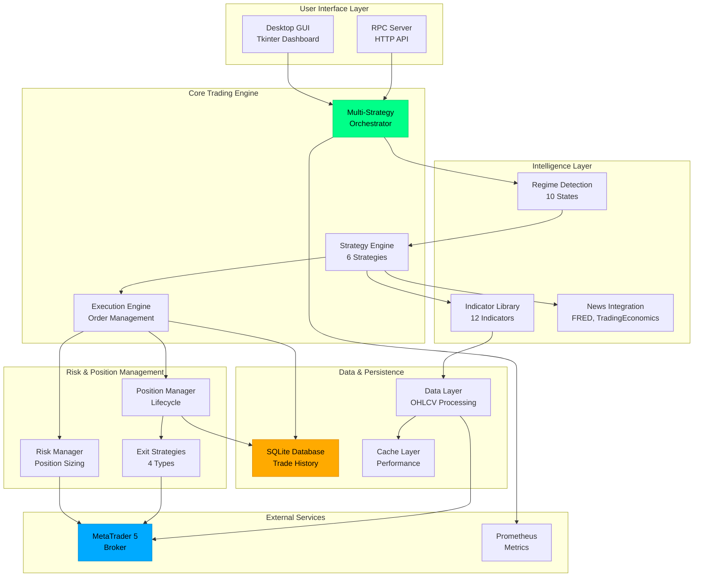

> 🧭 Interactive system map available: `docs/SYSTEM_MAP.html` (local draft in `_dev/system_map.html`)

### Component Architecture

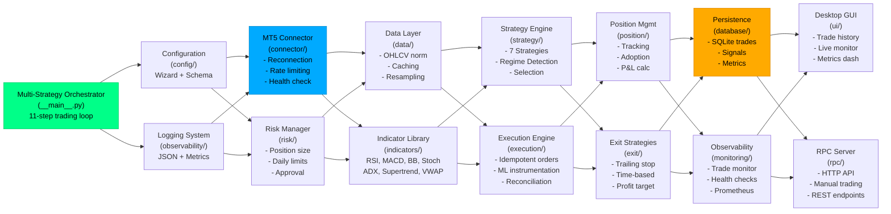

### Core Runtime Flow (strategy → execution → position → exit → persistence)

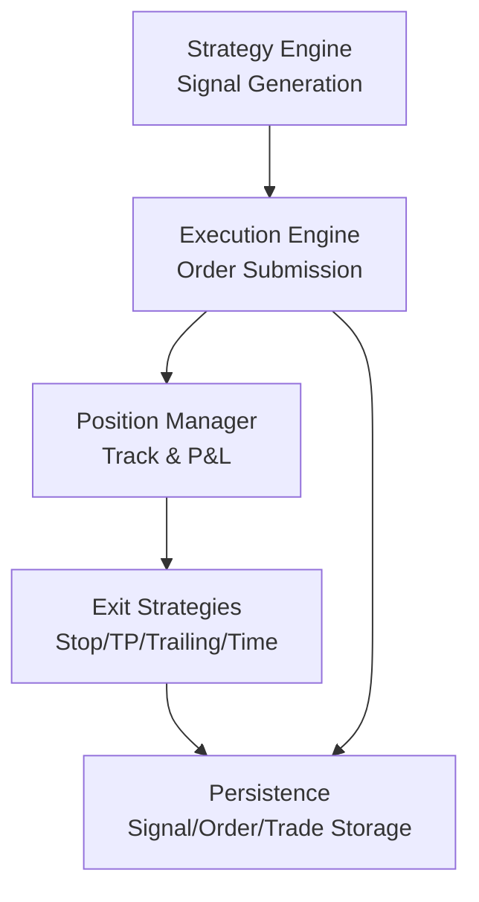

## Autonomous Trading Flow

### Trading Loop Sequence

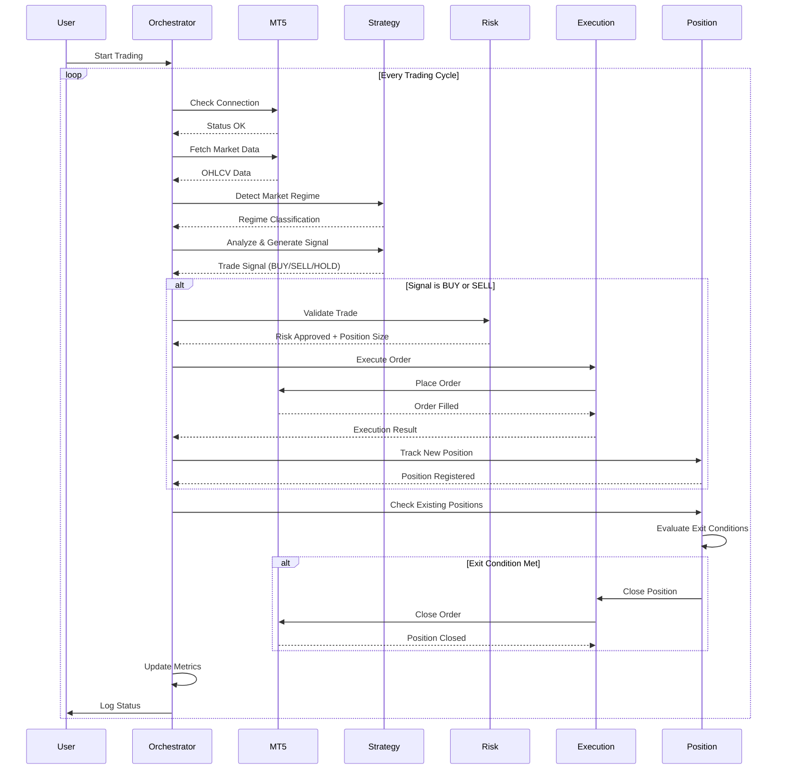

### Detailed Trading Flow

```mermaid
flowchart LR
    START([Start System])
    INIT[Initialize Components]
    CONFIG[Load Configuration]
    MT5CONN[Connect MT5]
    COMPONENTS[Setup Modules]

    LOOP_START{Main Trading Loop}
    HEALTH[Step 1: Connection Health]
    SYNC[Step 2: Position Sync]
    FETCH[Step 3: Market Data Fetch]
    IND[Step 4: Calculate Indicators]
    ENTRY[Step 5: Entry Signal]
    RISK_CHECK[Step 6: Risk Approval]
    EXECUTE[Step 7: Execute Entry]
    EXIT_CHECK[Step 8: Exit Signal Check]
    EXIT_EXEC[Step 9: Execute Exit]
    PERSIST[Step 10: Persistence & Metrics]
    SLEEP[Sleep Interval]

    SHUTDOWN[Shutdown: Close Connections & Save]
    END([End])

    START --> INIT
    INIT --> CONFIG
    CONFIG --> MT5CONN
    MT5CONN --> COMPONENTS
    COMPONENTS --> LOOP_START

    LOOP_START --> HEALTH
    HEALTH --> SYNC
    SYNC --> FETCH
    FETCH --> IND
    IND --> ENTRY
    ENTRY --> RISK_CHECK
    RISK_CHECK --> EXECUTE
    EXECUTE --> EXIT_CHECK
    EXIT_CHECK --> EXIT_EXEC
    EXIT_EXEC --> PERSIST
    PERSIST --> SLEEP
    SLEEP --> LOOP_START

    LOOP_START --> SHUTDOWN
    SHUTDOWN --> END

    style START fill:#00ff88,stroke:#00cc6a,color:#000
    style END fill:#ff4444,stroke:#cc0000,color:#fff
    style LOOP_START fill:#ffaa00,stroke:#dd8800,color:#000
```

## Data Flow

```mermaid
flowchart LR
    MT5[MT5 Terminal]
    CONN[MT5 Connector]
    DATA[Data Layer]
    IND[Indicators]
    STRAT[Strategy Engine]
    SIGNAL[Trade Signal]

    MT5 -->|Historical Data| CONN
    CONN -->|OHLCV| DATA
    DATA -->|Normalized DataFrame| IND
    IND -->|Technical Values| STRAT
    STRAT -->|Analysis| SIGNAL

    style MT5 fill:#00aaff,stroke:#0088cc,color:#000
    style SIGNAL fill:#00ff88,stroke:#00cc6a,color:#000
```

---

## Monitoring & Deployment Recommendations

**Short-term (30–60 min validation)**
- Run Cthulu locally using an aggressive mindset config and debug logging:
```bash
python -m Cthulu --config configs/mindsets/aggressive/config_aggressive_h1.json --symbol "GOLD#m" --skip-setup --no-prompt --log-level DEBUG
```
- Tail logs and watch for messages:
  - `Adopted trade:`
  - `Set SL/TP for #`
  - `SL/TP verification failed`
  - `Failed to select symbol`

**Production (recommended)**
- Containerize with Docker, expose Prometheus metrics (use `observability/prometheus.py`).
- Use orchestration (Compose/K8s) with health probes and restart policies.
- Centralized logging and alerting (Prometheus + Alertmanager; Slack/PagerDuty for critical alerts).

Choose: (A) 30–60 minute live terminal monitoring, or (B) start containerizing + add Prometheus endpoint and alert rules.

---

## Trade Decision Flow

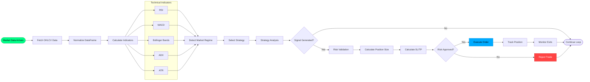

## Strategy Selection Logic

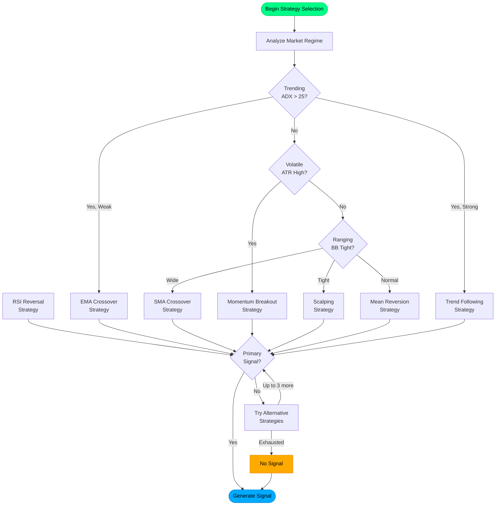

## Exit Strategy Priority Flow

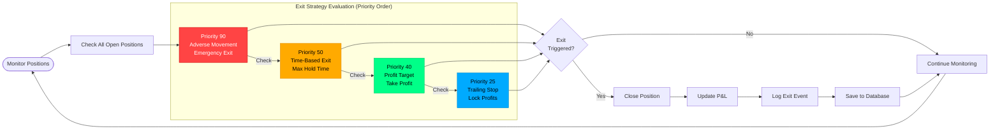

## Multi-Strategy Ensemble Architecture

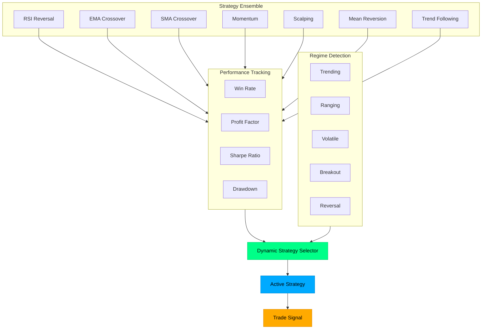

## Risk Management Flow

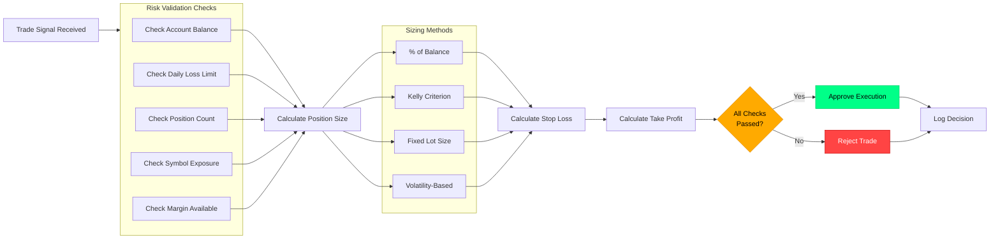

---

## Component Responsibilities

### Core Components

**MT5Connection** (`core/connection.py`)
- Establish and maintain MT5 terminal connection
- Handle reconnection logic
- Provide account and terminal information
- Manage symbol data access
- Health monitoring

**RiskManager** (`core/risk_manager.py`)
- Calculate position sizes based on risk percentage
- Compute stop loss and take profit levels
- Enforce trading limits (max positions, daily loss)
- Track daily P&L
- Validate margin requirements

**TradeManager** (`core/trade_manager.py`)
- Execute market orders (buy/sell)
- Close existing positions
- Modify position SL/TP
- Track all bot positions
- Handle order errors and retries

### Strategy Components

**BaseStrategy** (`strategies/base_strategy.py`)
- Abstract base class for all strategies
- Common functionality (data fetching, ATR calculation)
- Strategy execution framework
- Signal management

**SimpleMovingAverageCross** (`strategies/simple_ma_cross.py`)
- MA crossover signal detection
- Entry/exit logic
- Filter application
- Position management

### Utility Components

**Config** (`utils/config.py`)
- Load YAML configuration
- Access configuration values
- Validate settings
- Save configuration changes

**Logger** (`utils/logger.py`)
- Console and file logging
- Color-coded output
- Trade-specific logging
- Error tracking

## Safety Features

### Multi-Layer Risk Protection

1. Configuration Level
   - Risk per trade limit (default: 1%)
   - Max concurrent positions (default: 3)
   - Max daily loss (default: 5%)

2. Pre-Trade Checks
   - Connection validation
   - Trading hours filter
   - Spread limit check
   - Margin sufficiency
   - Account trading status

3. Position Level
   - Automatic stop loss on every trade
   - Take profit for profit targets
   - ATR-based SL sizing
   - Risk/reward ratio enforcement

4. Daily Tracking
   - Daily P&L monitoring
   - Automatic trading halt at loss limit
   - Position count enforcement

## Extensibility Points

### Adding New Strategies

```python
from strategies.base_strategy import BaseStrategy

class MyCustomStrategy(BaseStrategy):
    def analyze(self, df):
        # Your analysis logic
        return signal_dict

    def should_close_position(self, position, df):
        # Your exit logic
        return (should_close, reason)
```

### Adding New Indicators

```python
# indicators/custom.py
def my_indicator(df, period=14):
    # Calculate indicator
    return indicator_values
```

### Integration Points
- gold_standard Integration (import signals, regime detection)
- External Data Sources (sentiment, news, alternative data)
- Machine Learning (feature extraction, prediction integration)

## Testing Strategy

### Unit Tests
- Component isolation testing
- Mock MT5 API responses
- Risk calculation verification

### Integration Tests
- Full strategy execution
- Multi-component interaction
- Error handling scenarios

### Backtesting
- Historical data replay
- Performance metrics
- Optimization runs

## Deployment Architecture

```
Development Environment
├── Local Python venv
├── Demo MT5 account
├── File-based configuration
└── Console logging

Production Environment (Future)
├── Dedicated server/VPS
├── Live MT5 account
├── Database configuration
├── Remote logging (e.g., Elasticsearch)
├── Monitoring dashboard
└── Alert system
```

## Future Architecture Evolution

### Phase 2: Multi-Strategy
```
Cthulu Bot
├── Strategy Manager
│   ├── MA Crossover
│   ├── RSI + MACD
│   ├── Bollinger Breakout
│   └── Pattern Recognition
└── Regime Detector
    └── Strategy Router
```

### Phase 3: ML Integration
```
Cthulu Bot
├── Feature Engine
├── ML Model Manager
│   ├── Random Forest
│   ├── Gradient Boosting
│   └── Ensemble
└── Prediction Service
```

### Phase 4: Multi-Asset
```
Cthulu Bot
├── Asset Manager
│   ├── XAUUSD (Gold)
│   ├── EURUSD (Forex)
│   └── BTCUSD (Crypto)
├── Portfolio Manager
└── Correlation Engine
```

---

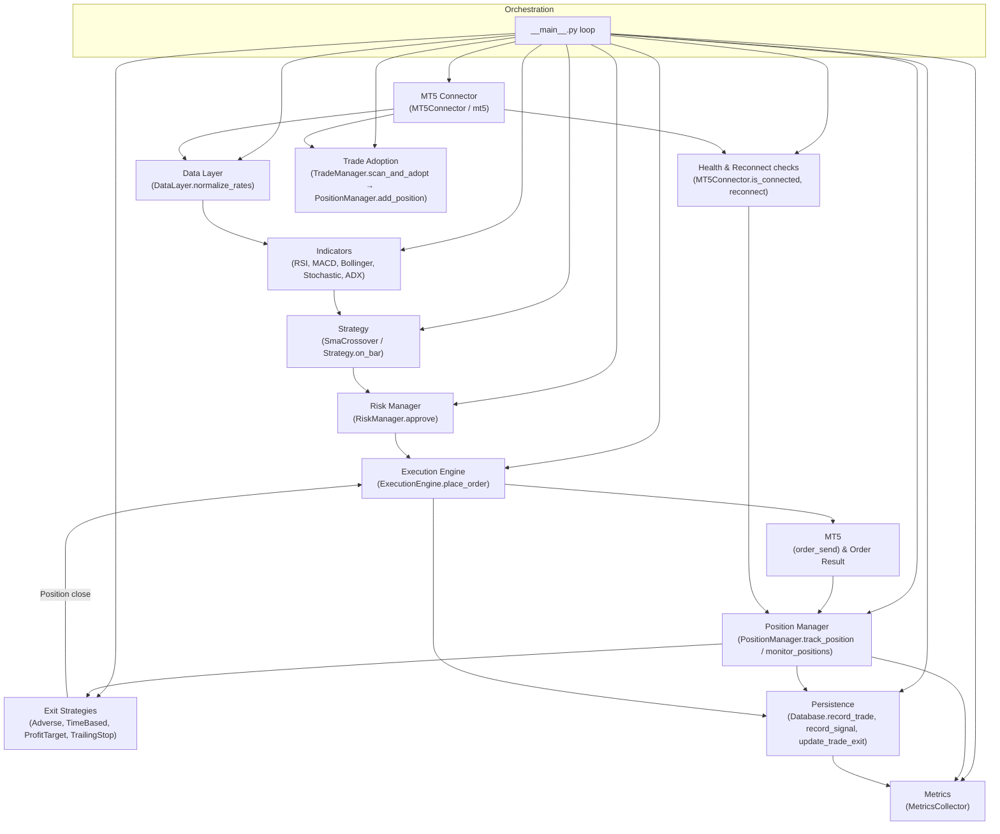

---

**Current Status:** Production-ready v5.1.0_APEX, upgrade implementation and additional research in-progess.
**Architecture:** Fully modular, extensible, enterprise-grade with 6 strategies and 12 indicators  
**Next Steps:** Performance optimization and advanced monitoring enhancements
