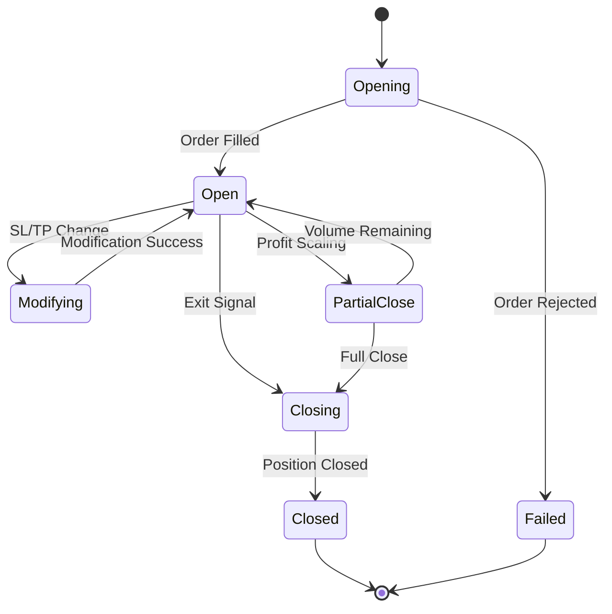
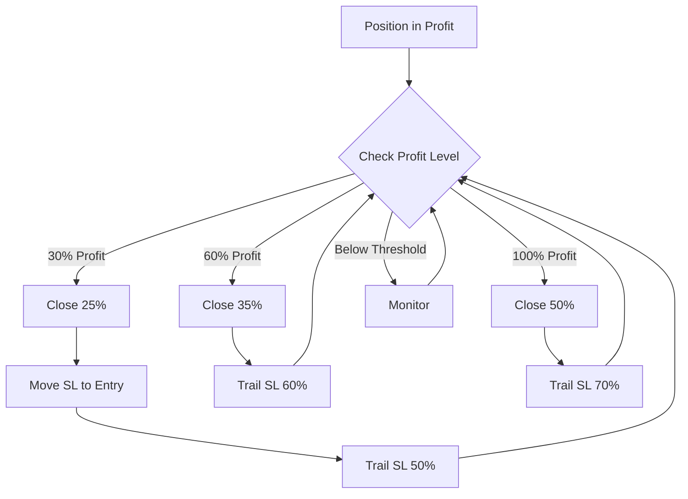
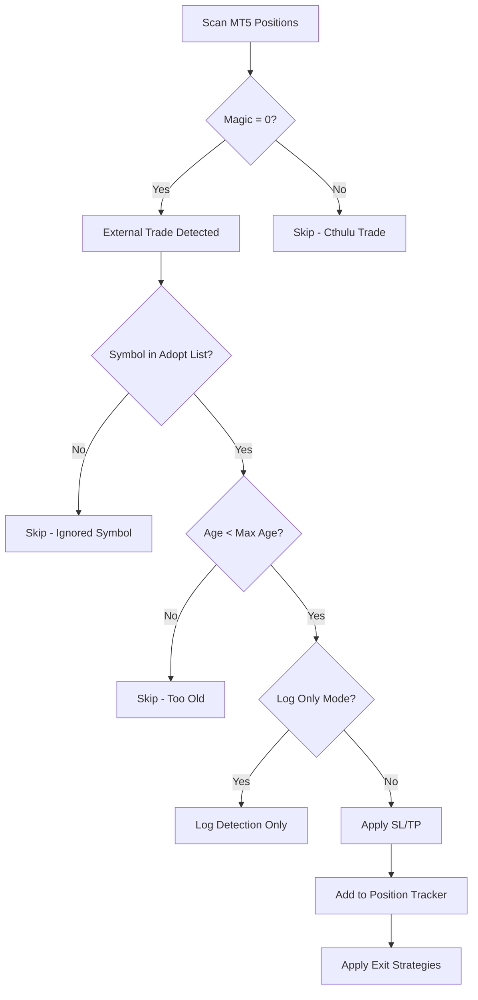

# Position Management System

## Overview

The Position Management system is responsible for the complete lifecycle of trading positions in Cthulu, from opening to closing, including sophisticated profit-taking strategies, external trade adoption, and real-time tracking.

### Key Components

- **Position Manager** (`position/manager.py`) - Central orchestrator
- **Profit Scaler** (`position/profit_scaler.py`) - Tiered profit-taking system
- **Position Lifecycle** (`position/lifecycle.py`) - State management and operations
- **Trade Adoption** (`position/adoption.py`) - External trade integration
- **Position Tracker** (`position/tracker.py`) - Real-time state tracking
- **Trade Manager** (`position/trade_manager.py`) - Trade execution coordination
- **Position Risk Manager** (`position/risk_manager.py`) - Position-level risk management

---

## Table of Contents

1. [Position Lifecycle Management](#position-lifecycle-management)
2. [Profit Scaling System](#profit-scaling-system)
3. [External Trade Adoption](#external-trade-adoption)
4. [Position Tracking](#position-tracking)
5. [Risk Management Integration](#risk-management-integration)
6. [Configuration Guide](#configuration-guide)
7. [Usage Examples](#usage-examples)
8. [Troubleshooting](#troubleshooting)

---

## Position Lifecycle Management

### Overview

The `PositionLifecycle` class manages all operations that change position state throughout its lifetime.

### Lifecycle States



### Key Operations

#### Opening a Position

```python
from position.lifecycle import PositionLifecycle

lifecycle = PositionLifecycle(
    connector=mt5_connector,
    execution_engine=execution_engine,
    position_tracker=position_tracker,
    db_handler=database
)

# Open a new position
ticket = lifecycle.open_position(
    symbol="BTCUSD#",
    order_type="buy",
    volume=0.1,
    sl=88000.0,
    tp=92000.0,
    comment="EMA Crossover Long",
    magic_number=12345,
    strategy_name="ema_crossover"
)
```

#### Modifying Position

```python
# Update stop loss
success = lifecycle.modify_position(
    ticket=ticket,
    new_sl=88500.0,
    reason="Move to breakeven"
)

# Update take profit
success = lifecycle.modify_position(
    ticket=ticket,
    new_tp=93000.0,
    reason="Extend profit target"
)
```

#### Closing Position

```python
# Close full position
success = lifecycle.close_position(
    ticket=ticket,
    reason="Profit target reached",
    close_pct=1.0  # 100%
)

# Partial close (profit scaling)
success = lifecycle.close_position(
    ticket=ticket,
    reason="Tier 1 profit taking",
    close_pct=0.25  # Close 25%
)
```

---

## Profit Scaling System

### Overview

The Profit Scaler implements a sophisticated tiered profit-taking system that:
- Takes partial profits at multiple levels
- Adapts to account size (micro vs regular accounts)
- Moves stop loss to breakeven automatically
- Trails stop loss after each tier
- Integrates with ML Tier Optimizer (optional)
- Protects against profit giveback

### How It Works



### Scaling Tiers

#### Standard Account (≥ $100)

| Tier | Profit Threshold | Close % | Move SL to Entry | Trail % |
|------|------------------|---------|------------------|---------|
| 1    | 30%              | 25%     | ✅ Yes           | 50%     |
| 2    | 60%              | 35%     | ✅ Yes           | 60%     |
| 3    | 100%             | 50%     | ✅ Yes           | 70%     |

#### Micro Account (< $100)

More aggressive profit-taking for capital preservation:

| Tier | Profit Threshold | Close % | Move SL to Entry | Trail % |
|------|------------------|---------|------------------|---------|
| 1    | 15%              | 30%     | ✅ Yes           | 40%     |
| 2    | 30%              | 40%     | ✅ Yes           | 50%     |
| 3    | 50%              | 50%     | ✅ Yes           | 60%     |

### Configuration

```json
{
  "profit_scaling": {
    "enabled": true,
    "micro_account_threshold": 100.0,
    "min_profit_amount": 0.10,
    "max_position_age_hours": 4.0,
    "emergency_lock_threshold_pct": 0.10,
    "tiers": [
      {
        "profit_threshold_pct": 0.30,
        "close_pct": 0.25,
        "move_sl_to_entry": true,
        "trail_pct": 0.50
      },
      {
        "profit_threshold_pct": 0.60,
        "close_pct": 0.35,
        "move_sl_to_entry": true,
        "trail_pct": 0.60
      },
      {
        "profit_threshold_pct": 1.00,
        "close_pct": 0.50,
        "move_sl_to_entry": true,
        "trail_pct": 0.70
      }
    ]
  }
}
```

### Usage Example

```python
from position.profit_scaler import ProfitScaler, ScalingConfig

# Initialize with custom config
config = ScalingConfig(
    enabled=True,
    micro_account_threshold=100.0,
    min_profit_amount=0.10
)

scaler = ProfitScaler(
    connector=mt5_connector,
    lifecycle=position_lifecycle,
    config=config
)

# Process position for profit scaling
position_info = {
    'ticket': 12345,
    'symbol': 'BTCUSD#',
    'volume': 0.1,
    'open_price': 89000.0,
    'current_price': 91000.0,
    'profit': 200.0,
    'sl': 88000.0,
    'tp': 93000.0
}

result = scaler.process_position(position_info, account_balance=5000.0)

if result['action_taken']:
    print(f"Scaled at tier {result['tier']}")
    print(f"Closed {result['close_pct']*100}%")
    print(f"New SL: {result['new_sl']}")
```

### ML Tier Optimizer Integration

The profit scaler can integrate with the ML Tier Optimizer to learn optimal profit-taking levels:

```python
from ML_RL.tier_optimizer import get_tier_optimizer, record_scaling_outcome

# Get ML-optimized tier
optimizer = get_tier_optimizer()
suggested_tier = optimizer.suggest_tier(
    symbol="BTCUSD#",
    current_profit_pct=0.35,
    position_age_hours=2.5,
    market_regime="TRENDING_UP"
)

# Record outcome for learning
record_scaling_outcome(
    symbol="BTCUSD#",
    tier_used=1,
    profit_at_scale=0.30,
    final_outcome=0.55,  # Total profit when position fully closed
    market_regime="TRENDING_UP"
)
```

### Emergency Profit Lock

If profit exceeds 10% of account balance, the scaler automatically locks in profits:

```python
# Emergency lock triggered
if position_profit > (account_balance * 0.10):
    # Close 50% immediately
    # Move SL to 80% profit lock
    # Alert user
```

---

## External Trade Adoption

### Overview

The Trade Adoption system allows Cthulu to detect and manage positions that were opened outside of Cthulu (manual trades, other EAs, external signals).

### How It Works



### Configuration

```json
{
  "orphan_trades": {
    "enabled": true,
    "adopt_symbols": [],
    "ignore_symbols": ["EURUSD"],
    "max_age_hours": 72,
    "log_only": false,
    "emergency_sl_pct": 0.08,
    "default_tp_risk_reward": 2.0
  }
}
```

### Configuration Options

| Parameter | Type | Default | Description |
|-----------|------|---------|-------------|
| `enabled` | bool | false | Enable external trade adoption |
| `adopt_symbols` | list | [] | Symbols to adopt (empty = all) |
| `ignore_symbols` | list | [] | Symbols to never adopt |
| `max_age_hours` | float | 72.0 | Maximum trade age to adopt |
| `log_only` | bool | false | Log detections without adopting |
| `emergency_sl_pct` | float | 0.08 | Emergency stop loss percentage |
| `default_tp_risk_reward` | float | 2.0 | Default risk:reward ratio for TP |

### Usage Example

```python
from position.adoption import TradeAdoption

adoption = TradeAdoption(
    connector=mt5_connector,
    lifecycle=position_lifecycle,
    config=adoption_config
)

# Scan for external trades
adopted_trades = adoption.scan_and_adopt()

for trade in adopted_trades:
    print(f"Adopted: {trade['symbol']} ticket {trade['ticket']}")
    print(f"Applied SL: {trade['sl']}, TP: {trade['tp']}")
```

### Testing Adoption

Use the helper script to place an external trade and test adoption:

```bash
# Place external test trade (magic number = 0)
python scripts/place_external_test_trade.py

# Run Cthulu in adopt-only mode
python -m cthulu --config config.json --adopt-only --log-level DEBUG
```

### SL/TP Application

When adopting an external trade:

1. **Calculate Risk-Appropriate SL:**
   - Use account balance and risk thresholds
   - Apply emergency_sl_pct as fallback
   - Respect symbol point size and spread

2. **Calculate TP:**
   - Use default_tp_risk_reward ratio
   - Set TP at risk_reward * sl_distance from entry

3. **Apply with Retries:**
   - Immediate retry on failure
   - Background queue for persistent failures
   - Verification after application

4. **Verification:**
   - Read position back from MT5
   - Confirm SL/TP values
   - Log verification failures
   - Emit Prometheus metric: `cthulu_sl_tp_failure_total`

### Troubleshooting Adoption

#### Trade Not Adopted

**Symptom:** External trade visible in MT5 but not adopted

**Checklist:**
- ✅ `orphan_trades.enabled` = true
- ✅ Symbol not in `ignore_symbols` list
- ✅ Trade age < `max_age_hours`
- ✅ Not in `log_only` mode
- ✅ Check logs for adoption attempt

#### SL/TP Not Applied

**Symptom:** Trade adopted but SL/TP missing

**Possible Causes:**
1. **Terminal Restrictions:**
   - AutoTrading disabled in MT5
   - EA trading not allowed for symbol
   - Trade modifications not allowed

2. **Broker Restrictions:**
   - Minimum distance not met
   - Market closed
   - Insufficient margin

3. **Technical Issues:**
   - MT5 connection lost during application
   - Request timeout
   - Invalid price levels

**Solution:**
- Enable AutoTrading in MT5 terminal
- Check symbol trading settings
- Review logs for specific error codes
- Monitor `cthulu_sl_tp_failure_total` metric
- Note: adoption now applies SL/TP directly on MT5 even if the position wasn't previously tracked; if an SL/TP is still missing, check the logs for modification failures and retry metrics

---

## Position Tracking

### Overview

The Position Tracker maintains real-time state for all open positions.

### Tracked Information

```python
@dataclass
class PositionInfo:
    ticket: int
    symbol: str
    type: str  # "buy" or "sell"
    volume: float
    open_price: float
    current_price: float
    sl: Optional[float]
    tp: Optional[float]
    profit: float
    swap: float
    commission: float
    magic_number: int
    comment: str
    open_time: datetime
    strategy_name: Optional[str]
    adopted: bool  # True if external trade
    scaling_state: Optional[dict]  # Profit scaling state
```

### Real-Time Updates

```python
from position.tracker import PositionTracker

tracker = PositionTracker(connector=mt5_connector)

# Update all positions
tracker.update_positions()

# Get specific position
position = tracker.get_position(ticket=12345)

# Get all open positions
all_positions = tracker.get_all_positions()

# Get positions by symbol
btc_positions = tracker.get_positions_by_symbol("BTCUSD#")

# Get positions by strategy
ema_positions = tracker.get_positions_by_strategy("ema_crossover")
```

### Position Reconciliation

After connection loss, positions are reconciled with MT5:

```python
# Reconcile positions
reconciled = tracker.reconcile_with_mt5()

print(f"New positions found: {len(reconciled['new'])}")
print(f"Closed positions detected: {len(reconciled['closed'])}")
print(f"Modified positions: {len(reconciled['modified'])}")
```

---

## Risk Management Integration

### Position-Level Risk Manager

The `position/risk_manager.py` module provides position-specific risk management:

```python
from position.risk_manager import suggest_sl_adjustment

# Get risk-appropriate SL suggestion
suggestion = suggest_sl_adjustment(
    account_balance=50000.0,
    proposed_sl_distance_pct=0.08,  # 8%
    entry_price=89000.0,
    symbol="BTCUSD#",
    order_side="buy"
)

print(f"Category: {suggestion['category']}")  # 'large'
print(f"Threshold: {suggestion['threshold']}")  # 0.05 (5%)
print(f"Adjusted SL: {suggestion['adjusted_sl']}")  # 84550.0
print(f"Suggested TF: {suggestion['suggested_timeframe']}")  # 'H1'
print(f"Trading Style: {suggestion['suggested_mindset']}")  # 'swing'
```

### Balance Categories

| Balance Range | Category | Max SL % | Suggested Style | Timeframes |
|---------------|----------|----------|-----------------|------------|
| ≤ $1,000 | tiny | 1% | scalping | M1, M5, M15 |
| $1,001 - $5,000 | small | 2% | scalping | M5, M15, M30 |
| $5,001 - $20,000 | medium | 5% | short-term | M15, M30, H1 |
| > $20,000 | large | 5% | swing | H1, H4, D1 |

### Integration with Execution

The execution engine automatically applies risk-adjusted SL:

```python
# Execution engine applies suggestion
order_result = execution_engine.execute_order(
    symbol="BTCUSD#",
    order_type="buy",
    volume=0.1,
    sl=proposed_sl,  # Will be adjusted by risk manager
    tp=proposed_tp
)

# Metadata includes risk adjustment info
print(order_result['risk_adjustment'])
# {
#   'original_sl': 88000.0,
#   'adjusted_sl': 84550.0,
#   'reason': 'large_account_threshold',
#   'category': 'large'
# }
```

---

## Configuration Guide

### Complete Position Management Configuration

```json
{
  "position_management": {
    "profit_scaling": {
      "enabled": true,
      "micro_account_threshold": 100.0,
      "min_profit_amount": 0.10,
      "max_position_age_hours": 4.0,
      "emergency_lock_threshold_pct": 0.10,
      "ml_optimizer_enabled": false,
      "tiers": [
        {
          "profit_threshold_pct": 0.30,
          "close_pct": 0.25,
          "move_sl_to_entry": true,
          "trail_pct": 0.50
        },
        {
          "profit_threshold_pct": 0.60,
          "close_pct": 0.35,
          "move_sl_to_entry": true,
          "trail_pct": 0.60
        },
        {
          "profit_threshold_pct": 1.00,
          "close_pct": 0.50,
          "move_sl_to_entry": true,
          "trail_pct": 0.70
        }
      ],
      "micro_tiers": [
        {
          "profit_threshold_pct": 0.15,
          "close_pct": 0.30,
          "move_sl_to_entry": true,
          "trail_pct": 0.40
        },
        {
          "profit_threshold_pct": 0.30,
          "close_pct": 0.40,
          "move_sl_to_entry": true,
          "trail_pct": 0.50
        },
        {
          "profit_threshold_pct": 0.50,
          "close_pct": 0.50,
          "move_sl_to_entry": true,
          "trail_pct": 0.60
        }
      ]
    },
    "orphan_trades": {
      "enabled": true,
      "adopt_symbols": [],
      "ignore_symbols": ["EURUSD", "GBPUSD"],
      "max_age_hours": 72.0,
      "log_only": false,
      "emergency_sl_pct": 0.08,
      "default_tp_risk_reward": 2.0
    },
    "tracking": {
      "update_interval_seconds": 5.0,
      "reconcile_on_startup": true,
      "reconcile_interval_minutes": 15.0
    }
  },
  "risk": {
    "emergency_stop_loss_pct": 8.0,
    "sl_balance_thresholds": {
      "tiny": 0.01,
      "small": 0.02,
      "medium": 0.05,
      "large": 0.05
    },
    "sl_balance_breakpoints": [1000.0, 5000.0, 20000.0]
  }
}
```

---

## Usage Examples

### Example 1: Complete Position Lifecycle

```python
from position.manager import PositionManager

# Initialize position manager
position_manager = PositionManager(
    connector=mt5_connector,
    execution_engine=execution_engine,
    database=database,
    config=config
)

# Open position
ticket = position_manager.open_position(
    symbol="BTCUSD#",
    order_type="buy",
    volume=0.1,
    strategy_name="ema_crossover"
)

# Monitor position (runs in trading loop)
while True:
    position_manager.update_all_positions()
    
    # Check for profit scaling opportunities
    position_manager.process_profit_scaling()
    
    # Check exit strategies
    exit_signals = exit_manager.check_exits(
        position_manager.get_all_positions()
    )
    
    for signal in exit_signals:
        position_manager.close_position(
            ticket=signal['ticket'],
            reason=signal['reason']
        )
    
    time.sleep(5)
```

### Example 2: External Trade Adoption

```python
# Enable adoption in config
config['orphan_trades']['enabled'] = True
config['orphan_trades']['adopt_symbols'] = ["BTCUSD#", "GOLD#m"]

# Initialize position manager
position_manager = PositionManager(...)

# Scan for external trades (run periodically or on startup)
adopted = position_manager.scan_and_adopt_external_trades()

print(f"Adopted {len(adopted)} external trades")

for trade in adopted:
    print(f"  {trade['symbol']} ticket {trade['ticket']}")
    print(f"  Applied SL: {trade['sl']}, TP: {trade['tp']}")
```

### Example 3: Custom Profit Scaling

```python
from position.profit_scaler import ProfitScaler, ScalingConfig, ScalingTier

# Define custom tiers
custom_config = ScalingConfig(
    enabled=True,
    tiers=[
        # Take 50% at 20% profit (aggressive)
        ScalingTier(
            profit_threshold_pct=0.20,
            close_pct=0.50,
            move_sl_to_entry=True,
            trail_pct=0.60
        ),
        # Take remaining 50% at 40% profit
        ScalingTier(
            profit_threshold_pct=0.40,
            close_pct=0.50,
            move_sl_to_entry=True,
            trail_pct=0.70
        )
    ]
)

scaler = ProfitScaler(
    connector=mt5_connector,
    lifecycle=lifecycle,
    config=custom_config
)

# Process positions
for position in positions:
    scaler.process_position(position, account_balance)
```

---

## Troubleshooting

### Issue: Profit Scaling Not Triggering

**Symptoms:**
- Position in profit but no partial closes
- No scaling events in logs

**Checklist:**
1. ✅ `profit_scaling.enabled` = true
2. ✅ Profit exceeds `min_profit_amount`
3. ✅ Profit percentage exceeds tier threshold
4. ✅ Position age < `max_position_age_hours`
5. ✅ Check logs for scaling evaluation

**Debug:**
```python
# Enable debug logging
import logging
logging.getLogger('position.profit_scaler').setLevel(logging.DEBUG)

# Check scaling state
state = scaler.get_position_state(ticket)
print(f"Tiers executed: {state.tiers_executed}")
print(f"Last evaluation: {state.last_evaluation_time}")
```

### Issue: Position Modifications Failing

**Symptoms:**
- SL/TP modification attempts logged but not applied
- MT5 errors in logs

**Common Causes:**
1. **Minimum Distance:** SL/TP too close to current price
2. **Market Closed:** Modifications during market close
3. **MT5 Connection:** Lost connection to MT5
4. **Invalid Levels:** SL/TP crosses spread incorrectly

**Solution:**
```python
# Check symbol info
symbol_info = connector.get_symbol_info("BTCUSD#")
print(f"Stops level: {symbol_info.trade_stops_level}")
print(f"Freeze level: {symbol_info.trade_freeze_level}")

# Calculate minimum distance
min_distance = symbol_info.trade_stops_level * symbol_info.point

# Ensure SL respects minimum distance
if order_type == "buy":
    sl = max(sl, current_price - min_distance)
else:
    sl = min(sl, current_price + min_distance)
```

### Issue: Position Reconciliation Errors

**Symptoms:**
- Positions mismatch between Cthulu and MT5
- Duplicate position tracking

**Solution:**
```python
# Force reconciliation
tracker.reconcile_with_mt5()

# Clear and rebuild position cache
tracker.clear_cache()
tracker.update_positions()

# Verify consistency
cthulu_tickets = set(p.ticket for p in tracker.get_all_positions())
mt5_tickets = set(p.ticket for p in connector.get_positions())

if cthulu_tickets != mt5_tickets:
    print(f"Mismatch detected:")
    print(f"  In Cthulu but not MT5: {cthulu_tickets - mt5_tickets}")
    print(f"  In MT5 but not Cthulu: {mt5_tickets - cthulu_tickets}")
```

---

## Performance Considerations

### Memory Usage

- Position tracker cache: ~1KB per position
- Scaling state: ~500 bytes per position
- Typical usage: < 10MB for 100 positions

### Update Frequency

- **Real-time tracking:** Every 5 seconds
- **Profit scaling evaluation:** Every loop iteration
- **Reconciliation:** Every 15 minutes

### Optimization Tips

1. **Batch Operations:**
   ```python
   # Instead of multiple single-position operations
   for ticket in tickets:
       close_position(ticket)
   
   # Use batch close if available
   close_positions_batch(tickets)
   ```

2. **Cache Position Data:**
   ```python
   # Cache symbol info to avoid repeated API calls
   symbol_cache = {}
   
   def get_cached_symbol_info(symbol):
       if symbol not in symbol_cache:
           symbol_cache[symbol] = connector.get_symbol_info(symbol)
       return symbol_cache[symbol]
   ```

3. **Async Updates:**
   ```python
   # Use async update for large position counts
   await tracker.update_positions_async()
   ```

---

## Related Documentation

- [Risk Management](RISK.md) - Position-level risk management
- [Exit Strategies](../exit/README.md) - Exit strategy system
- [Stop Loss Bug Fix](STOP_LOSS_BUG_FIX.md) - Critical fix details
- [Features Guide](FEATURES_GUIDE.md) - Profit scaling configuration
- [Architecture](ARCHITECTURE.md) - System architecture

---

## See Also

- [Advanced Risk Management](ADVANCED_RISK.md)
- [Execution Engine](../execution/README.md)
- [Database Schema](DB_MIGRATION.md)
- [Testing Guide](TESTING.md)

---

**Last Updated:** 2026-01-05  
**Version:** 5.2.33
