# 👾 Cthulu x Hektor Integration

> **Technical Integration Specification**  
> **Last Updated**: 2026-01-05  
> **Status**: IMPLEMENTED 

---

## Table of Contents

1. [Executive Summary](#executive-summary)
2. [System Overview: Cthulu](#system-overview-cthulu)
3. [System Overview: Vector Studio](#system-overview-vector-studio)
4. [Integration Architecture](#integration-architecture)
5. [Data Flow Specification](#data-flow-specification)
6. [Implementation Phases](#implementation-phases)
7. [API Contracts](#api-contracts)
8. [Performance Considerations](#performance-considerations)
9. [Risk Assessment](#risk-assessment)

---

## Executive Summary

This document specifies the technical integration between Cthulu (autonomous MT5 trading system) and Vector Studio (high-performance vector database). The integration enables semantic memory for trading decisions, pattern recognition across historical trades, and context-aware strategy selection based on similar market conditions.

### Integration Objectives

| Objective | Description | Priority |
|-----------|-------------|----------|
| **Semantic Trade Memory** | Store and retrieve trade contexts using embeddings | Critical |
| **Pattern Recognition** | Find similar historical market conditions | High |
| **Context-Aware Decisions** | Enhance cognition engine with retrieved contexts | High |
| **Training Data Export** | Export structured data for ML model training | Medium |
| **Performance Analytics** | Semantic search across performance metrics | Medium |

### Key Metrics

| Metric | Target | Rationale |
|--------|--------|-----------|
| Query Latency | < 5ms | Must not delay trading loop |
| Embedding Generation | < 10ms | Text encoding overhead |
| Storage Overhead | < 2.4 KB/vector | 512-dim float32 + metadata |
| Index Build Time | < 1s per 1000 vectors | Batch ingestion efficiency |

---

## System Overview: Cthulu

Cthulu v5.2.40 is a multi-strategy autonomous trading system for MetaTrader 5.

### Core Architecture


### Trading Pipeline (11 Steps)

1. **Market Data Ingestion** - Pull OHLCV from MT5
2. **Data Normalization** - Transform to pandas DataFrame
3. **Indicator Calculation** - RSI, MACD, ATR, ADX, Bollinger, Stochastic, Supertrend, VWAP
4. **Signal Generation** - Strategy evaluates entry conditions
5. **Entry Confluence** - Quality gate for entry timing
6. **Risk Approval** - Position sizing, exposure limits
7. **Order Execution** - Idempotent order placement
8. **Position Tracking** - Real-time P&L monitoring
9. **Exit Detection** - Priority-based exit strategy evaluation
10. **Position Close** - Execute exits, record to database
11. **Health Monitoring** - Connection recovery, metrics collection

### Data Produced by Cthulu

| Data Type | Format | Volume | Frequency |
|-----------|--------|--------|-----------|
| Trade Signals | JSON | ~100-500/day | Per bar (15-60s) |
| Executed Trades | SQLite rows | ~5-50/day | Per execution |
| Market Snapshots | DataFrame | ~5760/day | Per bar |
| Performance Metrics | JSON/CSV | ~1/hour | Periodic |
| Cognition Insights | JSON | ~100-500/day | Per signal |

---

## System Overview: Vector Studio

Vector Studio (Hecktor) is a high-performance C++ vector database with SIMD-optimized similarity search and local ONNX-based embeddings.

### Core Architecture


### Performance Characteristics

| Operation | Dataset Size | Latency | Throughput |
|-----------|-------------|---------|------------|
| Add text | 1 document | 8 ms | 125/sec |
| Search (k=10) | 100K vectors | 2 ms | 500 qps |
| Search (k=10) | 1M vectors | 3 ms | 333 qps |
| Batch ingest | 1000 docs | 12 s | 83/sec |

### Data Ingestion Capabilities

Vector Studio supports multiple data formats through its adapter system:

- **Text**: Plain text, Markdown, JSON, CSV
- **Documents**: PDF, Excel
- **Structured**: JSON Lines, tabular data

Chunking strategies: Fixed, Paragraph, Sentence, Sliding Window, Semantic, Document.

---

## Integration Architecture

### High-Level Integration


### Component Responsibilities

| Component | Location | Responsibility |
|-----------|----------|----------------|
| **VectorStudioAdapter** | `cthulu/integrations/vector_studio.py` | Connection, initialization, health checks |
| **TradeEmbedder** | `cthulu/integrations/embedder.py` | Convert trade data to text for embedding |
| **ContextRetriever** | `cthulu/integrations/retriever.py` | Query similar contexts, format results |
| **VectorStudioConfig** | `cthulu/config/vector_studio.py` | Configuration schema |

### Document Types for Trading

| Type | Content | Embedding Strategy |
|------|---------|-------------------|
| **TradeSignal** | Signal details, indicators, confidence | Full context embedding |
| **ExecutedTrade** | Entry/exit, P&L, duration, exit reason | Outcome-weighted embedding |
| **MarketSnapshot** | OHLCV, indicators, regime | Time-series embedding |
| **CognitionInsight** | Regime, prediction, sentiment | Multi-modal embedding |
| **PerformanceMetric** | Daily stats, win rate, drawdown | Metric embedding |

---

## Data Flow Specification

### Signal Storage Flow

```mermaid
sequenceDiagram
    participant TL as Trading Loop
    participant TE as TradeEmbedder
    participant VS as Vector Studio
    participant DB as SQLite
    
    TL->>TL: Generate Signal
    TL->>DB: Store signal (SQL)
    TL->>TE: Embed signal context
    TE->>TE: Format trade text
    TE->>VS: db.add_text(text, metadata)
    VS->>VS: Generate embedding
    VS->>VS: Add to HNSW index
    VS-->>TE: vector_id
    TE-->>TL: Embedding stored
```



### Context Retrieval Flow


### Text Representation Format

Trade signals and contexts are converted to natural language for embedding:

```text
[TradeSignal] Symbol: GOLD#m | Direction: LONG | Confidence: 0.82
Regime: TRENDING_BULLISH | ADX: 42.5 | RSI: 58.2
Entry Price: 2048.50 | Stop Loss: 2038.00 | Take Profit: 2068.00
Strategy: momentum_breakout | Timeframe: M15
Indicators: EMA20 above EMA50, MACD bullish crossover, Volume spike
Context: Strong uptrend with pullback to support, news sentiment positive
```

```text
[ExecutedTrade] Symbol: GOLD#m | Direction: LONG | Result: WIN
Entry: 2048.50 @ 2026-01-04T10:30:00Z
Exit: 2065.25 @ 2026-01-04T14:45:00Z | Duration: 4.25 hours
P&L: +$168.75 | Risk/Reward: 1:1.6 | Exit Reason: take_profit
Market Conditions: Trending, High volatility, Fed speech day
Lessons: Entry at support level, momentum confirmation valid
```

---

## Implementation Phases

### Phase 1: Foundation (Week 1-2)


**Deliverables:**
- `cthulu/integrations/vector_studio.py` - Adapter with connection management
- `cthulu/integrations/embedder.py` - Trade-to-text conversion
- `cthulu/config/vector_studio.py` - Pydantic config schema
- Unit tests with >80% coverage

### Phase 2: Storage Integration (Week 3)


**Deliverables:**
- Hook into `trading_loop.py` for signal storage
- Hook into `execution/engine.py` for trade completion
- Migration script for historical trades
- Verification suite

### Phase 3: Retrieval Integration (Week 4-5)


**Deliverables:**
- `cthulu/integrations/retriever.py` - Context retrieval
- Modified `cognition/engine.py` with semantic memory
- Modified `cognition/entry_confluence.py` with historical context
- Performance benchmarks

### Phase 4: Production Hardening (Week 6)

**Deliverables:**
- Connection resilience (retry, fallback)
- Graceful degradation (system works without Vector Studio)
- Monitoring and alerting
- Documentation and runbooks

---

## API Contracts

### VectorStudioAdapter

```python
class VectorStudioAdapter:
    """Manages connection to Vector Studio database."""
    
    def __init__(self, config: VectorStudioConfig):
        """Initialize adapter with configuration."""
        pass
    
    def connect(self) -> bool:
        """Establish connection to Vector Studio."""
        pass
    
    def is_healthy(self) -> bool:
        """Check database health."""
        pass
    
    def store_signal(self, signal: Signal, context: dict) -> Optional[int]:
        """
        Store a trading signal with context.
        
        Args:
            signal: Trading signal dataclass
            context: Additional context (indicators, regime, etc.)
        
        Returns:
            Vector ID if successful, None otherwise
        """
        pass
    
    def store_trade(self, trade: Trade, outcome: dict) -> Optional[int]:
        """
        Store a completed trade with outcome.
        
        Args:
            trade: Completed trade record
            outcome: Trade outcome (P&L, duration, exit reason)
        
        Returns:
            Vector ID if successful, None otherwise
        """
        pass
    
    def find_similar_contexts(
        self, 
        query: str, 
        k: int = 10,
        min_score: float = 0.7,
        filters: Optional[dict] = None
    ) -> List[SimilarContext]:
        """
        Find similar historical contexts.
        
        Args:
            query: Current context as text
            k: Number of results
            min_score: Minimum similarity score
            filters: Metadata filters (symbol, date range, etc.)
        
        Returns:
            List of similar contexts with scores
        """
        pass
    
    def close(self):
        """Close connection gracefully."""
        pass
```

### TradeEmbedder

```python
class TradeEmbedder:
    """Converts trading data to embeddable text."""
    
    def signal_to_text(self, signal: Signal, indicators: dict, regime: str) -> str:
        """Convert a signal to natural language text."""
        pass
    
    def trade_to_text(self, trade: Trade, outcome: dict) -> str:
        """Convert a completed trade to natural language text."""
        pass
    
    def market_snapshot_to_text(self, df: pd.DataFrame, symbol: str) -> str:
        """Convert market data to natural language text."""
        pass
    
    def build_query(self, current_state: dict) -> str:
        """Build a query from current market state."""
        pass
```

### ContextRetriever

```python
@dataclass
class SimilarContext:
    """A retrieved similar historical context."""
    vector_id: int
    score: float
    content: str
    metadata: dict
    trade_outcome: Optional[str]  # WIN, LOSS, BREAKEVEN
    pnl: Optional[float]

class ContextRetriever:
    """Retrieves relevant historical contexts for decision-making."""
    
    def __init__(self, adapter: VectorStudioAdapter, embedder: TradeEmbedder):
        pass
    
    def get_similar_signals(
        self, 
        current_signal: Signal,
        indicators: dict,
        regime: str,
        k: int = 5
    ) -> List[SimilarContext]:
        """Find similar historical signals and their outcomes."""
        pass
    
    def get_regime_contexts(
        self,
        regime: str,
        symbol: str,
        k: int = 10
    ) -> List[SimilarContext]:
        """Find contexts from similar market regimes."""
        pass
    
    def get_pattern_matches(
        self,
        pattern_description: str,
        timeframe: str,
        k: int = 5
    ) -> List[SimilarContext]:
        """Find trades with similar chart patterns."""
        pass
    
    def format_context_window(
        self,
        contexts: List[SimilarContext],
        max_tokens: int = 2000
    ) -> str:
        """Format contexts into a context window for cognition."""
        pass
```

### Configuration Schema

```python
class VectorStudioConfig(BaseModel):
    """Configuration for Vector Studio integration."""
    
    enabled: bool = True
    database_path: str = "./vectors/cthulu_memory"
    dimension: int = 512
    
    # HNSW parameters
    hnsw_m: int = 16
    hnsw_ef_construction: int = 200
    hnsw_ef_search: int = 50
    
    # Retrieval parameters
    default_k: int = 10
    min_similarity_score: float = 0.7
    max_context_age_days: int = 90
    
    # Performance
    batch_size: int = 100
    async_writes: bool = True
    cache_embeddings: bool = True
    
    # Resilience
    connection_timeout_ms: int = 5000
    retry_attempts: int = 3
    fallback_on_failure: bool = True
```

---

## Performance Considerations

### Latency Budget

The trading loop runs every 15-60 seconds. Vector operations must not delay critical paths.

| Operation | Budget | Strategy |
|-----------|--------|----------|
| Signal storage | < 20ms | Async write, fire-and-forget |
| Trade storage | < 20ms | Async write, batch option |
| Context retrieval | < 10ms | Sync, HNSW guarantees O(log n) |
| Embedding generation | < 10ms | Local ONNX, pre-loaded model |

### Optimization Strategies

1. **Async Writes**: Signal and trade storage use fire-and-forget pattern
2. **Batching**: Multiple signals batched before write
3. **Caching**: Hot embeddings cached in memory
4. **Pre-filtering**: Use metadata filters to reduce search space
5. **Index Partitioning**: Separate indices by symbol or timeframe

### Memory Footprint

| Component | Memory | Notes |
|-----------|--------|-------|
| ONNX Runtime | ~200 MB | MiniLM model loaded once |
| HNSW Index (100K vectors) | ~24 MB | 200 bytes/vector overhead |
| Vector Storage (100K vectors) | ~200 MB | 2 KB/vector |
| Metadata Cache | ~10 MB | Hot metadata |
| **Total (100K vectors)** | **~450 MB** | Acceptable for trading server |

### Scaling Considerations

| Scale | Vectors | Storage | Search Latency |
|-------|---------|---------|----------------|
| Small | 10K | ~25 MB | < 1 ms |
| Medium | 100K | ~250 MB | < 2 ms |
| Large | 1M | ~2.5 GB | < 3 ms |
| Enterprise | 10M | ~25 GB | < 5 ms |

Cthulu generates approximately 500 signals/day. At this rate:
- 1 year = 182K vectors (~450 MB)
- 5 years = 912K vectors (~2.2 GB)

---

## Risk Assessment

### Technical Risks

| Risk | Impact | Mitigation |
|------|--------|------------|
| Vector Studio unavailable | Trading continues without semantic memory | Graceful fallback, system works standalone |
| Embedding model drift | Similarity scores become unreliable | Version embeddings, periodic re-indexing |
| Index corruption | Historical context lost | Regular backups, transaction logging |
| Memory exhaustion | System crash | Memory limits, old vector pruning |
| Latency spikes | Trading loop delayed | Async writes, timeouts, circuit breaker |

### Operational Risks

| Risk | Impact | Mitigation |
|------|--------|------------|
| Stale contexts | Irrelevant recommendations | Time-decay scoring, max age filter |
| Overfitting to history | Poor generalization | Diversity sampling, regime filtering |
| Cold start | No historical context | Bootstrap with simulated/backtested trades |

### Fallback Behavior

When Vector Studio is unavailable:

1. **Signal Storage**: Queued locally, batch-written when available
2. **Context Retrieval**: Returns empty context, cognition uses defaults
3. **Trade Storage**: Queued with timeout, eventual consistency
4. **Health Checks**: Automatic reconnection attempts

```python
# Example fallback in cognition engine
def enhance_signal(self, signal: Signal) -> Signal:
    try:
        contexts = self.retriever.get_similar_signals(signal, timeout_ms=10)
        if contexts:
            signal = self._apply_context_adjustments(signal, contexts)
    except VectorStudioError:
        # Graceful degradation - continue without semantic memory
        self.logger.warning("Vector Studio unavailable, using default cognition")
    
    return signal
```

---

## Appendix

### Directory Structure

```
cthulu/
├── integrations/
│   ├── __init__.py
│   ├── vector_studio.py      # VectorStudioAdapter
│   ├── embedder.py           # TradeEmbedder
│   ├── retriever.py          # ContextRetriever
│   └── schemas.py            # Integration dataclasses
├── config/
│   └── vector_studio.py      # VectorStudioConfig
└── tests/
    └── integrations/
        ├── test_vector_studio.py
        ├── test_embedder.py
        └── test_retriever.py
```

### Dependencies

```txt
# requirements.txt additions
pyvdb>=1.0.0        # Vector Studio Python bindings
onnxruntime>=1.17   # Local embedding inference
```

### Environment Variables

```bash
# Vector Studio integration
CTHULU_VECTOR_STUDIO_ENABLED=true
CTHULU_VECTOR_STUDIO_PATH=./vectors/cthulu_memory
CTHULU_VECTOR_STUDIO_DIMENSION=512
```

---

**Document Status**: Ready for implementation  
**Next Steps**: Phase 1 implementation kickoff  
**Owner**: Cthulu Development Team
