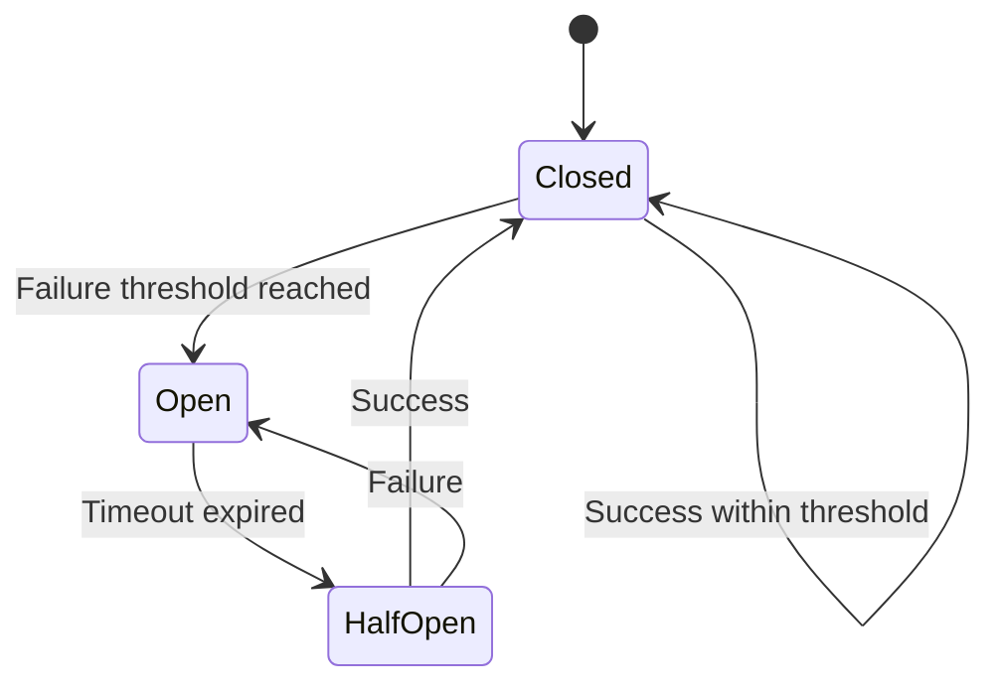

# Utility Modules

## Overview

The utility modules provide critical infrastructure components that support reliability, performance, and fault tolerance throughout the Cthulu trading system.

### Available Utilities

- **Circuit Breaker** (`utils/circuit_breaker.py`) - Fault tolerance pattern
- **Rate Limiter** (`utils/rate_limiter.py`) - Request throttling and protection
- **Cache** (`utils/cache.py`) - Smart caching with TTL and LRU
- **Health Monitor** (`utils/health_monitor.py`) - System health tracking
- **Retry Logic** (`utils/retry.py`) - Exponential backoff retry mechanism

---

## Table of Contents

1. [Circuit Breaker](#circuit-breaker)
2. [Rate Limiter](#rate-limiter)
3. [Cache System](#cache-system)
4. [Health Monitor](#health-monitor)
5. [Retry Logic](#retry-logic)
6. [Configuration Examples](#configuration-examples)
7. [Best Practices](#best-practices)

---

## Circuit Breaker

### Overview

The Circuit Breaker pattern prevents cascading failures by detecting faults and temporarily disabling failing components.

### States



### State Descriptions

| State | Description | Behavior |
|-------|-------------|----------|
| **Closed** | Normal operation | All requests allowed through |
| **Open** | Circuit tripped | All requests fail immediately |
| **Half-Open** | Testing recovery | Limited requests allowed to test |

### Usage

```python
from utils.circuit_breaker import CircuitBreaker

# Initialize circuit breaker
breaker = CircuitBreaker(
    name="mt5_connector",
    failure_threshold=5,      # Open after 5 failures
    timeout_seconds=60,       # Try recovery after 60s
    half_open_max_calls=3     # Test with 3 calls
)

# Protect function calls
@breaker.protect
def connect_to_mt5():
    return mt5.initialize()

# Or use context manager
try:
    with breaker:
        result = risky_operation()
except CircuitBreakerOpenError:
    logger.warning("Circuit breaker is open, skipping operation")
```

### Configuration

```python
from utils.circuit_breaker import CircuitBreaker, CircuitBreakerConfig

config = CircuitBreakerConfig(
    failure_threshold=5,        # Failures before opening
    timeout_seconds=60,         # Time to wait before half-open
    half_open_max_calls=3,      # Test calls in half-open state
    expected_exception=None,    # Specific exception to catch (None = all)
    reset_timeout_on_success=True  # Reset failure count on success
)

breaker = CircuitBreaker(name="api_calls", config=config)
```

### Monitoring

```python
# Get circuit breaker state
state = breaker.state  # "closed", "open", "half_open"
failures = breaker.failure_count
last_failure = breaker.last_failure_time

# Reset manually if needed
breaker.reset()

# Check state before operations
if breaker.is_closed():
    # Safe to proceed
    execute_operation()
```

### Use Cases in Cthulu

1. **MT5 Connection Protection:**
   ```python
   mt5_breaker = CircuitBreaker("mt5_connection", failure_threshold=3)
   
   @mt5_breaker.protect
   def get_market_data(symbol):
       return connector.get_rates(symbol)
   ```

2. **External API Protection:**
   ```python
   news_api_breaker = CircuitBreaker("news_api", timeout_seconds=300)
   
   @news_api_breaker.protect
   def fetch_news():
       return news_adapter.fetch_latest()
   ```

3. **Database Operation Protection:**
   ```python
   db_breaker = CircuitBreaker("database", failure_threshold=10)
   
   @db_breaker.protect
   def save_trade(trade_data):
       return database.insert_trade(trade_data)
   ```

---

## Rate Limiter

### Overview

Rate limiters control request frequency to prevent overwhelming external services, protect against abuse, and ensure fair resource usage.

### Algorithms

#### 1. Token Bucket

Best for: Bursty traffic with average rate control

```python
from utils.rate_limiter import TokenBucketRateLimiter

limiter = TokenBucketRateLimiter(
    rate=10,           # 10 tokens per second
    capacity=20,       # Bucket capacity (burst allowance)
    token_refill_rate=10  # Tokens added per second
)

if limiter.allow_request():
    execute_request()
else:
    wait_time = limiter.wait_time()
    time.sleep(wait_time)
```

#### 2. Sliding Window

Best for: Precise rate limiting without burst allowance

```python
from utils.rate_limiter import SlidingWindowRateLimiter

limiter = SlidingWindowRateLimiter(
    max_requests=60,      # Max requests
    window_seconds=60     # Per 60 seconds
)

if limiter.allow_request():
    execute_request()
```

#### 3. Leaky Bucket

Best for: Smoothing traffic to constant rate

```python
from utils.rate_limiter import LeakyBucketRateLimiter

limiter = LeakyBucketRateLimiter(
    leak_rate=5,          # 5 requests per second
    capacity=30           # Queue capacity
)

if limiter.allow_request():
    execute_request()
```

### Configuration

```python
from utils.rate_limiter import RateLimiterConfig

config = RateLimiterConfig(
    algorithm="token_bucket",  # or "sliding_window", "leaky_bucket"
    rate=10,
    capacity=20,
    burst_allowed=True,
    per_client=False  # Global or per-client limiting
)
```

### Use Cases in Cthulu

#### 1. MT5 API Rate Limiting

```python
# Protect MT5 API from excessive calls
mt5_limiter = TokenBucketRateLimiter(rate=50, capacity=100)

def get_rates_safe(symbol, timeframe, count):
    if not mt5_limiter.allow_request():
        time.sleep(mt5_limiter.wait_time())
    return connector.get_rates(symbol, timeframe, count)
```

#### 2. RPC Server Rate Limiting

```python
# Per-client rate limiting for RPC endpoints
rpc_limiter = SlidingWindowRateLimiter(
    max_requests=60,  # 60 requests
    window_seconds=60  # Per minute
)

@app.route('/trade', methods=['POST'])
def place_trade():
    client_ip = request.remote_addr
    
    if not rpc_limiter.allow_request(client_id=client_ip):
        return jsonify({"error": "Rate limit exceeded"}), 429
    
    # Process trade request
    ...
```

#### 3. News API Rate Limiting

```python
# Protect external news API
news_limiter = TokenBucketRateLimiter(rate=10, capacity=20)

def fetch_news():
    if not news_limiter.allow_request():
        logger.info("Rate limit reached, waiting...")
        time.sleep(news_limiter.wait_time())
    
    return news_api.fetch()
```

### Advanced Features

#### Per-Key Rate Limiting

```python
from utils.rate_limiter import MultiKeyRateLimiter

limiter = MultiKeyRateLimiter(
    rate=10,
    capacity=20,
    cleanup_interval=300  # Clean up old keys every 5 minutes
)

# Different limits per user/client/resource
if limiter.allow_request(key=user_id):
    process_request()
```

#### Adaptive Rate Limiting

```python
from utils.rate_limiter import AdaptiveRateLimiter

limiter = AdaptiveRateLimiter(
    base_rate=10,
    min_rate=5,
    max_rate=50,
    adjustment_factor=0.1  # Adjust by 10% based on load
)

# Automatically adjusts rate based on system load
limiter.adjust_for_load(current_cpu=0.8, current_memory=0.6)
```

---

## Cache System

### Overview

Smart caching system with TTL (Time To Live) and LRU (Least Recently Used) eviction policies.

### Basic Usage

```python
from utils.cache import SmartCache

cache = SmartCache(
    max_size=1000,        # Maximum cached items
    default_ttl=300       # Default TTL in seconds (5 minutes)
)

# Store value
cache.set("BTCUSD_H1_data", market_data, ttl=600)

# Retrieve value
data = cache.get("BTCUSD_H1_data")

if data is None:
    # Cache miss - fetch and cache
    data = fetch_market_data()
    cache.set("BTCUSD_H1_data", data)
```

### Advanced Features

#### Time-Based Expiration

```python
from datetime import timedelta

cache = SmartCache()

# Cache with specific TTL
cache.set("temp_data", value, ttl=60)  # 60 seconds

# Cache with timedelta
cache.set("hourly_data", value, ttl=timedelta(hours=1))

# No expiration
cache.set("permanent_data", value, ttl=None)
```

#### Cache Invalidation

```python
# Invalidate specific key
cache.delete("BTCUSD_H1_data")

# Invalidate by pattern
cache.delete_pattern("BTCUSD_*")

# Clear all cache
cache.clear()

# Invalidate expired entries
expired_count = cache.cleanup_expired()
```

#### Cache Statistics

```python
stats = cache.get_stats()

print(f"Hit rate: {stats['hit_rate']:.2%}")
print(f"Total gets: {stats['total_gets']}")
print(f"Total hits: {stats['hits']}")
print(f"Total misses: {stats['misses']}")
print(f"Current size: {stats['current_size']}/{stats['max_size']}")
```

### Use Cases in Cthulu

#### 1. Market Data Caching

```python
market_data_cache = SmartCache(max_size=100, default_ttl=60)

def get_market_data_cached(symbol, timeframe):
    cache_key = f"{symbol}_{timeframe}"
    
    data = market_data_cache.get(cache_key)
    if data is not None:
        return data
    
    # Fetch from MT5
    data = connector.get_rates(symbol, timeframe, 500)
    market_data_cache.set(cache_key, data, ttl=60)
    
    return data
```

#### 2. Indicator Caching

```python
indicator_cache = SmartCache(max_size=200, default_ttl=300)

def calculate_rsi_cached(symbol, period=14):
    cache_key = f"RSI_{symbol}_{period}"
    
    rsi = indicator_cache.get(cache_key)
    if rsi is not None:
        return rsi
    
    # Calculate RSI
    data = get_market_data(symbol)
    rsi = calculate_rsi(data, period)
    indicator_cache.set(cache_key, rsi, ttl=300)
    
    return rsi
```

#### 3. Configuration Caching

```python
config_cache = SmartCache(max_size=50, default_ttl=None)  # No expiration

def get_config_cached(key):
    value = config_cache.get(key)
    if value is None:
        value = load_config(key)
        config_cache.set(key, value)
    return value
```

---

## Health Monitor

### Overview

System health monitoring tracks component status and provides health checks for observability.

### Usage

```python
from utils.health_monitor import HealthMonitor, HealthStatus

monitor = HealthMonitor()

# Register components
monitor.register_component("mt5_connector")
monitor.register_component("database")
monitor.register_component("rpc_server")

# Update component health
monitor.update_health("mt5_connector", HealthStatus.HEALTHY, "Connected")
monitor.update_health("database", HealthStatus.DEGRADED, "Slow queries")
monitor.update_health("rpc_server", HealthStatus.UNHEALTHY, "Connection timeout")

# Get overall health
overall = monitor.get_overall_health()
# {"status": "DEGRADED", "components": {...}}

# Get specific component
mt5_health = monitor.get_component_health("mt5_connector")
# {"status": "HEALTHY", "message": "Connected", "last_check": "2026-01-05T10:30:00"}
```

### Health Status Levels

| Status | Description | Recommended Action |
|--------|-------------|-------------------|
| **HEALTHY** | Component operating normally | Continue monitoring |
| **DEGRADED** | Component functional but impaired | Investigate and monitor |
| **UNHEALTHY** | Component not functioning | Immediate intervention required |
| **UNKNOWN** | Component status unknown | Check connectivity |

### Health Check Endpoints

```python
# For RPC/HTTP servers
@app.route('/health')
def health_check():
    health = monitor.get_overall_health()
    
    status_code = 200
    if health['status'] == 'UNHEALTHY':
        status_code = 503
    elif health['status'] == 'DEGRADED':
        status_code = 200  # Still serving requests
    
    return jsonify(health), status_code

@app.route('/health/<component>')
def component_health(component):
    health = monitor.get_component_health(component)
    return jsonify(health)
```

### Use Cases in Cthulu

```python
# Initialize health monitor
health_monitor = HealthMonitor()

# Register all major components
health_monitor.register_component("mt5_connector")
health_monitor.register_component("execution_engine")
health_monitor.register_component("position_manager")
health_monitor.register_component("database")
health_monitor.register_component("strategy_selector")

# Update health in trading loop
def trading_loop():
    while True:
        try:
            # Check MT5 connection
            if connector.is_connected():
                health_monitor.update_health(
                    "mt5_connector", 
                    HealthStatus.HEALTHY,
                    "Connected"
                )
            else:
                health_monitor.update_health(
                    "mt5_connector",
                    HealthStatus.UNHEALTHY,
                    "Disconnected"
                )
            
            # Execute trading logic
            # ...
            
        except Exception as e:
            health_monitor.update_health(
                "execution_engine",
                HealthStatus.UNHEALTHY,
                str(e)
            )
```

---

## Retry Logic

### Overview

Exponential backoff retry mechanism for handling transient failures.

### Basic Usage

```python
from utils.retry import retry_with_backoff

@retry_with_backoff(
    max_attempts=3,
    base_delay=1.0,
    max_delay=30.0,
    exponential_base=2.0
)
def fetch_data_from_api():
    response = requests.get("https://api.example.com/data")
    response.raise_for_status()
    return response.json()

# Function will retry up to 3 times with exponential backoff:
# Attempt 1: Immediate
# Attempt 2: Wait 1 second (1.0 * 2^0)
# Attempt 3: Wait 2 seconds (1.0 * 2^1)
# Attempt 4: Wait 4 seconds (1.0 * 2^2)
```

### Configuration

```python
from utils.retry import RetryConfig, retry_with_config

config = RetryConfig(
    max_attempts=5,
    base_delay=1.0,
    max_delay=60.0,
    exponential_base=2.0,
    jitter=True,  # Add randomness to prevent thundering herd
    retry_on=[ConnectionError, TimeoutError],  # Specific exceptions
    on_retry=lambda attempt, delay: logger.info(f"Retry {attempt} after {delay}s")
)

@retry_with_config(config)
def connect_to_service():
    return service.connect()
```

### Advanced Usage

```python
from utils.retry import RetryableOperation

# Manual retry control
operation = RetryableOperation(
    max_attempts=3,
    base_delay=1.0
)

for attempt in operation:
    try:
        result = risky_function()
        operation.succeed(result)  # Mark as successful
        break
    except TemporaryError as e:
        operation.fail(e)  # Will retry
    except PermanentError as e:
        operation.abort(e)  # No retry

# Get final result or raise exception
result = operation.get_result()
```

### Use Cases in Cthulu

#### 1. MT5 Connection Retry

```python
@retry_with_backoff(max_attempts=5, base_delay=2.0)
def connect_mt5():
    if not mt5.initialize():
        raise ConnectionError("MT5 initialization failed")
    
    if not mt5.login(login, password, server):
        raise ConnectionError("MT5 login failed")
    
    return True
```

#### 2. Database Operation Retry

```python
@retry_with_backoff(
    max_attempts=3,
    retry_on=[sqlite3.OperationalError]
)
def save_trade_to_db(trade_data):
    return database.insert_trade(trade_data)
```

#### 3. SL/TP Application Retry

```python
@retry_with_backoff(max_attempts=5, base_delay=0.5, max_delay=5.0)
def apply_sl_tp(ticket, sl, tp):
    result = mt5.order_modify(
        ticket=ticket,
        sl=sl,
        tp=tp
    )
    
    if not result:
        error = mt5.last_error()
        raise RuntimeError(f"SL/TP modification failed: {error}")
    
    return result
```

---

## Configuration Examples

### Complete Utility Configuration

```json
{
  "utilities": {
    "circuit_breaker": {
      "mt5_connector": {
        "failure_threshold": 5,
        "timeout_seconds": 60,
        "half_open_max_calls": 3
      },
      "news_api": {
        "failure_threshold": 3,
        "timeout_seconds": 300,
        "half_open_max_calls": 2
      }
    },
    "rate_limiter": {
      "mt5_api": {
        "algorithm": "token_bucket",
        "rate": 50,
        "capacity": 100
      },
      "rpc_server": {
        "algorithm": "sliding_window",
        "max_requests": 60,
        "window_seconds": 60
      }
    },
    "cache": {
      "market_data": {
        "max_size": 100,
        "default_ttl": 60
      },
      "indicators": {
        "max_size": 200,
        "default_ttl": 300
      }
    },
    "retry": {
      "mt5_operations": {
        "max_attempts": 5,
        "base_delay": 1.0,
        "max_delay": 30.0,
        "exponential_base": 2.0,
        "jitter": true
      }
    }
  }
}
```

---

## Best Practices

### Circuit Breaker Best Practices

1. **Set Appropriate Thresholds:**
   - Too low: Unnecessary circuit opens
   - Too high: Delayed failure detection
   - Recommended: 3-5 failures

2. **Choose Timeout Wisely:**
   - Consider service recovery time
   - Balance between resilience and availability
   - Recommended: 30-120 seconds

3. **Monitor Circuit State:**
   - Log all state transitions
   - Alert on circuit opens
   - Track failure patterns

### Rate Limiter Best Practices

1. **Choose Right Algorithm:**
   - Token bucket: Bursty traffic
   - Sliding window: Precise limits
   - Leaky bucket: Smooth traffic

2. **Set Reasonable Limits:**
   - Based on service capacity
   - Consider peak vs average load
   - Leave safety margin

3. **Handle Rate Limit Errors:**
   - Return appropriate HTTP status (429)
   - Include Retry-After header
   - Implement client-side backoff

### Cache Best Practices

1. **Set Appropriate TTL:**
   - Balance freshness vs performance
   - Consider data volatility
   - Market data: 30-60s
   - Config data: No expiration

2. **Monitor Cache Performance:**
   - Track hit rate (target: >80%)
   - Monitor cache size
   - Identify hot keys

3. **Invalidation Strategy:**
   - Explicit invalidation for important updates
   - Pattern-based for related data
   - Time-based for others

### Health Monitor Best Practices

1. **Check Frequently:**
   - Critical components: Every 5-10s
   - Secondary components: Every 30-60s

2. **Define Clear Thresholds:**
   - HEALTHY: < 100ms response, < 70% CPU
   - DEGRADED: < 500ms response, < 90% CPU
   - UNHEALTHY: > 500ms or > 90% CPU

3. **Expose Health Endpoints:**
   - `/health` for overall status
   - `/health/<component>` for specific components
   - Include response times in output

### Retry Best Practices

1. **Retry Only Transient Errors:**
   - Network errors: YES
   - Timeouts: YES
   - Rate limits: YES
   - Authentication errors: NO
   - Validation errors: NO

2. **Limit Retry Attempts:**
   - 3-5 attempts for most operations
   - Longer for critical operations
   - No retries for idempotency concerns

3. **Use Exponential Backoff:**
   - Base delay: 1-2 seconds
   - Max delay: 30-60 seconds
   - Add jitter to prevent thundering herd

---

## Related Documentation

- [Performance Tuning](PERFORMANCE_TUNING.md) - Optimization strategies
- [Security](SECURITY.md) - Security best practices
- [Observability](OBSERVABILITY.md) - Monitoring and metrics
- [Architecture](ARCHITECTURE.md) - System architecture

---

**Last Updated:** 2026-01-05  
**Version:** 5.2.33
