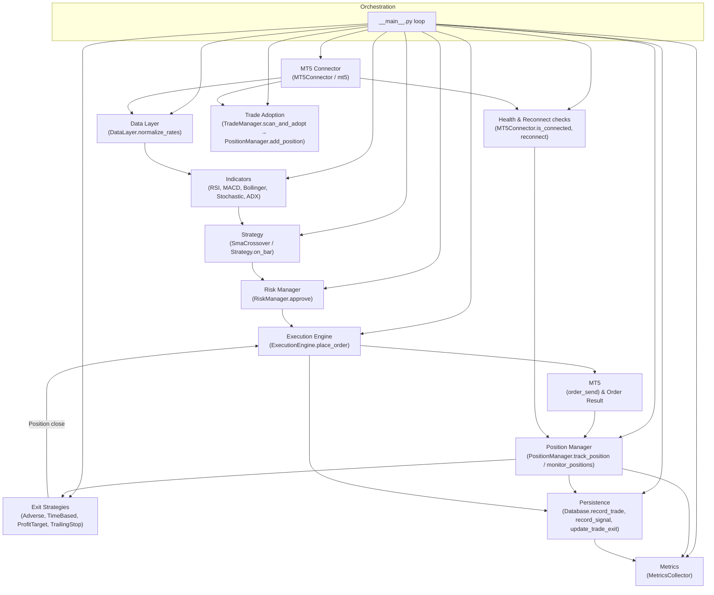

# Herald Architecture Overview
**Version 5.0.0 - Phase 4: Enhanced Multi-Strategy Autonomous Trading**

## System Architecture (Phase 4)

```
┌─────────────────────────────────────────────────────────────────────┐
│                 Multi-Strategy Orchestrator                         │
│                         (__main__.py)                               │
│  11-step trading loop: Connect → Detect Regime → Select Strategy → │
│  Analyze → Decide → Execute → Track → Exit → Learn → Monitor       │
└────────────────────────────────┬────────────────────────────────────┘
                                 │
                ┌────────────────┴────────────────┐
                │                                 │
                ▼                                 ▼
    ┌───────────────────┐           ┌───────────────────┐
    │   Configuration   │           │   Logging System  │
    │   (config/)       │           │  (observability/) │
    │   Wizard + Schema │           │  JSON + Metrics   │
    └───────────────────┘           └───────────────────┘
                │                                 │
                └──────────┬──────────────────────┘
                           │
        ┌──────────────────┴──────────────────┐
        │                                     │
        ▼                                     ▼
┌─────────────────┐                 ┌─────────────────┐
│  MT5 Connector  │                 │  Risk Manager   │
│ (connector/)    │                 │  (risk/)        │
│                 │                 │                 │
│ - Reconnection  │                 │ - Position size │
│ - Rate limiting │                 │ - Daily limits  │
│ - Health check  │                 │ - Approval      │
│ - Session mgmt  │                 │ - Kelly sizing  │
└────────┬────────┘                 └────────┬────────┘
         │                                   │
         └──────────┬────────────────────────┘
                    │
        ┌───────────┴───────────┐
        │                       │
        ▼                       ▼
┌─────────────────┐   ┌─────────────────────┐
│   Data Layer    │   │  Indicator Library  │
│   (data/)       │   │  (indicators/)      │
│                 │   │                     │
│ - OHLCV norm    │   │ - RSI, MACD, BB, Stoch │
│ - Indicators    │   │ - ADX, Supertrend, VWAP │
│ - Caching       │   │ - VPT, Vol Osc, PVT, ATR │
│ - Resampling    │   │ - Williams %R, Anchored VWAP │
└────────┬────────┘   └─────────┬──────────┘
         │                       │
         └──────────┬────────────┘
                    │
        ┌───────────┴───────────┐
        │                       │
        ▼                       ▼
┌─────────────────┐   ┌─────────────────────┐
│ Strategy Engine │   │  Execution Engine   │
│ (strategy/)     │   │  (execution/)       │
│                 │   │                     │
│ - 6 Strategies  │   │ - Idempotent orders │
│ - 10 Regime Detect │   │ - ML instrumentation│
│ - Performance   │   │ - Reconciliation    │
│ - Selection     │   │ - Error recovery    │
└────────┬────────┘   └─────────┬──────────┘
         │                       │
         └──────────┬────────────┘
                    │
        ┌───────────┴───────────┐
        │                       │
        ▼                       ▼
┌─────────────────┐   ┌─────────────────────┐
│ Position Mgmt   │   │  Exit Strategies    │
│ (position/)     │   │  (exit/)           │
│                 │   │                     │
│ - Tracking      │   │ - Trailing stop     │
│ - Adoption      │   │ - Time-based        │
│ - Reconciliation│   │ - Profit target     │
│ - P&L calc      │   │ - Adverse movement  │
└────────┬────────┘   └─────────┬──────────┘
         │                       │
         └──────────┬────────────┘
                    │
        ┌───────────┴───────────┐
        │                       │
        ▼                       ▼
┌─────────────────┐   ┌─────────────────────┐
│   Persistence   │   │   Observability     │
│   (database/)   │   │  (monitoring/)      │
│                 │   │                     │
│ - SQLite trades │   │ - Trade monitor     │
│ - Signals       │   │ - Health checks     │
│ - Metrics       │   │ - GUI integration   │
│ - Export        │   │ - Prometheus hooks  │
└────────┬────────┘   └─────────┬──────────┘
         │                       │
         └──────────┬────────────┘
                    │
        ┌───────────┴───────────┐
        │                       │
        ▼                       ▼
┌─────────────────┐   ┌─────────────────────┐
│   Desktop GUI   │   │     RPC Server      │
│   (ui/)         │   │   (rpc/)           │
│                 │   │                     │
│ - Trade history │   │ - HTTP API          │
│ - Live monitor  │   │ - Manual trading    │
│ - Metrics dash  │   │ - External access   │
│ - Manual orders │   │ - REST endpoints    │
└─────────────────┘   └─────────────────────┘
```
         │            │ - ATR               │
         │            └──────────┬──────────┘
         │                       │
         └───────────┬───────────┘
                     │
                     ▼
          ┌──────────────────────┐
          │   Strategy Engine    │
          │   (strategy/)        │
          │                      │
          │ - Signal generation  │
          │ - SMA crossover      │
          │ - Indicator fusion   │
          └──────────┬───────────┘
                     │
                     ▼
          ┌──────────────────────┐
          │  Execution Engine    │
          │  (execution/)        │
          │                      │
          │ - Order submission   │
          │ - Idempotency        │
          │ - Fill tracking      │
          └──────────┬───────────┘
                     │
                     ▼
          ┌──────────────────────┐
          │ Position Manager     │
          │  (position/)         │
          │                      │
          │ - Track positions    │
          │ - Calculate P&L      │
          │ - Sync with MT5      │
          └──────────┬───────────┘
                     │
                     ▼
          ┌──────────────────────┐
          │  Exit Strategies     │
          │  (exit/)             │
          │                      │
          │ - Stop Loss (P1)     │
          │ - Take Profit (P2)   │
          │ - Trailing Stop (P3) │
          │ - Time-based (P4)    │
          └──────────┬───────────┘
                     │
                     ▼
          ┌──────────────────────┐
          │   Persistence Layer  │
          │  (persistence/)      │
          │                      │
          │ - Signal storage     │
          │ - Order history      │
          │ - Trade records      │
          │ - P&L tracking       │
          └──────────────────────┘
```

## Autonomous Trading Flow (Phase 2)

```
1. Initialization (Orchestrator)
   └─> Load config.json or .env
   └─> Setup structured logging
   └─> Initialize MT5 connector
   └─> Initialize all components:
       ├─> DataLayer
       ├─> RiskManager
       ├─> ExecutionEngine
       ├─> PositionManager
       └─> ExitStrategyManager

2. Main Loop (10-Step Cycle)
   
   Step 1: Connection Health
   └─> Check MT5 connection
   └─> Reconnect if needed
   
   Step 2: Position Synchronization
   └─> Sync positions from MT5
   └─> Update PositionManager state
   
   Step 3: Market Data Fetch
   └─> Get OHLCV data for symbol
   └─> Normalize to DataFrame
   
   Step 4: Indicator Calculation
   └─> Calculate RSI, MACD, Bollinger
   └─> Calculate Stochastic, ADX, ATR
   
   Step 5: Entry Signal Generation
   └─> Run strategy analysis
   └─> Generate entry signal (if any)
   
   Step 6: Risk Approval (Entry)
   └─> Position sizing calculation
   └─> Check daily loss limits
   └─> Approve or reject signal
   
   Step 7: Entry Execution
   └─> Submit order to MT5
   └─> Track order status
   └─> Update PositionManager
   
   Step 8: Exit Signal Generation
   └─> Check all open positions
   └─> Run exit strategies (priority order):
       ├─> P1: Stop Loss Exit
       ├─> P2: Take Profit Exit
       ├─> P3: Trailing Stop Exit
       └─> P4: Time-based Exit
   
   Step 9: Exit Execution
   └─> Submit close orders
   └─> Track fill status
   └─> Update P&L records
   
   Step 10: Persistence & Logging
   └─> Save signals to database
   └─> Log trade history
   └─> Update metrics
   
   └─> Sleep interval (e.g., 60s)
   └─> Repeat
       ├─> Position Management
       │   └─> Check existing positions
       │   └─> Evaluate exit conditions
       │   └─> Close if needed
       │
       └─> Signal Execution
           └─> Risk checks
           └─> Position sizing
           └─> SL/TP calculation
           └─> Order placement
           └─> Update tracking

3. Shutdown
   └─> Close connections
   └─> Save logs
   └─> Exit gracefully
```

## Data Flow

```
MT5 Terminal
    │
    │ (Historical Data)
    ▼
Strategy.get_candles()
```

---

## Monitoring & Deployment Recommendations

**Short-term (30-60 min validation)**
- Run Herald locally in a terminal using the aggressive mindset config and `--log-level DEBUG`:

```bash
python -m herald --config configs/mindsets/aggressive/config_aggressive_h1.json --symbol "GOLD#m" --skip-setup --no-prompt --log-level DEBUG
```

- Tail logs (e.g., `tail -f herald.log`) and watch for these messages:
  - `Adopted trade:` — adoption events
  - `Set SL/TP for #` — confirmed SL/TP set on broker
  - `SL/TP verification failed` — broker refused modification (investigate immediately)
  - `Failed to select symbol` — symbol visibility issue in MT5 Market Watch

**Production (recommended)**
- Containerize with Docker and expose Prometheus metrics via simple endpoint (use `observability/prometheus.py` and a tiny metrics HTTP server).
- Use an orchestrator (Docker Compose or Kubernetes) and set restart policies, resource limits, and liveness/readiness probes.
- Centralized logging + alerting (Prometheus + Alertmanager; PagerDuty/Slack integration for critical alerts):
  - Alert on any `herald_sl_tp_failure_total > 0` within a 1-minute window
  - Alert on `herald_mt5_connected == 0` for 2 consecutive checks
  - Alert on repeated adoption failures or repeated market data absence

**Monitoring approach choice**
- Terminal monitoring: fast, low-friction for smoke tests and short runs (30–60 min). I can run and monitor logs and report back.
- Containerized monitoring: recommended for production — reproducible, easier integration with metrics and alerting, and safer for long-term uptime.

Let me know if you want me to: **(A)** run a 30–60 minute live terminal monitoring session now, or **(B)** start containerizing Herald and add Prometheus HTTP exposure + alert rules (I can start with a Dockerfile and a metrics endpoint).
    │
    │ (OHLCV DataFrame)
    ▼
Strategy.analyze()
    │
    │ (Calculate Indicators)
    ├─> Moving Averages
    ├─> ATR
    └─> Filters
    │
    │ (Signal)
    ▼
TradeManager.open_position()
    │
    │ (Risk Validation)
    ▼
RiskManager.can_open_trade()
RiskManager.calculate_position_size()
RiskManager.calculate_stop_loss()
RiskManager.calculate_take_profit()
    │
    │ (Order Details)
    ▼
MT5 Terminal
    │
    │ (Execution Result)
    ▼
Logger.trade_opened()
RiskManager.update_daily_pnl()
```

## Component Responsibilities

### Core Components

**MT5Connection** (`core/connection.py`)
- Establish and maintain MT5 terminal connection
- Handle reconnection logic
- Provide account and terminal information
- Manage symbol data access
- Health monitoring

**RiskManager** (`core/risk_manager.py`)
- Calculate position sizes based on risk percentage
- Compute stop loss and take profit levels
- Enforce trading limits (max positions, daily loss)
- Track daily P&L
- Validate margin requirements

**TradeManager** (`core/trade_manager.py`)
- Execute market orders (buy/sell)
- Close existing positions
- Modify position SL/TP
- Track all bot positions
- Handle order errors and retries

### Strategy Components

**BaseStrategy** (`strategies/base_strategy.py`)
- Abstract base class for all strategies
- Common functionality (data fetching, ATR calculation)
- Strategy execution framework
- Signal management

**SimpleMovingAverageCross** (`strategies/simple_ma_cross.py`)
- MA crossover signal detection
- Entry/exit logic
- Filter application
- Position management

### Utility Components

**Config** (`utils/config.py`)
- Load YAML configuration
- Access configuration values
- Validate settings
- Save configuration changes

**Logger** (`utils/logger.py`)
- Console and file logging
- Color-coded output
- Trade-specific logging
- Error tracking

## Safety Features

### Multi-Layer Risk Protection

1. **Configuration Level**
   - Risk per trade limit (default: 1%)
   - Max concurrent positions (default: 3)
   - Max daily loss (default: 5%)

2. **Pre-Trade Checks**
   - Connection validation
   - Trading hours filter
   - Spread limit check
   - Margin sufficiency
   - Account trading status

3. **Position Level**
   - Automatic stop loss on every trade
   - Take profit for profit targets
   - ATR-based SL sizing
   - Risk/reward ratio enforcement

4. **Daily Tracking**
   - Daily P&L monitoring
   - Automatic trading halt at loss limit
   - Position count enforcement

## Extensibility Points

### Adding New Strategies

```python
from strategies.base_strategy import BaseStrategy

class MyCustomStrategy(BaseStrategy):
    def analyze(self, df):
        # Your analysis logic
        return signal_dict
    
    def should_close_position(self, position, df):
        # Your exit logic
        return (should_close, reason)
```

### Adding New Indicators

```python
# indicators/custom.py
def my_indicator(df, period=14):
    # Calculate indicator
    return indicator_values
```

### Integration Points

1. **gold_standard Integration**
   - Import signals from analysis database
   - Use regime detection
   - Filter by economic calendar

2. **External Data Sources**
   - Sentiment analysis
   - News feeds
   - Alternative data

3. **Machine Learning**
   - Feature extraction from indicators
   - Model prediction integration
   - Confidence-based filtering

## Testing Strategy

### Unit Tests
- Component isolation testing
- Mock MT5 API responses
- Risk calculation verification

### Integration Tests
- Full strategy execution
- Multi-component interaction
- Error handling scenarios

### Backtesting
- Historical data replay
- Performance metrics
- Optimization runs

## Deployment Architecture

```
Development Environment
├── Local Python venv
├── Demo MT5 account
├── File-based configuration
└── Console logging

Production Environment (Future)
├── Dedicated server/VPS
├── Live MT5 account
├── Database configuration
├── Remote logging (e.g., Elasticsearch)
├── Monitoring dashboard
└── Alert system
```

## Future Architecture Evolution

### Phase 2: Multi-Strategy
```
Herald Bot
├── Strategy Manager
│   ├── MA Crossover
│   ├── RSI + MACD
│   ├── Bollinger Breakout
│   └── Pattern Recognition
└── Regime Detector
    └── Strategy Router
```

### Phase 3: ML Integration
```
Herald Bot
├── Feature Engine
├── ML Model Manager
│   ├── Random Forest
│   ├── Gradient Boosting
│   └── Ensemble
└── Prediction Service
```

### Phase 4: Multi-Asset
```
Herald Bot
├── Asset Manager
│   ├── XAUUSD (Gold)
│   ├── EURUSD (Forex)
│   └── BTCUSD (Crypto)
├── Portfolio Manager
└── Correlation Engine
```

---



---


**Current Status:** Phase 1 Complete - Foundation  
**Architecture:** Modular, extensible, production-ready foundation  
**Next Steps:** Deploy Phase 2 enhancements
