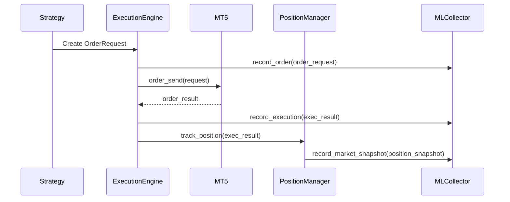
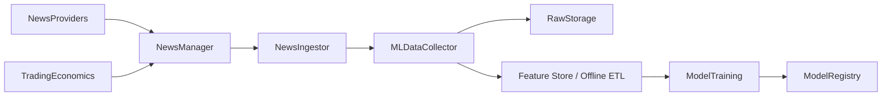

# Herald
> Feature List & Technical Reference

This document is a complete, developer-grade and stakeholder-friendly reference of every implemented feature in Herald (v3.3.1). It includes module-level details, key classes/functions, configuration knobs, ML/event schemas, test coverage, and visual diagrams (Mermaid) to explain system architecture and core data flows.

---

## Table of Contents
- Overview
- Core modules (per-module breakdown)
  - Connector (MT5)
  - Data Layer
  - Strategy Engine
  - Indicators
  - Execution Engine
  - Risk Manager
  - Position Manager
  - Trade Manager (external adoption)
  - Monitoring (TradeMonitor)
  - News & Calendar (adapters, manager, ingest)
  - Advisory & Ghost Modes
  - Persistence & Database
  - Observability & Metrics
  - ML & Instrumentation
  - Tests & CI
  - Configuration & Env
- ML & event schema reference
- Architecture diagrams (Mermaid)
- Release & versioning notes
- Appendices (extension points, contributor notes)

---

## Overview
Herald is an autonomous and adaptive trading system focused on safe, auditable execution with strong observability and pluggable signal sources. The system is designed to run headless, in a gated live mode, and to produce rich ML-friendly event streams to support downstream model training and analysis.

---

## Core Modules (detailed)

### Connector (MT5)
- File: `herald/connector/mt5_connector.py` (exposed as `MT5Connector` and `mt5` wrapper)
- Responsibilities:
  - Connect/disconnect to MetaTrader5 terminal
  - Reconnect with exponential backoff
  - Query account info, symbol info, rates, order_send, positions_get
  - Error normalization (unified exceptions and retcodes)
- Key features:
  - Connection health checks and logging
  - Support for custom installation paths and timeout configuration
  - Rate-limiting guard rails for frequent calls

### Data Layer
- File: `herald/data/layer.py`
- Responsibilities:
  - Normalize raw OHLCV to pandas DataFrame
  - Cache recent history and resampling utilities
  - Validate and clean input bars
- Features:
  - Efficient lookback and windowing for strategy calculations
  - Symbol metadata mapping (digits, tick size)

### Strategy Engine
- File: `herald/strategy/*` (e.g., `sma_crossover.py`)
- Interface:
  - `Strategy` base class with `on_bar()` and `on_tick()` methods
  - Signals include: id, timestamp, symbol, side, stop_loss, take_profit, confidence, metadata
- Built-in strategies:
  - SMA crossover (example implementation)
  - Extensible factory in `__main__` (load_strategy)

### Indicators
- Files: `herald/indicators/*` (RSI, MACD, Bollinger, Stochastic, ADX, ATR support in main loop)
- Features:
  - Self-contained indicator classes that return DataFrames
  - Can be composed and merged into main market DataFrame

### Execution Engine
- File: `herald/execution/engine.py` → `ExecutionEngine`
- Responsibilities:
  - Place and manage orders (market, limit, stop)
  - Idempotency via `client_tag` generation (hash of order payload)
  - Reconciliation and position identification after fills
  - Robust close flow with filling-mode fallbacks (IOC, then FOK, then without `type_filling`)
- Key features:
  - Optional `ml_collector` instrumentation hooks for `record_order` and `record_execution`
  - Slippage control, magic number usage, metadata collection

### Risk Manager
- File: `herald/risk/manager.py`
- Responsibilities:
  - Approve/reject candidate orders based on account and risk limits
  - Position sizing (percentage-based, fixed-lot), exposure caps
  - Emergency stop controls, daily loss tracking and circuit breakers
  - Suggest SL adjustments based on balance and thresholds
- Configurable via `config_schema.RiskConfig`

### Position Manager
- File: `herald/position/manager.py`
- Responsibilities:
  - Track positions opened by Herald
  - Apply / verify SL/TP updates, retry mechanics and readback verification
  - Provide monitoring API used by TradeMonitor
- Features:
  - Digit-aware SL/TP tolerances
  - Retry queue and exponential backoff when broker refuses SL/TP changes

### Trade Manager (External Adoption)
- File: `herald/position/trade_manager.py`
- Responsibilities:
  - Detect external/manual trades and optionally adopt them
  - Apply protective SL/TP and adopt metadata for auditing
  - Maintain `_pending_sl_tp` retry queue with exponential backoff
- Policies: configurable adopt/ignore symbol lists, log-only mode, max adoption age

### Monitoring — TradeMonitor
- File: `herald/monitoring/trade_monitor.py`
- Responsibilities:
  - Background polling of Herald positions
  - Emits ML events: `monitor.heartbeat`, `monitor.pending_sl_tp`, `monitor.market_snapshot`, `monitor.news_alert`
  - Integrates with `NewsManager` to detect high-impact events and pauses trading
- Features:
  - Non-blocking ML recording
  - Configurable poll interval and news alert window (pause duration)

### News & Economic Calendar
- Modules: `herald/news/*`
  - `base.py` — `NewsEvent`, `NewsAdapter` base class
  - `rss_adapter.py` — RSS/Atom adapter (no API required)
  - `newsapi_adapter.py` — NewsAPI adapter
  - `fred_adapter.py` — FRED adapter (macros series)
  - `tradingeconomics_adapter.py` — calendar adapter with `importance` normalization
  - `cache.py` — `FileCache` TTL based cache
  - `manager.py` — `NewsManager` orchestration (adapter fallback + caching)
  - `ingest.py` — `NewsIngestor` periodic fetcher that records ML events
- Features:
  - Priority: prefer RSS fallback, then API adapters (to avoid rate limit dependence)
  - Calendar events normalized with `meta.importance` (low/medium/high)
  - NewsIngestor writes `news_event` and `calendar_event` to `MLDataCollector`
  - TradeMonitor can pause trading on high-impact events

### Advisory & Ghost Modes
- Files: `herald/advisory/manager.py`
- Modes:
  - `advisory`: never execute orders; log and record advisory signals for verification
  - `ghost`: executes small test trades (configurable `ghost_lot_size`, `ghost_max_trades`, `ghost_max_duration`) to validate live plumbing
  - `production` (disabled by default): normal execution
- Safety:
  - `log_only` switch prevents any live order submission
  - ML events `advisory.signal` recorded for all decisions
  - Default disabled; opt-in via `config['advisory']` or runtime

### Persistence & Database
- Files: `herald/persistence/*` or `herald/persistence/database.py`
- Stores:
  - `signals` (SignalRecord), `trades` (TradeRecord), metrics and provenance
  - Audit trail includes original signal, execution result, exit prices, reasons
- DB defaults to SQLite (`database.path` in config)

### Observability & Metrics
- Files: `herald/observability/*`
- Features:
  - JSON/human log output via `setup_logger` with rotation
  - `MetricsCollector` for: trade counts, win rate, P&L, Sharpe-like stats, drawdown
  - Prometheus exporters or hooks can be added via `MetricsCollector`

### ML & Instrumentation
- File: `herald/ML_RL/instrumentation.py` (MLDataCollector)
- Design:
  - Non-blocking producer-queue and background writer — gzipped JSONL
  - Rotate-by-size, fallback synchronous file if queue full
- Event types recorded (canonical):
  - `order_request` (payload: signal_id, symbol, side, volume, sl, tp, client_tag, metadata)
  - `execution` (payload: order_id, position_ticket, status, price, volume, timestamp, metadata)
  - `market_snapshot` (payload: symbol, ticket, sl, tp, unrealized_pnl, timestamp)
  - `news_event` / `calendar_event` (payload: provider, headline, body, ts, symbol, meta)
  - `advisory.signal` (payload: mode, decision, reason, signal_id, metadata)
  - `monitor.*` series (heartbeat, pending_sl_tp)
- Files are written to `herald/ML_RL/data/raw/` and test coverage verifies non-blocking behavior

### Tests & CI
- Unit tests in `tests/unit/*`: adapters, ML collector, trade monitor, advisory manager
- Gated integration tests in `tests/integration/*`: live MT5/instrumentation and news ingest (requires env flags)
- CI gating: environment variables `RUN_MT5_INTEGRATION`, `RUN_NEWS_INTEGRATION`, etc.

### Configuration & Env
- Config schema: `config_schema.py` (Pydantic models for MT5, risk, trading, advisory)
- Important env variables (required vs optional):
  - Required: `MT5_LOGIN`, `MT5_PASSWORD`, `MT5_SERVER`, `DATABASE_PATH`, `LIVE_RUN_CONFIRM`
  - Optional but recommended: `NEWS_RSS_FEEDS`, `NEWS_USE_RSS`, `NEWS_CACHE_TTL`, `NEWSAPI_KEY`, `FRED_API_KEY`, `ECON_CAL_API_KEY`
- CLI: `--config`, `--dry-run`, `--wizard`, `--wizard-ai`, `--enable-ml / --disable-ml`

---

## ML & Event schema reference (short)
- `order_request`:
  - ts, event_type='order_request', payload { signal_id, symbol, side, volume, order_type, price, sl, tp, client_tag, metadata }
- `execution`:
  - ts, event_type='execution', payload { order_id, position_ticket, status, price, volume, timestamp, metadata }
- `market_snapshot`:
  - ts, event_type='market_snapshot', payload { ticket, symbol, volume, sl, tp, unrealized_pnl, timestamp }
- `news_event` / `calendar_event`:
  - ts, event_type='news_event', payload { provider, headline, body, symbol, ts, meta }
- `advisory.signal`:
  - ts, event_type='advisory.signal', payload { mode, decision, reason, signal_id, symbol, volume, metadata }

---

## Architecture diagrams (Mermaid)

### System Component Diagram
```mermaid
flowchart TD
  subgraph DATA
    A[MT5 Terminal] -->|OHLC/Rates| B[MT5Connector]
    E[News Providers (RSS, NewsAPI, FRED, TradingEconomics)] -->|news| F[NewsManager]
  end

  subgraph CORE
    B --> D[DataLayer]
    D --> S[Strategy Engine]
    S --> EX[ExecutionEngine]
    EX --> B
    EX --> P[PositionManager]
    P --> TM[TradeMonitor]
    F -->|events| NI[NewsIngestor]
    NI --> ML[MLDataCollector]
    TM --> ML
    P --> DB[Database]
    EX --> DB
    ML --> Storage[ML Raw Data (gzipped JSONL)]
  end

  subgraph CONTROLS
    UI[Interactive Wizard / CLI] --> S
    CONFIG[Config Files / Env] --> CORE
  end

  style ML fill:#f9f,stroke:#333,stroke-width:2px
```

### Order Lifecycle Sequence (simplified)


### ML / News Data Flow


---

## Release & Versioning
- Current release: **v3.3.1** — includes advisory/ghost modes, news ingest, importance mapping, monitor alerts, tests and docs.
- Release artifacts: annotated git tag `v3.3.1` and GitHub Release entry with `docs/changelog/RELEASE_NOTES_v3.3.1.md`.

---

## Appendices
- Contribution notes: keep tests deterministic when possible; gate live tests behind env flags.
- Extension points:
  - Add `NewsAdapter` implementations under `herald/news` and register with `NewsManager`.
  - Add exit strategies under `herald/exit` and register in config.
  - Add ML features by writing into `MLDataCollector` with clearly typed payloads.

---

If you'd like, I can now:
- Generate a stakeholder-ready one-page PDF from this file,
- Add a diagram image export (PNG/SVG) of the mermaid diagrams into `herald/docs/assets/`, or
- Add a summary slide deck for stakeholders.

Choose one and I'll proceed.