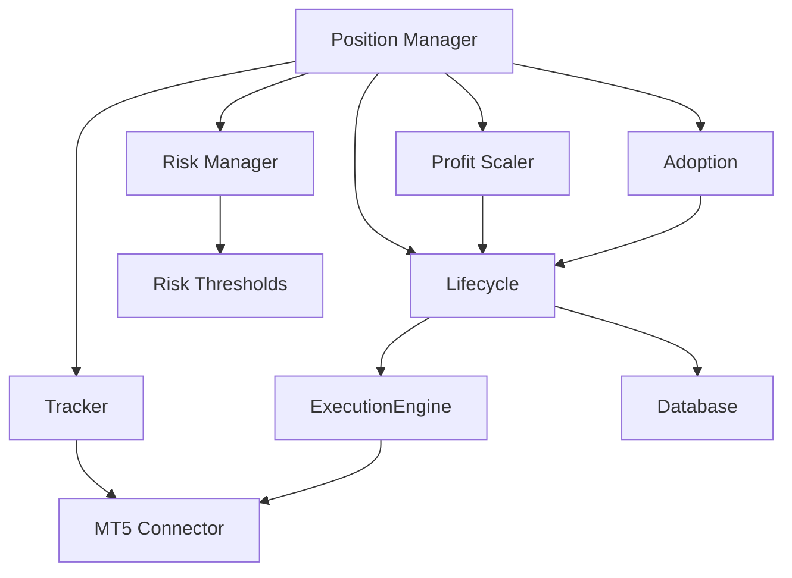

# Position Management Module


## Overview

The position management module handles the complete lifecycle of trading positions, from opening to closing, including sophisticated profit-taking strategies, external trade adoption, and real-time tracking.

## Module Components

```
position/
├── __init__.py              # Module exports
├── manager.py               # Central position orchestrator
├── lifecycle.py             # Position state management
├── profit_scaler.py         # Tiered profit-taking system
├── adoption.py              # External trade integration
├── tracker.py               # Real-time position tracking
├── trade_manager.py         # Trade execution coordination
└── risk_manager.py          # Position-level risk management
```

## Key Features

### 1. Position Lifecycle Management (`lifecycle.py`)
- Opening positions via ExecutionEngine
- Closing positions (full/partial)
- SL/TP modifications
- Exit strategy application
- State tracking through PositionTracker

### 2. Profit Scaling System (`profit_scaler.py`)
- Tiered profit-taking (25%, 35%, 50% at different profit levels)
- Micro account adjustments (< $100 balance)
- Automatic SL movement to breakeven
- Trailing stop after each tier
- ML Tier Optimizer integration (optional)
- Emergency profit lock (10% of balance threshold)

### 3. External Trade Adoption (`adoption.py`)
- Detect trades placed outside Cthulu
- Automatic SL/TP application
- Symbol filtering (adopt/ignore lists)
- Age-based filtering
- Log-only mode for testing

### 4. Position Tracking (`tracker.py`)
- Real-time position state
- MT5 synchronization
- Position reconciliation after connection loss
- P&L tracking

### 5. Position Risk Manager (`risk_manager.py`)
- Balance-based SL thresholds
- Risk-appropriate SL suggestions
- Trading style recommendations
- Account size categorization

## Quick Start

### Opening a Position

```python
from position.manager import PositionManager

position_manager = PositionManager(
    connector=mt5_connector,
    execution_engine=execution_engine,
    database=database,
    config=config
)

ticket = position_manager.open_position(
    symbol="BTCUSD#",
    order_type="buy",
    volume=0.1,
    strategy_name="ema_crossover"
)
```

### Profit Scaling

```python
from position.profit_scaler import ProfitScaler, ScalingConfig

config = ScalingConfig(enabled=True)
scaler = ProfitScaler(
    connector=mt5_connector,
    lifecycle=position_lifecycle,
    config=config
)

# Process positions for profit scaling
for position in positions:
    scaler.process_position(position, account_balance)
```

### External Trade Adoption

```python
from position.adoption import TradeAdoption

adoption = TradeAdoption(
    connector=mt5_connector,
    lifecycle=position_lifecycle,
    config=adoption_config
)

# Scan and adopt external trades
adopted_trades = adoption.scan_and_adopt()
```

## Configuration

### Position Management Configuration

```json
{
  "position_management": {
    "profit_scaling": {
      "enabled": true,
      "micro_account_threshold": 100.0,
      "min_profit_amount": 0.10,
      "tiers": [
        {
          "profit_threshold_pct": 0.30,
          "close_pct": 0.25,
          "move_sl_to_entry": true,
          "trail_pct": 0.50
        }
      ]
    },
    "orphan_trades": {
      "enabled": true,
      "adopt_symbols": [],
      "ignore_symbols": ["EURUSD"],
      "max_age_hours": 72.0,
      "log_only": false
    }
  }
}
```

### Risk Configuration

```json
{
  "risk": {
    "sl_balance_thresholds": {
      "tiny": 0.01,
      "small": 0.02,
      "medium": 0.05,
      "large": 0.05
    },
    "sl_balance_breakpoints": [1000.0, 5000.0, 20000.0]
  }
}
```

## Usage Examples

### Complete Position Lifecycle

```python
# Open position
ticket = position_manager.open_position(
    symbol="BTCUSD#",
    order_type="buy",
    volume=0.1
)

# Monitor and scale
while position_open:
    position_manager.update_all_positions()
    position_manager.process_profit_scaling()
    
    # Check exit signals
    if should_exit:
        position_manager.close_position(ticket)
        break
```

### Adopt External Trade

```python
# Place external trade (for testing)
# python scripts/place_external_test_trade.py

# Run adoption
adopted = position_manager.scan_and_adopt_external_trades()
for trade in adopted:
    print(f"Adopted: {trade['symbol']} #{trade['ticket']}")
```

## Architecture



## Testing

```bash
# Run position management tests
python -m pytest tests/unit/test_position_manager.py -v

# Test profit scaling
python -m pytest tests/test_profit_scaling.py -v

# Test lifecycle
python -m pytest tests/unit/test_lifecycle_open_position.py -v

# Integration test with MT5
RUN_MT5_INTEGRATION=1 python -m pytest tests/integration/ -v
```

## Troubleshooting

### Profit Scaling Not Triggering
- Check `profit_scaling.enabled` = true
- Verify profit exceeds `min_profit_amount`
- Confirm position age < `max_position_age_hours`
- Enable debug logging for evaluation details

### Trade Adoption Failing
- Ensure `orphan_trades.enabled` = true
- Check symbol not in `ignore_symbols`
- Verify trade age < `max_age_hours`
- Check MT5 AutoTrading is enabled
- Review logs for SL/TP application errors

### Position Reconciliation Errors
- Force reconciliation: `tracker.reconcile_with_mt5()`
- Clear cache: `tracker.clear_cache()`
- Verify MT5 connection is stable

## Performance Considerations

- **Memory:** ~1KB per position + 500 bytes for scaling state
- **Update Frequency:** Every 5 seconds for real-time tracking
- **Scaling Evaluation:** Every trading loop iteration
- **Reconciliation:** Every 15 minutes or on connection restore

## Dependencies

- `connector.mt5_connector` - MT5 integration
- `execution.engine` - Order execution
- `persistence.database` - Trade persistence
- `ML_RL.tier_optimizer` - (Optional) ML-based tier optimization

## Related Documentation

- [Position Management Guide](../docs/POSITION_MANAGEMENT.md) - Comprehensive guide
- [Risk Management](../docs/RISK.md) - Risk configuration
- [Stop Loss Bug Fix](../docs/STOP_LOSS_BUG_FIX.md) - Critical fix details
- [Features Guide](../docs/FEATURES_GUIDE.md) - System features

## See Also

- [Execution Module](../execution/README.md)
- [Exit Strategies](../exit/README.md)
- [Risk Module](../risk/README.md)

---

**Module Version:** 5.2.0  
**Last Updated:** 2026-01-06
