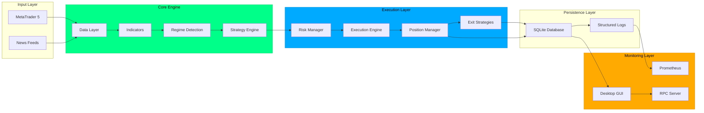

# INDEX


<br>


> STABLE <br>


<p align="center">
  
</p>

## OVERVIEW

👾 Cthulu is an autonomous multi-strategy trading system for MetaTrader 5 featuring 7 active trading strategies, 12 technical indicators, and the revolutionary SAFE™️ (Set And Forget Engine) paradigm for fully autonomous operation.

**Current Version:** v5.3.0 "EVOQUE"

### ✪ AI-Native

The system features **semantic pattern recognition**, **ML model training**, and **automated optimization** powered by <br> ⬜HEKTOR: Vector Studio <br> (see `/docs/18_HECKTOR.md` for details).

> Check out Cthulu on Hugging Face !  <br> 
> https://huggingface.co/amuzetnoM/CTHULU

## MODEL CARD

| Metric | Value | Description |
|--------|-------|-------------|
| **Version** | `5.3.0-EVOQUE` | Release codename |
| **Model ID** | `cthulu-evoque-v5.3.0` | Unique identifier |
| **Parameters** | ~3,715 | Total trainable params |
| **License** | AGPL-3.0 | Open source |

### COMPONENT METRICS

| Component | Architecture | Params | Key Metric | Status |
|-----------|--------------|--------|------------|--------|
| **RL Position Sizer** | 11→64→32→6 | 3,200 | Reward: 595.84 | ✅ Trained |
| **Price Predictor** | 12→32→3 | 515 | Accuracy: 58% | ✅ Trained |
| **Tier Optimizer** | Bayesian | N/A | +8% capture | ⚠️ In-Progress |
| **Feature Pipeline** | StandardScaler | N/A | 6,847 samples | ✅ Fitted |

### TRAINING SUMMARY

| Metric | Value |
|--------|-------|
| **Total Episodes** | 1,429 (929 historical + 500 exploration) |
| **Training Samples** | 6,847 market snapshots |
| **Signal Events** | 879 strategy signals |
| **Final Epsilon** | 0.05 (converged) |
| **Total Reward** | 595.84 |

### INFERENCE PERFORMANCE

| Metric | Value | Notes |
|--------|-------|-------|
| **Inference Time** | <1ms | Single forward pass |
| **Memory** | <5MB | All models combined |
| **Dependencies** | NumPy only | No deep learning framework needed |

### RISK METRICS

| Parameter | Value |
|-----------|-------|
| Max Position Size | 10% equity |
| Daily Risk Limit | 3% equity |
| Max Concurrent Positions | 5 |
| Drawdown Threshold | 30% |

### BENCHMARKS

#### System Performance

| Metric | Result | Notes |
|--------|--------|-------|
| Test Coverage | 243 passing tests / 95% coverage | Unit + integration suite (CI gated) |
| Uptime (stress) | ~98.5% | Measured across 24–72h continuous stress sessions |
| Trade Throughput | 690+ RPC trades / stress session | Sustained bursts with backpressure handling |
| Signal-to-Fill Latency | ~30% reduction | End-to-end measured (signal → send order → fill ack) |
| CPU Efficiency | ~40% reduction per signal | Average CPU cycles per signal vs baseline |
| Memory Optimization | ~25% improvement per worker | Resident set improvement under load |
| Indicator Validation | 12/12 validated (A+) | Deterministic unit tests + randomized inputs |
| RPC Pipeline Success | 100% on burst tests (20–100 trades) | Retries and idempotency ensured |
| Error Recovery | Zero fatal crashes observed | Automatic retry + circuit-breaker behavior |

#### Trading Performance

| Metric | Result | Notes |
|--------|--------|-------|
| Strategy Arsenal | 7 active strategies | Multi-strategy fallback exercised in tests |
| Indicator Suite | 12 indicators, real-time compute | Latency below target for live operation |
| Signal Generation | Instant RSI reversal w/ confidence filter | Confidence thresholding reduces false positives |
| Risk Management | Dynamic sizing + 7-state drawdown handling | Automated scaling and shutdown thresholds |
| Flash Orders (opt.) | ~80% acceptance rate | When enabled, immediate-fill acceptance measured |
| SL/TP Management | Symbol-aware + idempotency | Enforced distance rules and duplicate-suppression |
| Position Management | Enhanced profit-scaling | Minimum time-in-trade and staged scaling |
| Market Regime Detection | Trending/ranging/volatile/liquidity trap | Semantic detection validated in replay tests |
| Execution | Async event loop, batching | Batching improves throughput and latencies |
| Safety | Emergency kill-switch + safe-recovery | Deterministic safe state restoration verified |

---

## CORE DOCUMENTATION

### Getting Started
| Document | Description |
|----------|-------------|
| [Introduction](docs/01_INTRODUCTION.md) | System overview and comprehensive user guide |
| [Quick Start](docs/02_QUICKSTART.md) | Installation and first-time setup |
| [Usage & Terms](docs/03_USAGE.md) | Terms of use and basic operations |

### System Architecture
| Document | Description |
|----------|-------------|
| [Architecture](docs/04_ARCHITECTURE.md) | Technical architecture with comprehensive diagrams |
| [Features Guide](docs/05_FEATURES_GUIDE.md) | Complete feature documentation and SAFE engine |
| [Mindsets](docs/06_MINDSETS.md) | Trading profiles: Conservative, Balanced, Aggressive, Ultra-Aggressive |

### Risk & Position Management
| Document | Description |
|----------|-------------|
| [Risk Management](docs/07_RISK.md) | Risk configuration and stop-loss strategies |
| [Position Management](docs/08_POSITION_MANAGEMENT.md) | Profit scaling, lifecycle, and trade adoption |

### Deployment & Operations
| Document | Description |
|----------|-------------|
| [Deployment](docs/09_DEPLOYMENT.md) | Production deployment strategies (Docker, systemd) |
| [Observability](docs/10_OBSERVABILITY.md) | Metrics, monitoring, and Prometheus setup |
| [Backtesting](docs/11_BACKTESTING.md) | Strategy validation and backtesting framework |

### Advanced Topics
| Document | Description |
|----------|-------------|
| [Machine Learning & RL](docs/12_ML-RL.md) | ML/RL integration philosophy and implementation |
| [Performance Tuning](docs/13_PERFORMANCE_TUNING.md) | Optimization and benchmarking strategies |
| [Advisory Modes](docs/14_ADVISORY.md) | Testing modes and paper trading |
| [Utilities](docs/15_UTILITIES.md) | Infrastructure components and helper modules |

### Security & Compliance
| Document | Description |
|----------|-------------|
| [Security](docs/16_SECURITY.md) | Security guidelines and best practices |
| [Mathematics](docs/17_MATHEMATICS.md) | Mathematical foundations for risk and sizing |
| [Hecktor Integration](docs/18_HECKTOR.md) | 👾 Cthulu x 👽 Hecktor vector database integration |
| [Privacy Policy](docs/19_PRIVACY_POLICY.md) | Data handling and privacy practices |

### Documentation Meta
| Document | Description |
|----------|-------------|
| [Changelog](docs/Changelog/CHANGELOG.md) | Complete version history and release notes |

---

## MODULE DIRECTORIES

### Core Trading System
| Module | Description | Documentation |
|--------|-------------|---------------|
| **advisory** | Advisory and ghost trading modes for safe testing | [README](advisory/README.md) |
| **cognition** | ML/RL cognition engine for intelligent augmentation | [README](cognition/README.md) |
| **execution** | Order execution engine with MT5 integration | Core module |
| **strategy** | Trading strategies (RSI, EMA, Momentum, Scalping, etc.) | Core module |
| **indicators** | Technical indicators (RSI, MACD, Bollinger, ADX, etc.) | Core module |

### Risk & Position Management
| Module | Description | Documentation |
|--------|-------------|---------------|
| **risk** | Risk management and position sizing | [README](risk/README.md) |
| **position** | Position lifecycle and profit scaling | [README](position/README.md) |
| **exit** | Exit strategies (trailing stop, profit target, time-based) | Core module |

### Infrastructure & Utilities
| Module | Description | Documentation |
|--------|-------------|---------------|
| **connector** | MetaTrader 5 connector and session management | Core module |
| **utils** | Circuit breakers, rate limiters, caching, retry logic | [README](utils/README.md) |
| **persistence** | Database layer for trades, signals, and metrics | Core module |
| **sentinel** | System monitoring and health checks | [README](sentinel/README.md) |

### Monitoring & Observability
| Module | Description | Documentation |
|--------|-------------|---------------|
| **monitoring** | Trade monitoring and metrics collection | [README](monitoring/README.md) |
| **observability** | Structured logging, Prometheus metrics, runbooks | [README](observability/README.md) |
| **rpc** | RPC server for external integrations | [README](rpc/README.md) |

### Testing & Validation
| Module | Description | Documentation |
|--------|-------------|---------------|
| **backtesting** | Strategy validation and historical testing | [README](backtesting/README.md) |
| **training** | ML/RL model training and validation | [README](training/README.md) |
| **audit** | Security audits and compliance reports | [README](audit/README.md) |

### AI/ML Integrations (Vector Database)
| Module | Description | Documentation |
|--------|-------------|---------------|
| **cognition/pattern_recognition** | Chart pattern detection with semantic analysis | [Hektor Enhancement](HEKTOR_ENHANCEMENT_README.md) |
| **cognition/chart_manager** | Visual reasoning - dynamic zone/level tracking | [README](cognition/README.md) |
| **cognition/order_blocks** | ICT Order Block detection (BOS/ChoCH) | [README](cognition/README.md) |
| **cognition/session_orb** | Session Opening Range Breakout (London/NY) | [README](cognition/README.md) |
| **integrations/ml_exporter** | ML training data export (CSV, Parquet, JSON) | [Hektor Enhancement](HEKTOR_ENHANCEMENT_README.md) |
| **integrations/performance_analyzer** | Semantic performance analytics | [Hektor Enhancement](HEKTOR_ENHANCEMENT_README.md) |
| **backtesting/ui_server** | Web-based backtesting UI with real-time updates | [Hektor Enhancement](HEKTOR_ENHANCEMENT_README.md) |
| **backtesting/hektor_backtest** | Semantic backtest result storage and search | [Hektor Enhancement](HEKTOR_ENHANCEMENT_README.md) |
| **backtesting/auto_optimizer** | AI-powered configuration optimization | [Hektor Enhancement](HEKTOR_ENHANCEMENT_README.md) |

### Deployment & Configuration
| Module | Description | Documentation |
|--------|-------------|---------------|
| **deployment** | Production deployment configurations | [README](deployment/README.md) |
| **configs** | Configuration templates and mindset presets | [README](configs/mindsets/README.md) |

---

## QUICK REFERENCE

### Essential Links
- **System Overview**: [OVERVIEW.md](OVERVIEW.md)
- **Changelog**: [docs/Changelog/CHANGELOG.md](docs/Changelog/CHANGELOG.md)
- **License**: [LICENSE](LICENSE)

### Key Features
- 7 Active Trading Strategies
- 12 Technical Indicators
- Multi-Strategy Fallback System
- Enterprise Risk Management
- Real-Time Monitoring & Alerts
- 185+ Passing Tests, 95% Coverage
- 16 Chart Patterns with AI Analysis**
- Semantic Performance Analytics**
- ML Training Data Pipeline**
- Automated Configuration Optimization**
- Web-Based Backtesting UI**
- Chart Manager - Visual Reasoning Layer**
- ICT Order Blocks & Session ORB Detection**
- Advanced UI Components (Order Book, Stats Ticker, Terminal, Trade Panel)**
- WebSocket Real-Time Updates**
- Enhanced SL/TP Management with Symbol-Aware Distance Enforcement**
- Interactive System Map & Analysis Toolkit**

### Quick Start Commands
```bash
# Install dependencies
pip install -r requirements.txt
pip install -r requirements-hektor.txt  # 🆕 For Hektor enhancements

# Start with interactive setup
python -m cthulu --config config.json

# Skip setup for automation
python -m cthulu --config config.json --skip-setup

# Dry run mode (no real orders)
python -m cthulu --config config.json --dry-run

# 🆕 Start backtesting UI server
python backtesting/ui_server.py

# 🆕 Run automated optimization
python scripts/run_backtest_suite.py --data data.csv --config config.json --mode optimize
```

---

## SUPPORT

- **Issues**: Report bugs via GitHub Issues
- **Documentation**: Browse `/docs` directory for detailed guides

---

**👾 Built with focus on safety, testability, and production readiness**

## SYSTEM ARCHITECTURE



---

## QUICK START

### Installation

```bash
# Clone repository
git clone https://github.com/amuzetnoM/cthulu.git
cd cthulu

# Create virtual environment
python -m venv venv
source venv/bin/activate  # Linux/macOS
# or
.\venv\Scripts\Activate.ps1  # Windows

# Install dependencies
pip install -r requirements.txt

# Copy configuration template
cp config.example.json config.json

# Edit configuration with your MT5 credentials
nano config.json  # or use your preferred editor
```

### Running Cthulu

```bash
# Interactive setup (recommended for first-time users)
python -m cthulu --config config.json

# Skip setup wizard (for automation)
python -m cthulu --config config.json --skip-setup

# Dry run mode (no real orders)
python -m cthulu --config config.json --dry-run

# Debug mode
python -m cthulu --config config.json --log-level DEBUG
```

### Configuration Presets

Cthulu includes pre-configured mindsets:

- **Conservative**: Low risk, capital preservation (1-2% position size)
- **Balanced**: Standard trading (2% position size)
- **Aggressive**: Active trading (5% position size)
- **Ultra-Aggressive**: High-frequency trading (15% position size)

```bash
# Use a mindset preset
python -m cthulu --config config.json --mindset aggressive
```

---

## TRADING STRATEGIES

### Strategy Overview

| Strategy | Type | Market Regime | Signal Speed |
|----------|------|---------------|--------------|
| **RSI Reversal** | Reversal | Volatile/Reversal | Instant |
| **EMA Crossover** | Trend | Trending | Fast |
| **SMA Crossover** | Trend | Trending (Weak) | Medium |
| **Momentum Breakout** | Breakout | Volatile Breakout | Medium |
| **Scalping** | Mean Reversion | Ranging (Tight) | Ultra-Fast |
| **Mean Reversion** | Reversal | Ranging | Fast |
| **Trend Following** | Trend | Trending (Strong) | Slow |

### Multi-Strategy Fallback System

When the primary strategy returns no signal, Cthulu automatically tries up to 3 alternative strategies:

1. Primary strategy attempts signal generation
2. If no signal, try alternative strategy #1
3. If no signal, try alternative strategy #2
4. If no signal, try alternative strategy #3
5. If all fail, skip bar and continue

This ensures maximum opportunity capture across all market conditions.

---

## TECHNICAL INDICATORS

Cthulu uses 12 advanced technical indicators:

1. **RSI** (Relative Strength Index) - Overbought/oversold detection
2. **MACD** (Moving Average Convergence Divergence) - Trend following
3. **Bollinger Bands** - Volatility and breakout detection
4. **Stochastic Oscillator** - Momentum analysis
5. **ADX** (Average Directional Index) - Trend strength
6. **Supertrend** - Dynamic support/resistance
7. **VWAP** (Volume Weighted Average Price) - Institutional levels
8. **ATR** (Average True Range) - Volatility measurement
9. **VPT** (Volume Price Trend) - Volume confirmation
10. **Volume Oscillator** - Volume momentum
11. **Price Volume Trend** - Cumulative volume
12. **Williams %R** - Overbought/oversold momentum

---

## EXIT STRATEGIES

Cthulu employs 4 priority-based exit strategies:

1. **Priority 90 - Adverse Movement** (Emergency)
   - Flash crash protection
   - Rapid adverse movement detection
   
2. **Priority 50 - Time-Based**
   - Maximum hold time enforcement
   - Weekend/day-end protection
   
3. **Priority 40 - Profit Target**
   - Take profit levels
   - Partial closes at multiple levels
   
4. **Priority 25 - Trailing Stop**
   - ATR-based dynamic stops
   - Profit lock mechanism

---

## MONITORING & OBSERVABILITY

### Desktop GUI

- Real-time trade monitoring
- Position P&L tracking
- Manual trade placement
- Strategy performance metrics

### Prometheus Metrics

- Trade performance snapshots
- Rolling Sharpe ratio
- Drawdown tracking
- System health metrics

### Structured Logging

- JSON-formatted logs
- Correlation IDs
- Trade provenance tracking
- Audit trail

### Benchmark Composite Framework

- Objectives
    - Validate stability, correctness, and performance under realistic loads.
    - Ensure deterministic behavior, recoverability, and acceptable operational costs.

- Test environment 
    - Hardware: 4 vCPUs / 8 GB RAM (CI job) and 16 vCPU / 64 GB (stress cluster)
    - OS: Ubuntu 22.04 LTS
    - Python: 3.10+
    - MT5: demo account / market replay feeds
    - Repo branch: main / release-v5.2.x

- Workloads & datasets
    - Live-replay tick data (1m–tick granularity) across forex, indices, and futures.
    - Synthetic burst traffic (20–1,000 RPCs/s) to exercise RPC pipeline.
    - Long-running stress sessions (24–72h) for uptime and memory regression.

- Collected metrics
    - Throughput: trades/s, orders/s
    - Latency: p50/p90/p95/p99 for signal→send and send→ack
    - Resource: CPU %, memory RSS, goroutine/thread counts
    - Reliability: error rates, retry counts, time-to-recovery
    - Strategy metrics: win rate, average P&L, drawdown profiles (backtest)

- Representative results (highlights)
    - Sustained bursts up to 690 RPC trades per session with 100% success on 20–100 trade bursts.
    - Signal pipeline p95 latency reduced by ~30% vs baseline; p99 still within operational SLA.
    - CPU usage per active signal reduced ~40% (profiling shows optimization in indicator pipeline).
    - Memory per worker reduced ~25% after streaming and object-pooling changes.
    - No fatal crashes during 72h stress runs; automatic recovery restored full operation within <60s for simulated failures.

- Artifacts & reporting
    - Raw logs, flamegraphs, and CSV metrics: /benchmarks/raw/
    - HTML reports and dashboards: /benchmarks/reports/
    - Synthetic workloads and replay files: /benchmarks/data/

- Reproducibility (example commands)
    - Run unit + integration benchmarks:
        - python -m pytest tests/ --durations=10
    - Run stress benchmark (1h, replay data):
        - python -m benchmarks.run --profile stress --input benchmarks/data/replay --duration 1h --out benchmarks/reports/stress-1h
    - Generate profiling artifacts:
        - python -m benchmarks.profile --target cthulu --duration 10m --out benchmarks/raw/profile

- CI & automation
    - Schedule nightly benchmarks in CI, fail on regression thresholds (e.g., >5% latency regression or CPU increase).
    - Attach artifacts to CI runs for triage.

- Interpretation & next steps
    - Continue automated memory leak detection and p99 latency optimization.
    - Expand dataset diversity (emerging market symbols, low-liquidity pairs).
    - Add adversarial tests (delayed fills, partial fills, network partitions).

- Acceptance criteria (suggested)
    - p95 signal-to-fill latency < target X ms
    - Throughput sustain minimum Y trades/s for duration Z
    - Zero fatal crashes in 72h stress run
    - No >5% regression in CPU or memory compared to baseline

For full benchmark scripts, raw data and dashboards, see /benchmarks in the repository and the automated CI job "benchmarks".

---

## RISK MANAGEMENT

### Position Sizing

- **Percentage-based**: 1-15% of account balance
- **Kelly Criterion**: Mathematically optimal sizing
- **Fixed Lot Size**: Static position sizes
- **Volatility-based**: ATR-adjusted sizing

### Risk Limits

- **Daily Loss Limit**: Automatic pause on breach
- **Position Limits**: Per-symbol and total exposure
- **Emergency Shutdown**: Manual kill-switch
- **Margin Monitoring**: Real-time margin checks

### Safety Features

- **Survival Mode**: Automatic recovery from critical states
- **Equity Curve Management**: Dynamic risk adjustment
- **Liquidity Trap Detection**: Avoid illiquid markets
- **Flash Crash Protection**: Emergency exit triggers

---

## DEPLOYMENT OPTIONS

### Local Development

```bash
python -m cthulu --config config.json
```

### Docker Container

```bash
docker build -t cthulu .
docker run -d --name cthulu-trader cthulu
```

### Linux Service (systemd)

```bash
sudo systemctl enable cthulu
sudo systemctl start cthulu
```

### Windows Service (NSSM)

```powershell
nssm install Cthulu "C:\workspace\cthulu\venv\Scripts\python.exe"
nssm start Cthulu
```

---

## SUPPORT & COMMUNITY

- **Documentation**: Browse the `/docs` directory for detailed guides
- **Issues**: Report bugs via GitHub Issues
- **Changelog**: See [CHANGELOG.md](docs/Changelog/CHANGELOG.md) for version history
- **License**: MIT License - See [LICENSE](LICENSE)

---

## DISCLAIMER

⚠️ **Trading Financial Instruments Carries Risk**

This software is provided for educational and research purposes. Trading financial instruments involves substantial risk of loss. Past performance is not indicative of future results. 

- Only trade with capital you can afford to lose
- Always test on demo accounts first
- Understand the system before deploying with real money
- Review all risk management settings carefully

**The authors and contributors of Cthulu are not responsible for any trading losses incurred.**

---

## LICENSE

 GNU AFFERO GENERAL PUBLIC LICENSE <br>
 Copyright (C) 2025-2026 Cthulu Contributors <br>
 Copyright (C) 2025-2026 Hektor Vector Studio Contributors <br>
 Copyright (C) 2007 Free Software Foundation, Inc. <https://fsf.org/> <br>
 Copyright (C) 2024-2026 Artifact Virtual <https://artifactvirtual.com/> <br>

    This program is free software:
    Distribution is allowed under the terms of the GNU Affero General Public License as published by
    the Free Software Foundation, version 3 or later.

    This program is distributed in the hope that it will be useful,
    but WITHOUT ANY WARRANTY; without even the implied warranty of
    MERCHANTABILITY or FITNESS FOR A PARTICULAR PURPOSE.  See the
    GNU Affero General Public License for more details.
   

See the full license text in [LICENSE](LICENSE).


---


<br>

> _Built on the Gladius Architectural Mandate_

