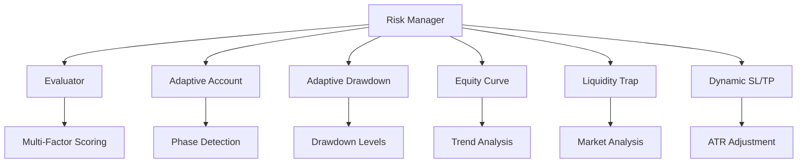

# Risk Management Module


## Overview

The risk management module provides sophisticated risk controls including adaptive account management, drawdown protection, equity curve monitoring, liquidity trap detection, and dynamic SL/TP adjustment.

## Module Components

```
risk/
├── __init__.py                    # Module exports
├── manager.py                     # Central risk orchestrator
├── evaluator.py                   # Risk evaluation engine
├── adaptive_account_manager.py    # Account phase management
├── adaptive_drawdown.py           # Drawdown protection
├── equity_curve_manager.py        # Equity monitoring
├── liquidity_trap_detector.py     # Market liquidity analysis
└── dynamic_sltp.py                # Dynamic SL/TP adjustment
```

## Key Features

### 1. Adaptive Account Manager (`adaptive_account_manager.py`)
- Account phase detection (growth, protection, recovery)
- Dynamic timeframe selection
- Trade frequency limits
- Argmax decision making
- Risk scaling based on performance

### 2. Adaptive Drawdown (`adaptive_drawdown.py`)
- Real-time drawdown monitoring
- Tiered protection levels
- Automatic risk reduction
- Recovery mode activation
- Survival mode for extreme drawdowns

### 3. Equity Curve Manager (`equity_curve_manager.py`)
- Equity curve tracking
- Performance trend analysis
- Dynamic risk adjustment
- Capital preservation mode
- Peak equity tracking

### 4. Liquidity Trap Detector (`liquidity_trap_detector.py`)
- Low volume detection
- Wide spread analysis
- Quote gap identification
- Market flip protection
- Trading recommendations

### 5. Dynamic SL/TP (`dynamic_sltp.py`)
- Volatility-based SL/TP
- ATR-adjusted distances
- Market condition adaptation
- Trailing stop management

### 6. Risk Evaluator (`evaluator.py`)
- Comprehensive risk scoring
- Multi-factor analysis
- Position risk assessment
- Account risk limits

## Quick Start

### Basic Risk Manager

```python
from risk.manager import RiskManager

risk_manager = RiskManager(config=config)

# Evaluate signal
approved, reason, adjusted_size = risk_manager.evaluate_signal(
    signal=trading_signal,
    account=account_info,
    open_positions=current_positions
)

if approved:
    execute_trade(adjusted_size)
```

### Adaptive Account Management

```python
from risk.adaptive_account_manager import AdaptiveAccountManager

account_mgr = AdaptiveAccountManager(
    database=db,
    config=config
)

# Get current phase
phase = account_mgr.get_current_phase(account_balance)
# Returns: "growth", "protection", or "recovery"

# Get adjusted risk
risk_multiplier = account_mgr.get_risk_multiplier()
adjusted_risk = base_risk * risk_multiplier
```

### Drawdown Protection

```python
from risk.adaptive_drawdown import AdaptiveDrawdown

drawdown_mgr = AdaptiveDrawdown(
    database=db,
    config=config
)

# Check drawdown level
level = drawdown_mgr.get_drawdown_level(
    current_equity=current_equity,
    peak_equity=peak_equity
)

if level in ["critical", "severe"]:
    # Reduce position sizes
    # Tighten stop losses
    # Consider pausing trading
```

### Liquidity Trap Detection

```python
from risk.liquidity_trap_detector import LiquidityTrapDetector

liquidity_detector = LiquidityTrapDetector()

# Analyze market
analysis = liquidity_detector.analyze(
    symbol="BTCUSD#",
    market_data=recent_data
)

if analysis["is_trapped"]:
    print(f"Trap type: {analysis['trap_type']}")
    print(f"Recommendation: {analysis['recommendation']}")
    # Skip trading or reduce size
```

## Configuration

### Complete Risk Configuration

```json
{
  "risk": {
    "max_position_size": 1.0,
    "position_size_pct": 2.0,
    "max_daily_loss": 500.0,
    "max_positions_per_symbol": 1,
    "max_total_positions": 3,
    "emergency_stop_loss_pct": 8.0,
    "sl_balance_thresholds": {
      "tiny": 0.01,
      "small": 0.02,
      "medium": 0.05,
      "large": 0.05
    },
    "sl_balance_breakpoints": [1000.0, 5000.0, 20000.0],
    "adaptive_drawdown": {
      "enabled": true,
      "levels": {
        "normal": 0.05,
        "warning": 0.10,
        "severe": 0.15,
        "critical": 0.20
      },
      "risk_multipliers": {
        "normal": 1.0,
        "warning": 0.75,
        "severe": 0.50,
        "critical": 0.25
      }
    },
    "adaptive_account_manager": {
      "enabled": true,
      "growth_threshold": 1.20,
      "protection_threshold": 0.95,
      "recovery_threshold": 0.85,
      "max_trades_per_day": {
        "growth": 20,
        "protection": 10,
        "recovery": 5
      }
    },
    "liquidity_trap_detection": {
      "enabled": true,
      "min_volume_threshold": 100,
      "max_spread_threshold": 0.001,
      "max_gap_threshold": 0.005
    }
  }
}
```

## Usage Examples

### Complete Risk Evaluation

```python
from risk.manager import RiskManager

risk_manager = RiskManager(config)

# Before placing trade
signal = {
    "symbol": "BTCUSD#",
    "side": "buy",
    "confidence": 0.75,
    "suggested_size": 0.1
}

account = {
    "balance": 10000.0,
    "equity": 10200.0,
    "margin_free": 9000.0
}

# Evaluate
approved, reason, size = risk_manager.evaluate_signal(
    signal, account, open_positions=[]
)

if approved:
    print(f"Approved: {size} lots")
else:
    print(f"Rejected: {reason}")
```

### Adaptive Risk Scaling

```python
from risk.adaptive_account_manager import AdaptiveAccountManager
from risk.adaptive_drawdown import AdaptiveDrawdown

account_mgr = AdaptiveAccountManager(db, config)
drawdown_mgr = AdaptiveDrawdown(db, config)

# Get current multipliers
account_multiplier = account_mgr.get_risk_multiplier()
drawdown_multiplier = drawdown_mgr.get_risk_multiplier()

# Combined risk adjustment
final_risk = base_risk * account_multiplier * drawdown_multiplier

print(f"Base risk: {base_risk:.2%}")
print(f"Account phase: {account_mgr.get_current_phase()}")
print(f"Drawdown level: {drawdown_mgr.get_drawdown_level()}")
print(f"Final risk: {final_risk:.2%}")
```

### Market Condition Check

```python
from risk.liquidity_trap_detector import LiquidityTrapDetector

detector = LiquidityTrapDetector()

# Check before trading
def should_trade(symbol, market_data):
    analysis = detector.analyze(symbol, market_data)
    
    if analysis["is_trapped"]:
        logger.warning(
            f"{symbol} liquidity trap detected: {analysis['trap_type']}"
        )
        return False
    
    return True

if should_trade("BTCUSD#", data):
    place_trade()
```

## Architecture



## Balance Category Thresholds

| Balance Range | Category | Max SL % | Suggested Style | Timeframes |
|---------------|----------|----------|-----------------|------------|
| ≤ $1,000 | tiny | 1% | scalping | M1, M5, M15 |
| $1,001 - $5,000 | small | 2% | scalping | M5, M15, M30 |
| $5,001 - $20,000 | medium | 5% | short-term | M15, M30, H1 |
| > $20,000 | large | 5% | swing | H1, H4, D1 |

**Note:** The 'large' threshold was fixed from 0.25 (25%) to 0.05 (5%) in v5.1 to prevent excessive losses. See `docs/STOP_LOSS_BUG_FIX.md` for details.

## Account Phases

### Growth Phase
- **Condition:** Equity > 120% of initial balance
- **Risk Multiplier:** 1.0 (normal risk)
- **Max Trades/Day:** 20
- **Focus:** Capitalize on winning streak

### Protection Phase
- **Condition:** 95% < Equity < 120% of initial balance
- **Risk Multiplier:** 0.75
- **Max Trades/Day:** 10
- **Focus:** Preserve capital

### Recovery Phase
- **Condition:** Equity < 95% of initial balance
- **Risk Multiplier:** 0.50
- **Max Trades/Day:** 5
- **Focus:** Conservative recovery

## Drawdown Levels

| Level | Drawdown | Risk Multiplier | Action |
|-------|----------|-----------------|--------|
| **Normal** | < 5% | 1.0 | Continue trading |
| **Warning** | 5-10% | 0.75 | Reduce risk |
| **Severe** | 10-15% | 0.50 | Conservative mode |
| **Critical** | 15-20% | 0.25 | Survival mode |
| **Emergency** | > 20% | 0.0 | Pause trading |

## Testing

```bash
# Run risk management tests
python -m pytest tests/unit/test_risk_manager.py -v

# Test stop loss fix
python -m pytest tests/test_stop_loss_fix.py -v

# Test adaptive systems
python -m pytest tests/unit/test_adaptive_*.py -v
```

## Troubleshooting

### Signals Rejected Due to Risk
- Check daily loss limit not exceeded
- Verify position limits not reached
- Review account phase (recovery mode?)
- Check drawdown level (critical?)
- Ensure liquidity is adequate

### Risk Multipliers Too Conservative
- Review drawdown level threshold
- Adjust account phase thresholds
- Check if in recovery mode
- Verify peak equity is accurate

### Liquidity Warnings
- Normal during market open/close
- Check symbol specifications
- Verify time is within trading hours
- Consider using major symbols

## Performance Considerations

- **Evaluation Time:** < 5ms per signal
- **Memory Usage:** < 1MB for state
- **Database Queries:** Cached with 5min TTL
- **Update Frequency:** Per-trade and hourly

## Dependencies

- `persistence.database` - Trade history and equity tracking
- `connector.mt5_connector` - Market data and account info
- `utils.cache` - Performance optimization

## Related Documentation

- [Risk Management Guide](../docs/RISK.md) - Configuration guide
- [Stop Loss Bug Fix](../docs/STOP_LOSS_BUG_FIX.md) - Critical fix
- [Features Guide](../docs/FEATURES_GUIDE.md) - Risk features
- [Architecture](../docs/ARCHITECTURE.md) - System design

## See Also

- [Position Module](../position/README.md)
- [Execution Module](../execution/README.md)
- [Utilities](../docs/UTILITIES.md)

---

**Module Version:** 5.1.0  
**Last Updated:** 2026-01-05
